# 《现代软件开发技术》上机实验手册：Git版本管理工具实践

## 实验主题

Git版本管理工具实践

## 实验目标

1. 理解Git版本控制系统的基本概念和工作原理
2. 掌握Git常用命令的使用方法
3. 学会使用Gitee在线代码仓库进行代码管理
4. 掌握IDEA和VSCODE等IDE与Git的集成配置
5. 学会创建和使用.gitignore文件
6. 掌握分支管理策略（创建、合并、冲突消解）
7. 了解代码审查和分支保护机制

## 📅 课程概览 (Total: 240 Mins)

| 时间段 | 教学环节 | 核心目标 | 关键技术栈 |
| :--- | :--- | :--- | :--- |
| **0-30'** | **模块一：理论导入与环境准备** | 理解Git版本控制的核心概念，完成Git安装与基础配置。 | Git, Gitee, SSH密钥 |
| **30-70'** | **模块二：仓库创建与基本操作** | 掌握Gitee仓库创建、克隆、提交、推送等基本操作。 | Git Bash, 命令行操作 |
| **70-110'** | **模块三：IDE集成与可视化操作** | 学会在IDEA和VSCODE中使用Git进行可视化操作。 | IDEA, VSCODE, Git GUI |
| **110-150'** | **模块四：分支管理与冲突消解** | 掌握分支创建、合并、冲突解决的核心流程。 | 分支策略, 冲突消解 |
| **150-190'** | **模块五：团队协作与代码审查** | 理解团队协作流程，掌握Pull Request与代码审查。 | Gitee PR, 代码审查 |
| **190-240'** | **模块六：综合实战与结课** | 完成综合实战项目，构建完整的Git工作流。 | 实战项目, 版本管理 |

## 资源

git工具官方网站：
```
https://git-scm.com/
```

在线代码仓库：
```
https://github.com/（境外）
https://gitee.com/（境内）
```

离线代码仓库：
```
https://gitlab.com/
```

## 目的与意义

git一直服务于团队合作的最前沿，但是作为个人开发者使用git工具管理自己的代码和文件也具有非凡的意义。

### 长周期的代码版本控制与备份

版本控制和备份：管理代码的不同版本，可随时恢复到以前的工作状态，避免数据丢失。选择长期且稳定的在线代码仓库至关重要。

### 代码训练的激励机制

学习和成长的激励机制：通过查看提交历史，个人开发者可以反思和学习自己的代码变更，了解哪些改动带来了积极或消极的影响。

学习专业化工作流程：使用Git可以帮助个人开发者养成专业的软件开发习惯，如定期提交、撰写详细的提交信息等，这对职业发展非常有帮助。

### 代码的开放及交流

共享和协作：即使是个人项目，开发者也可以使用Git轻松地与其他人共享代码，接受建议和反馈，提升项目质量。

## 代码仓库的创建与配置（以Gitee为例）

```
https://gitee.com/
```

本次短学期实习以 Gitee 为例。

同学首先需要注册 Gitee 账号。然后进入 `个人主页 -> 个人设置 -> 邮箱管理` 选项中。

**作为重要的第一步，同学需要配置`提交邮箱`。**

默认情况下，`提交邮箱` 在git中扮演身份识别的角色。如下：

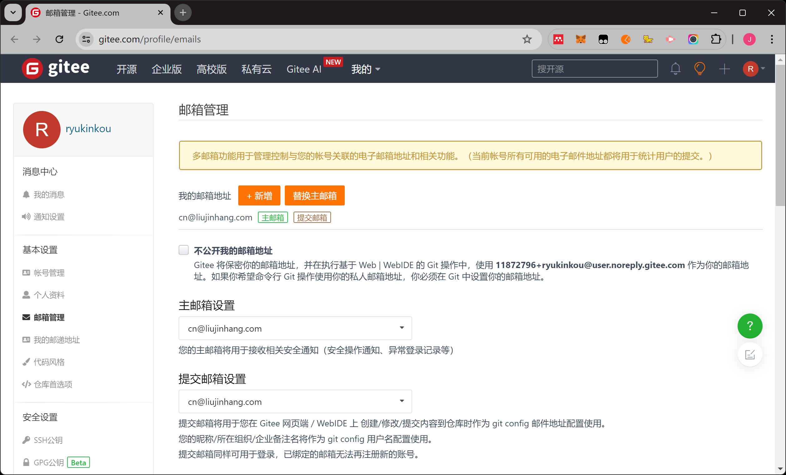

在开始使用 Git 之前，同学需要先进行 Git 的基础配置。打开命令行终端（Windows使用Git Bash，macOS使用Terminal），执行以下命令配置身份信息：

```bash
# 配置用户名
git config --global user.name "你的真实姓名"
# 配置提交邮箱
git config --global user.email "你的邮箱@example.com"
# 配置默认分支名
git config --global init.defaultBranch master
```

为了实现安全的免密通信，Git提供了两种主要的认证方式：**SSH密钥认证**（推荐）和**用户名密码认证**。

### 方式一：配置SSH密钥认证（推荐）

SSH密钥认证是一种更安全、更便捷的认证方式，无需每次输入密码。

1. **生成SSH密钥对**：在本地命令行中执行（一路回车默认即可）：
```bash
ssh-keygen -t ed25519 -C "你的邮箱@example.com"
```

2. **查看并复制公钥**：
   - Windows: `cat ~/.ssh/id_ed25519.pub`
   - macOS: `cat ~/.ssh/id_ed25519.pub`

3. **在Gitee中添加公钥**：进入 Gitee `个人设置 -> SSH公钥`，将复制的公钥内容粘贴进去并保存。

4. **测试连接**：在命令行中执行：
```bash
ssh -T git@gitee.com
```

如果提示 `Welcome to Gitee.com, 你的用户名!` 说明配置成功。

### 方式二：用户名密码认证（简单但安全性较低）

如果不想配置SSH密钥，也可以使用用户名密码进行认证。

1. **获取个人访问令牌（PAT）**：
   - 进入 Gitee `个人设置 -> 安全设置 -> 个人访问令牌`
   - 点击 `生成新令牌`，勾选必要的权限（projects、user_info等）
   - 生成后复制保存令牌，只会显示一次

2. **使用方式**：
   - 克隆仓库时使用HTTPS地址：`https://gitee.com/用户名/仓库名.git`
   - 推送时用户名输入Gitee用户名，密码输入个人访问令牌

**注意**：密码认证存在安全风险，推荐使用SSH密钥认证方式。

随后，通过右上角菜单打开`新建仓库`页面。

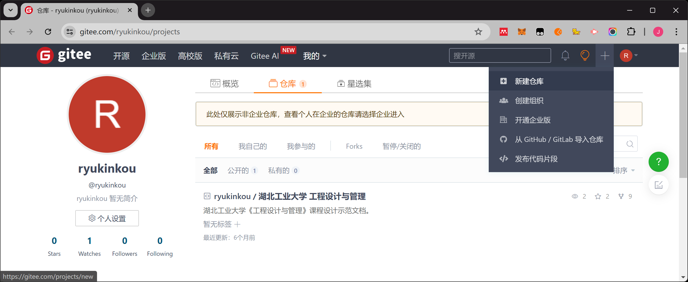

根据自己的需求填写仓库名称、路径等信息。

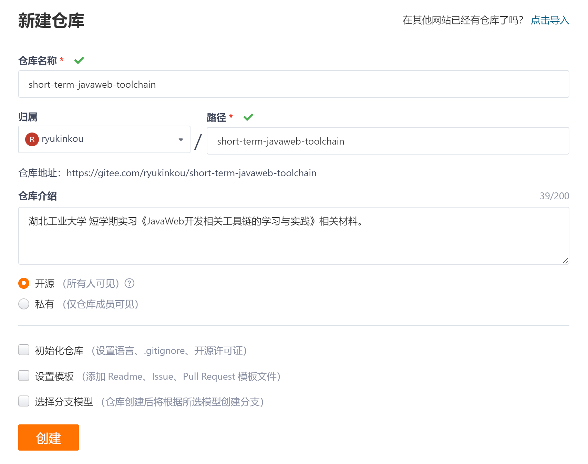

仓库创建完成后，会返回一个用于管理该仓库的地址信息。复制该信息。

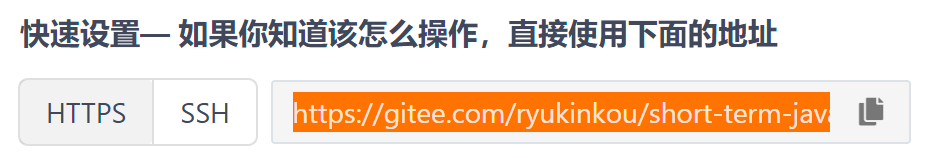

## IDE的配置（以IDEA为例）

下载并安装git工具与Intellij IDEA。

检查git工具在IDEA中的配置是否完备。

进入IDEA的Settings界面（通过左侧菜单`Customize -> All Settings`进入）。

打开`Version Control -> Git`。

在`Path to Git executable`文本框中，找到并填入git.exe的位置。点击Test按钮。

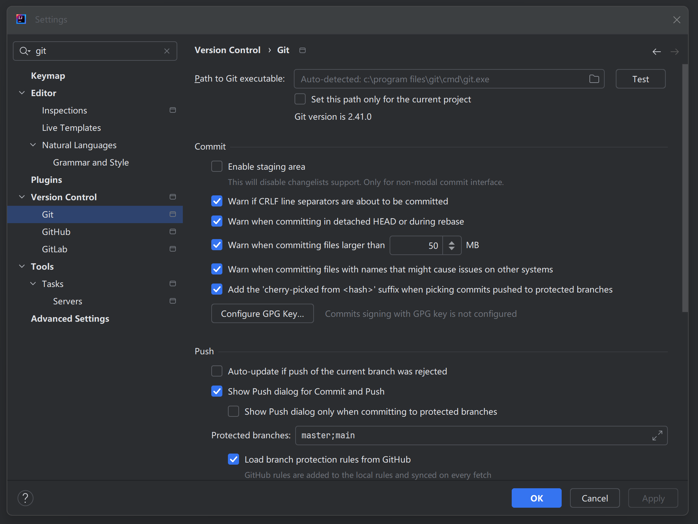

回到启动页，选择`Get from Version Control`。

输入刚才复制的仓库地址信息。点击`Clone`。

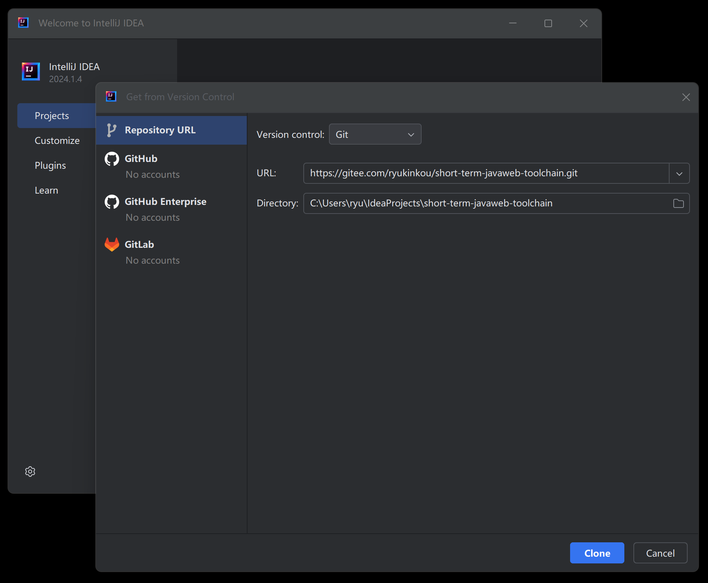

至此，同学已完成在IDEA中配置连接在线代码仓库的过程。

## 创建.gitignore文件

同学在提交代码之前需要创建 `.gitignore` 文件，用于自动排除不需要提交到仓库的文件。

### 什么是.gitignore文件

.gitignore文件告诉Git哪些文件或目录不需要被版本控制。这可以避免将IDE配置文件、依赖库、编译产物等提交到仓库，保持仓库的清洁。

### 创建.gitignore文件

在项目根目录创建 `.gitignore` 文件，内容如下（以Java项目为例）：

```bash
# Java编译产物
*.class
*.jar
*.war
*.ear
target/

# IDE配置文件
.idea/
*.iml
*.iws
*.ipr
.vscode/
.vs/
*.suo
*.user

# 操作系统文件
.DS_Store
Thumbs.db

# 依赖库
lib/
*.dll
*.so
*.dylib

# 日志文件
*.log
logs/
```

可以根据项目类型选择合适的.gitignore模板，例如：
- Python项目：添加 `__pycache__/`, `*.pyc`, `venv/`
- Node.js项目：添加 `node_modules/`, `npm-debug.log`
- C/C++项目：添加 `*.o`, `*.obj`, `bin/`, `build/`

### 使用.gitignore文件

1. 在项目根目录创建 `.gitignore` 文件
2. 填写需要忽略的文件和目录规则
3. 将 `.gitignore` 文件提交到仓库

这样，Git会自动忽略这些文件，不会将它们提交到仓库。

# 提交代码

接下来，完成将本地代码提交到代码仓库的过程。

首先，创建并完成一个文件。本次实践创建并使用一个README.md文件作为例子。

文件的颜色会发生一些变化，白色代表文件与仓库相等，绿色代表新追加的文件，蓝色代表该文件被修改过。

初次创建文件时，会弹出一个对话框，如下。选择`Add`。

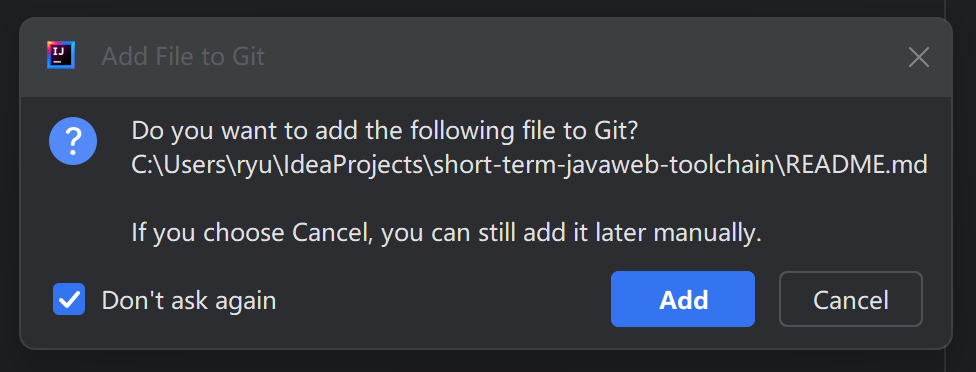

在已创建的文件上，点击右键，选择`Git -> Commit File`。

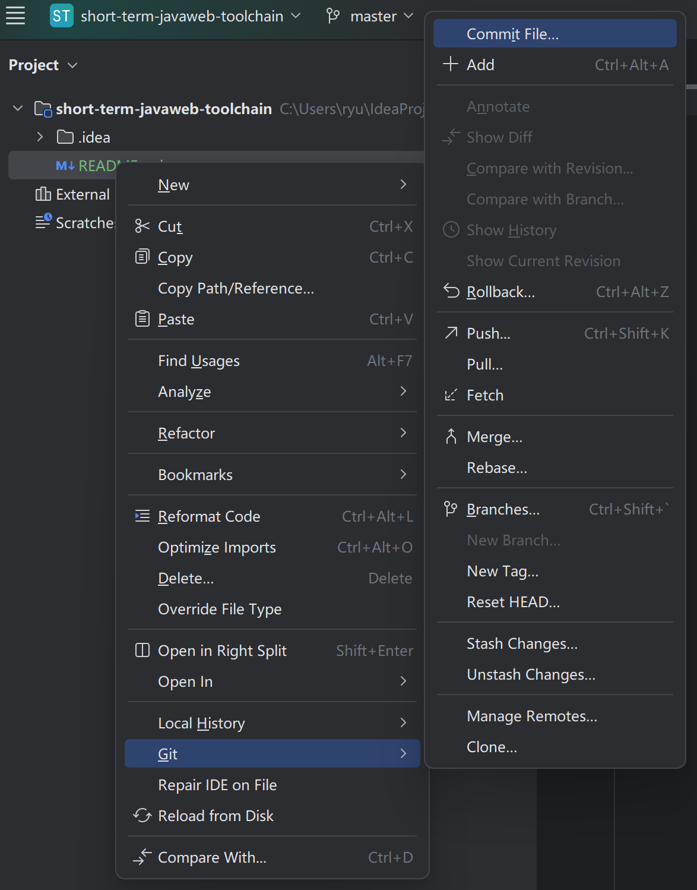

进入Commit界面后，检查需要提交的文件。

为了保证在线仓库的纯洁性，只提交和程序和代码相关的文件进入仓库。

而且尽量不要提交过大的文件。管理大文件并不是git工具所擅长的。

比如一些IDE的配置文件之类的数据不要提交到仓库。

**最后，不要忘记填写提交说明。**

### 提交信息规范（Conventional Commits）

推荐使用约定式提交规范，使提交历史更加清晰可读：

格式：`<类型>: <描述>`

常用类型：
- `feat: 新功能` - 添加新功能
- `fix: 修复bug` - 修复缺陷
- `docs: 文档更新` - 仅修改文档
- `style: 代码格式` - 不影响代码运行的格式修改
- `refactor: 重构` - 既不新增功能也不修复bug的代码修改
- `test: 测试相关` - 添加或修改测试代码
- `chore: 构建相关` - 构建流程或辅助工具的变动

示例：
```
feat: 添加用户登录功能
fix: 修复登录页面跳转错误
docs: 更新API文档
refactor: 重构用户认证逻辑
```

良好的提交信息有助于团队协作和代码审查。

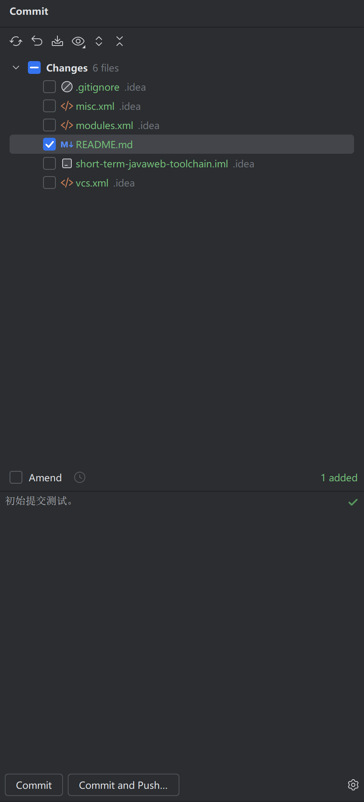

提交代码会改变仓库的内容，所以在这一步中需要验证身份。

**身份验证方式：**

根据所选择的认证方式，有两种验证方法：

### 方式一：SSH密钥认证（推荐）
如果使用SSH密钥认证：不需要输入用户名和密码，直接提交即可。
- 确保使用SSH地址克隆仓库：`git@gitee.com:用户名/仓库名.git`
- 确保已正确配置SSH公钥

### 方式二：用户名密码认证
如果使用HTTP认证：
- `Username`填写Gitee用户名
- `Password`填写Gitee的个人访问令牌（PAT）或注册密码
- 确保使用HTTPS地址克隆仓库：`https://gitee.com/用户名/仓库名.git`

**注意**：密码认证存在安全风险，推荐使用SSH密钥认证方式。

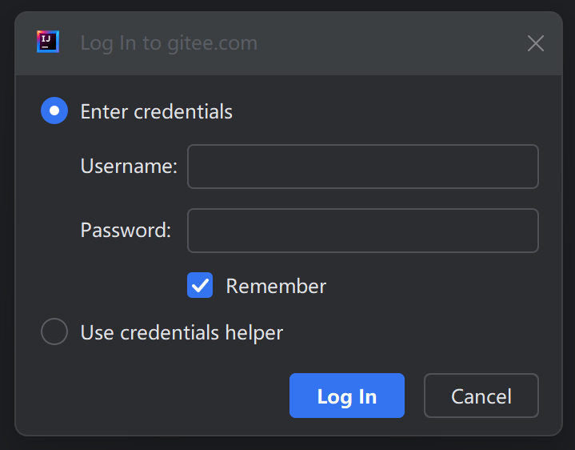

如果一切正常，IDE右下角会显示相关信息。

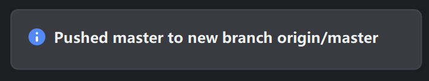

同时，在Gitee的网站上，也会显示相应的内容。

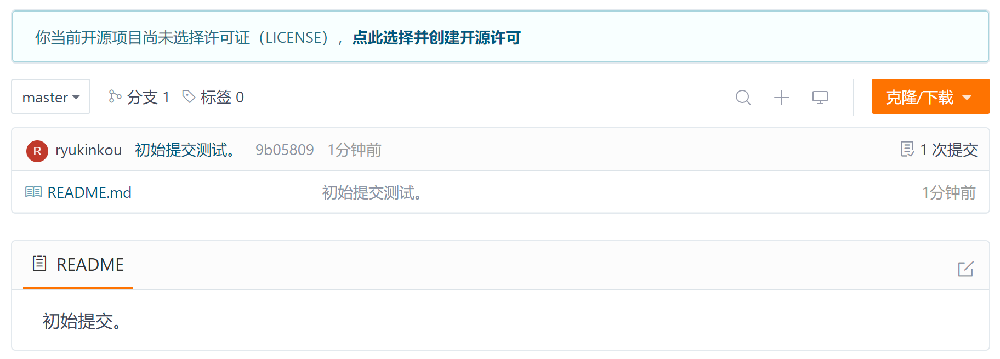
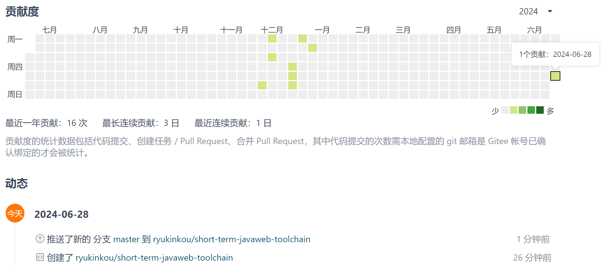

## IDE的配置（以VSCODE为例）

VSCODE的配置内容和流程基本一致。

首先，在左侧列表中切换到第三个按钮，代表版本管理。

然后，在顶部输入框中输入仓库地址。回车后开始克隆仓库内容。

此时，下载的仓库已经包含前面提交过的内容。

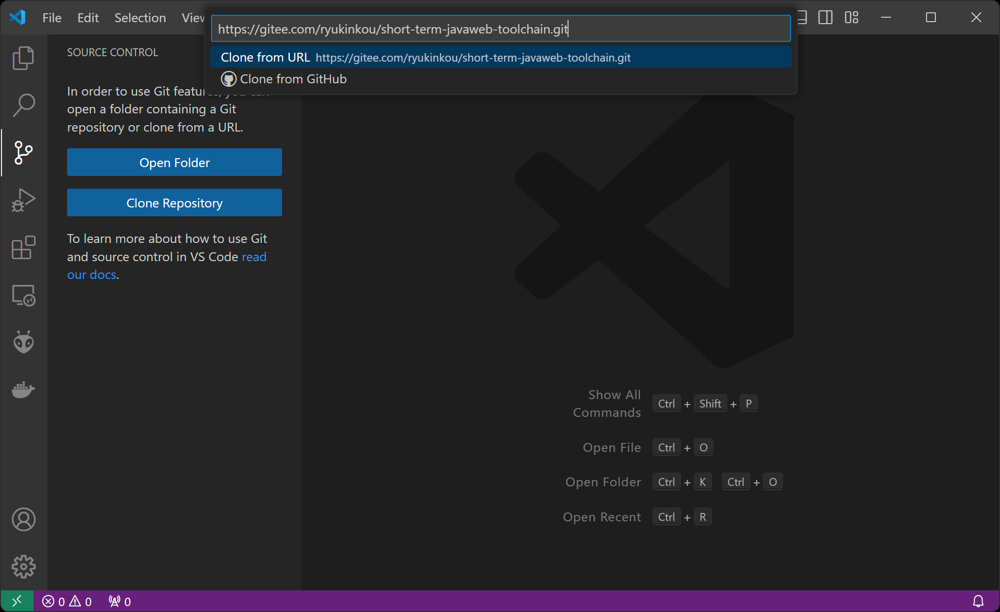

在本实践中，同学尝试在VSCODE中修改一下之前的README.md文档，用来测试VSCODE和在线仓库的配置是否完备。

切换回左侧第一个按钮，打开README.md文档，修改该文档，并**保存**。然后再次切换到第三个按钮处。

此时，被修改的文档被列在changes列表中，但Commit按钮尚未生效。

**注意：这里和IDEA的流程稍微不一样，需要先点击文件右侧的+号，对修改进行暂存（Stage Changes）后才能提交。 这个过程在IDEA中自动完成了，但在VSCODE中需要手动完成。**

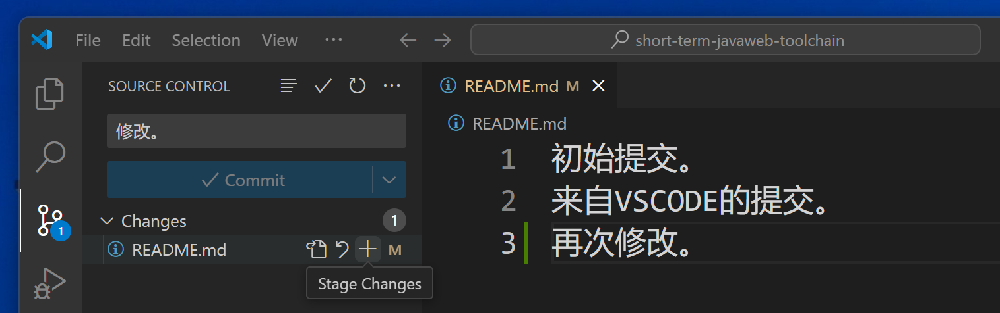

这个时候，`Commit`按钮生效，可以提交代码了。

注意：提交代码其实有2个过程，即`Commit`向本地仓库提交修改，`Push`将这个修改推送给在线仓库。

可以选择`Commit & Push`，一次性完成这2个流程。

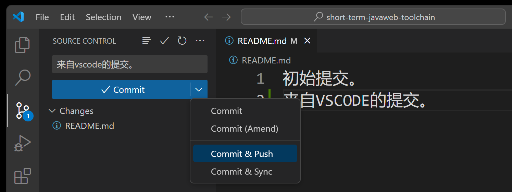

同样的，在Push到在线仓库的时候，需要验证身份。根据所选择的认证方式：

- **SSH密钥认证（推荐）**：不需要输入用户名和密码，直接提交即可
- **用户名密码认证**：使用Gitee用户名和个人访问令牌进行验证

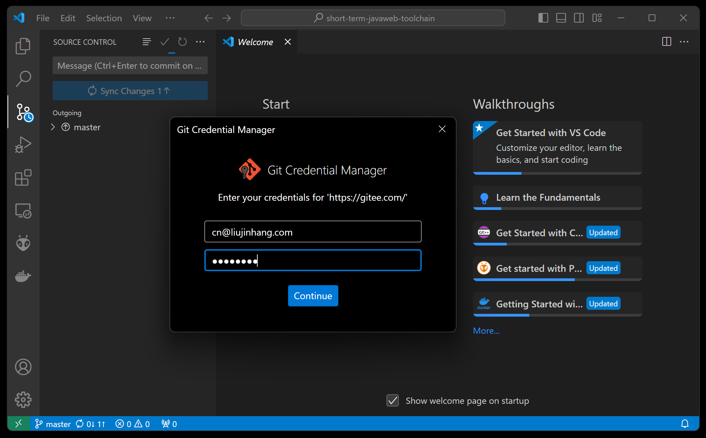

最后，检查一下在线仓库。

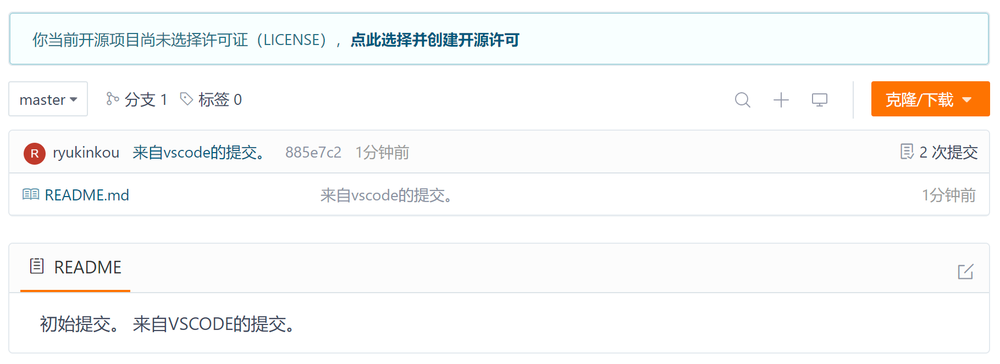

除了IDEA和VSCODE之外，市面上的绝大部分IDE都能够与git工具进行很好的连携，完成代码的版本管理工作，例如：

Android Studio

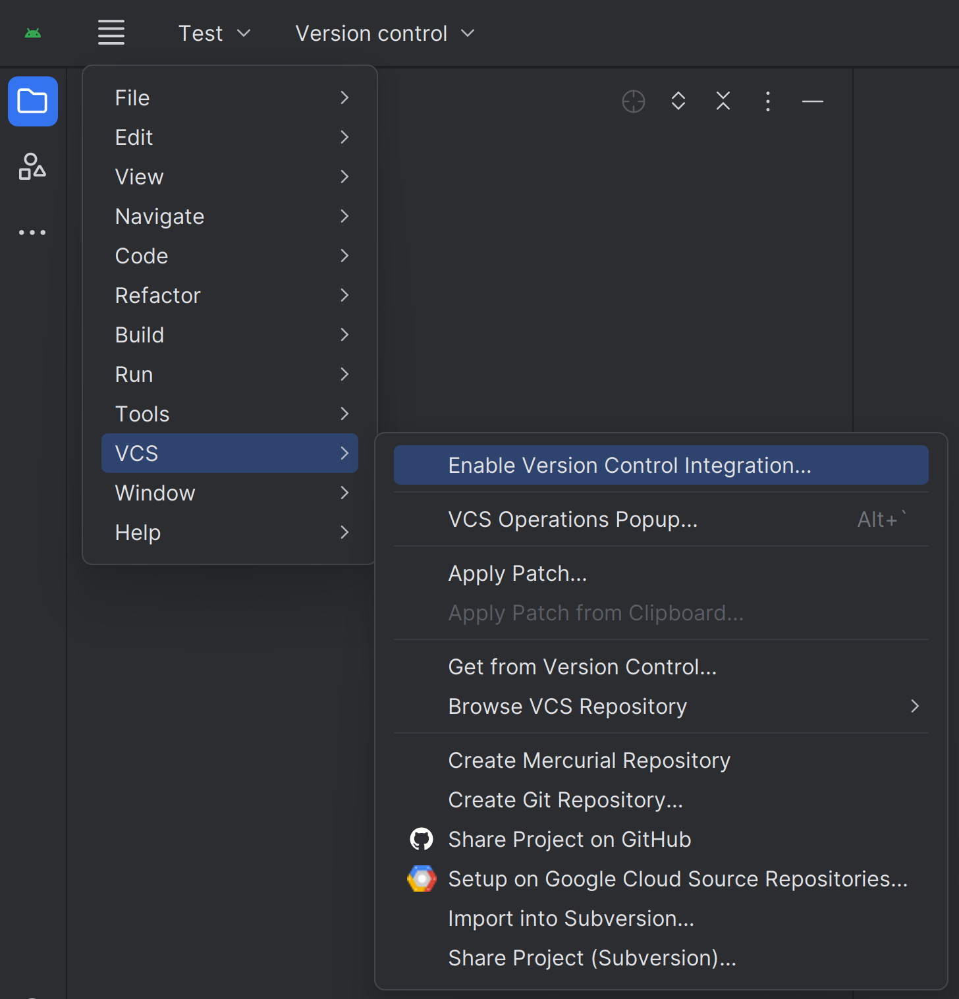

Visual Studio

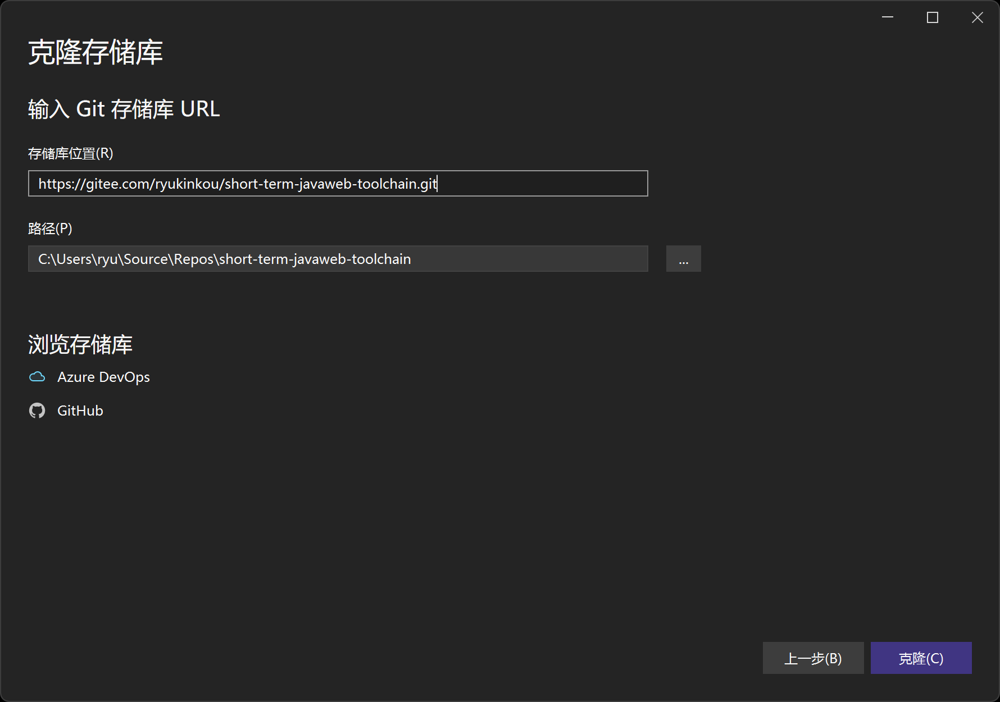

等等。

## 常用Git命令

除了IDE操作，了解Git命令行操作也很重要。以下是常用命令：

### 基础命令

```bash
# 查看仓库状态
git status

# 查看提交历史
git log
# 查看简洁的提交历史
git log --oneline --graph --all

# 查看文件变更
git diff
# 查看已暂存的变更
git diff --cached

# 撤销工作区修改
git checkout -- <文件名>
# 撤销暂存
git reset HEAD <文件名>
```

### 分支操作

```bash
# 查看所有分支
git branch -a

# 创建并切换分支
git checkout -b <分支名>

# 切换分支
git checkout <分支名>

# 删除本地分支
git branch -d <分支名>

# 查看分支合并图
git log --graph --oneline --all
```

### 远程操作

```bash
# 查看远程仓库
git remote -v

# 获取远程更新
git fetch

# 拉取并合并远程分支
git pull

# 推送本地分支到远程
git push origin <分支名>

# 删除远程分支
git push origin --delete <分支名>
```

掌握这些命令可以帮助同学们更高效地使用Git。

## 两种机制：master直接提交与branch合并

在版本管理中，软件的各个版本的开发犹如一根根线段一样不停的向前发展。而master主线代表代码最**健壮**的，也是最初始默认的发展方向。

在上面的步骤中，本文档演示了一种提交代码的方式，即向`master主线`直接提交代码的方式。

这种开发方式简单而直接，适合个人开发者完成个人产品。但也会带来一些风险和不确定性。

在团队开发或者开源软件开发中，通常采用：

`创建分支（create branch） -> 基于分支开发 -> 发起合并请求（pull request） -> 合并分支到主线`

的基于分支的开发流程。

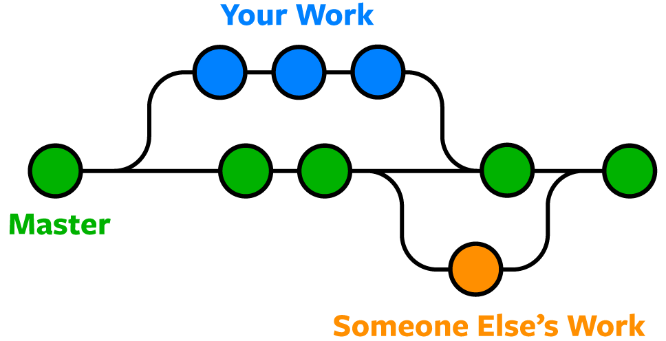

## 创建一个分支（branch）

### 分支命名规范

推荐使用以下分支命名规范，使分支管理更加清晰：

```
feature/xxx    # 新功能分支，例如：feature/user-login
bugfix/xxx     # 修复bug分支，例如：bugfix/login-error
hotfix/xxx     # 紧急修复分支，例如：hotfix/security-patch
release/xxx    # 发布分支，例如：release/v1.0.0
develop        # 开发主分支
master/main    # 生产主分支
```

示例：
- `feature/add-payment-method` - 添加支付方式功能
- `bugfix/fix-null-pointer` - 修复空指针异常
- `hotfix/critical-security-fix` - 紧急安全修复

良好的分支命名有助于团队协作和版本管理。

以IDEA为例，默认情况下，IDE 中显示的是master主线代码，但是随着时间的发展，本地主线代码可能不再是最新的了。

这主要是因为同学下载主线代码后，其他的小伙伴又更新了主线代码。

在创建新的分支的时候，需要先保证自身所拥有的代码为最新。

可以通过pull操作来完成。`pull` = `fetch` + `merge`，即先获取远程更新，然后自动合并到本地分支。在本地代码没有修改的情况下，这是安全的。

如下：

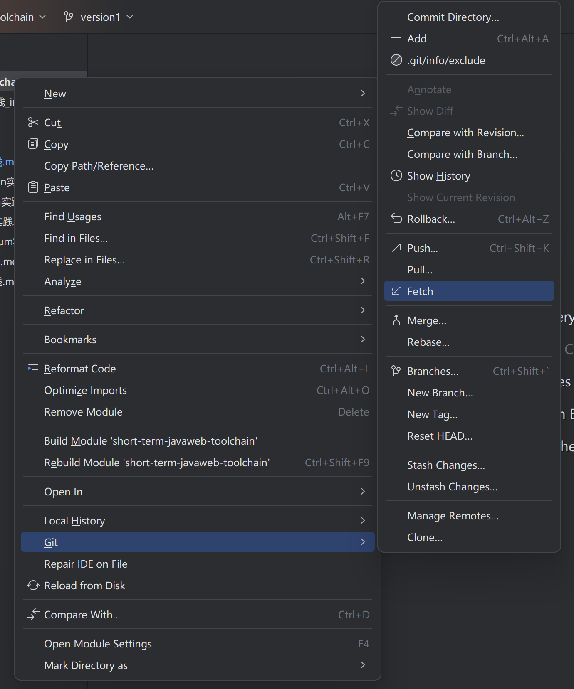

在同步了最新代码后，基于这个版本创建一个新的branch。

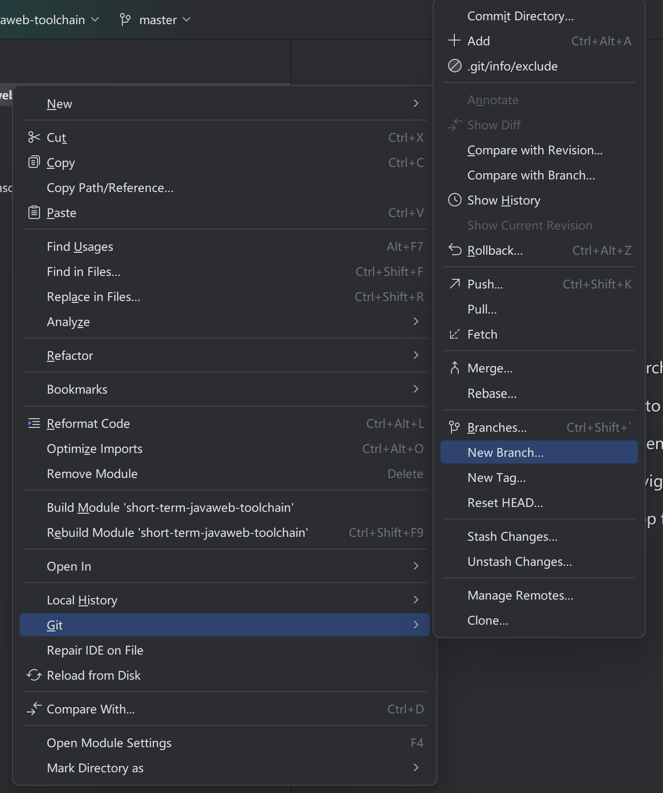

给这个分支一个名字，注意不要和现有的分支名冲突。

注意保持Checkout branch选项为选中，这样在分支创建后，IDE将自动切换到这个分支版本。

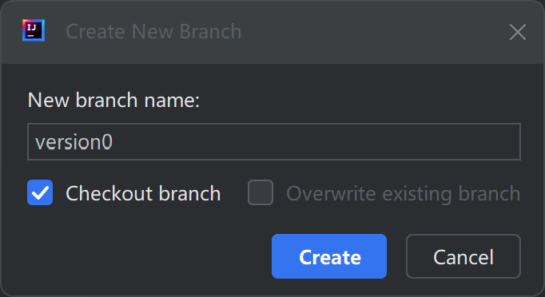

此时，可以看到，当前IDE的代码版本已经切换到了version0分支上。

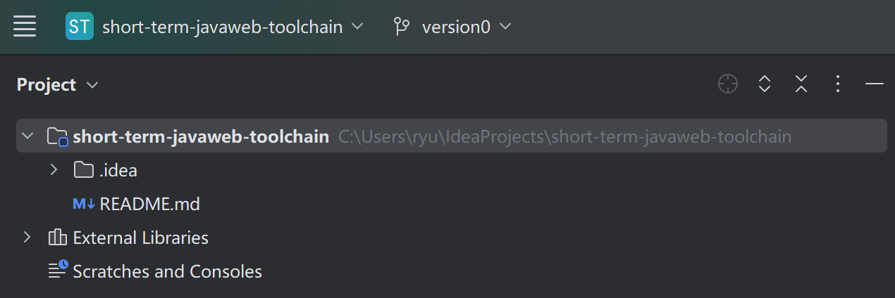

至此，新分支就创建成功了。

## 合并分支

当同学在自己创建的分支完成任务后，那么还有最后一个步骤，就是将这个分支合并回master主线。让同学们的贡献成为软件未来开发的基石。

首先，仍然像往常一样，提交代码到在线仓库，不过这次提交的对象是version0分支，而非master主线。

然后，发起一个`Pull Request（合并请求）`，在Gitee中也称为`Merge Request`，告诉并请求管理者请合并version0的代码到master主线。

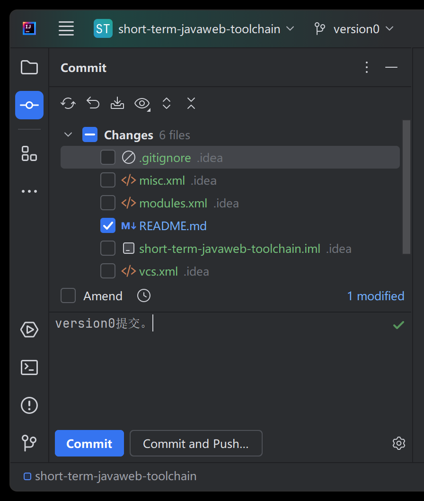

此时，切换到Gitee网站上，可以看到有如下信息：

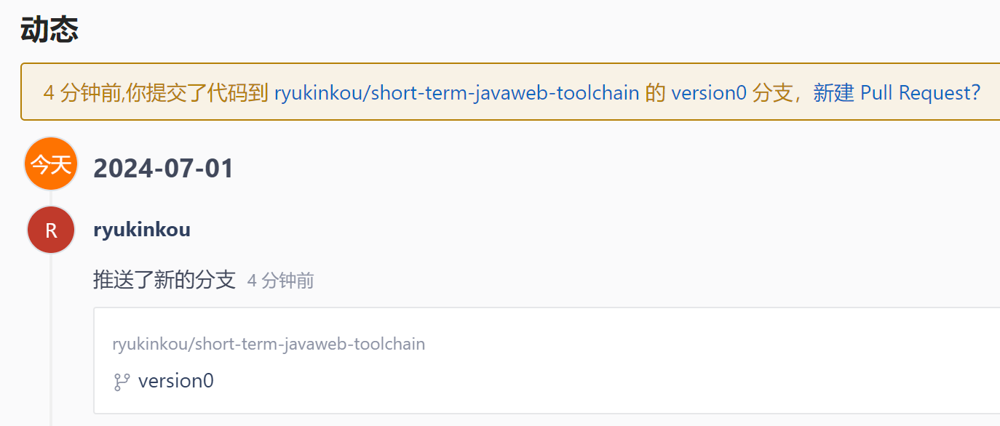

点击`创建 Pull Request（合并请求）`，在接下来的界面中小心检查**源分支与合并分支**，确保没有错误。然后填写相应的描述信息。

最后点击`创建 Pull Request（合并请求）`按钮。

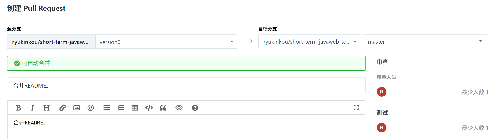

进入审核界面后，需要测试员和审核员分别审核代码，确保代码不会劣化（之前可以正常运行的测试用例，更新后不能运行的情况）。

### 代码审查标准

代码审查是保证代码质量的重要环节，以下是审查清单：

#### 代码质量
- [ ] 代码风格符合项目规范（缩进、命名、注释等）
- [ ] 没有重复代码或冗余代码
- [ ] 代码逻辑清晰，易于理解
- [ ] 没有硬编码的魔法数字或字符串
- [ ] 适当的注释和文档

#### 功能完整性
- [ ] 功能需求完整实现
- [ ] 边界条件得到正确处理
- [ ] 异常情况有适当处理
- [ ] 有相应的测试用例

#### 安全性
- [ ] 没有敏感信息泄露（密码、密钥等）
- [ ] 输入验证和数据清洗
- [ ] 防止SQL注入、XSS等安全漏洞
- [ ] 权限控制合理

#### 兼容性
- [ ] 不破坏现有功能
- [ ] 向后兼容性考虑
- [ ] 数据库变更有迁移脚本

#### 性能
- [ ] 没有明显的性能问题
- [ ] 避免不必要的数据库查询
- [ ] 循环和递归有终止条件

代码审查通过后才能合并到主线。

因为本例中只有一个分支更新了代码，所以不会出现冲突的情况。而且因为本例中开发者只有一名，所以同学需要兼任测试与审核。

审核和测试完成后，点击`合并分支`按钮完成代码合并。

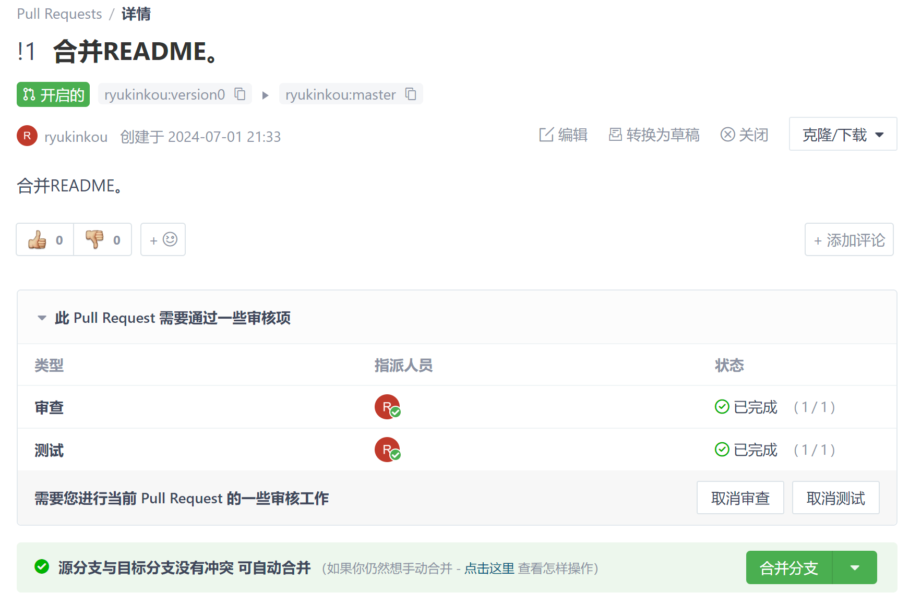

## 冲突消解

在刚才的例子中，本文档描述了一种梦幻般的场景，即只有一名开发者开发，维护代码的情况，这种情况比较少见。

但在更多的场景中，将自己的分支合并到主线中的时候，难免会产生冲突。

因为是多人协作场景，所以同学手中的基于master主线分叉出来的分支很快就会过期，其他协作者可能添加更多内容，甚至编辑同学正在处理的文件。

**当这样的代码尝试合并到master主线的时候，就会产生冲突。**

例如，在创建version0的时候，同时创建了version1分支。

在刚才的version0流程中，同学对 README.md 文件做了修改，并最终将version0分支合并到了master主线中。

此时，version1分支的代码将会开始落后于master主线。

随后，同样修改version1主线中的README.md文件，在其中添加了其他内容。

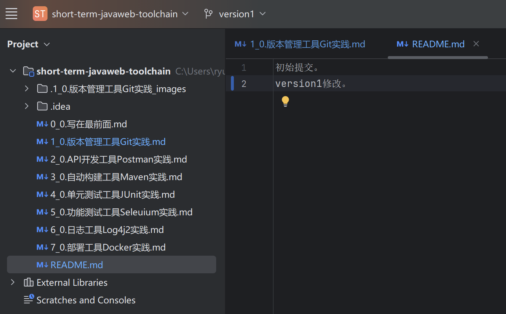

结束后，尝试将version1分支内容合并到master主线中去。这是开发中非常常见的一种场景。

开发中一些共通的函数库、变量库，总是会被不同的开发小组同时修改。

但这样的合并将会产生冲突，这是git为了防止代码劣化的措施。

按照刚才的流程，`Commit & Push` version1的代码到在线仓库。

然后切换到Gitee网站中，创建一个从源分支为`version1`，合并分支为`master`的`Pull Request（合并请求）`。

然后在评审的界面中，可以看到本次合并产生了冲突（注意`存在冲突`红字）。

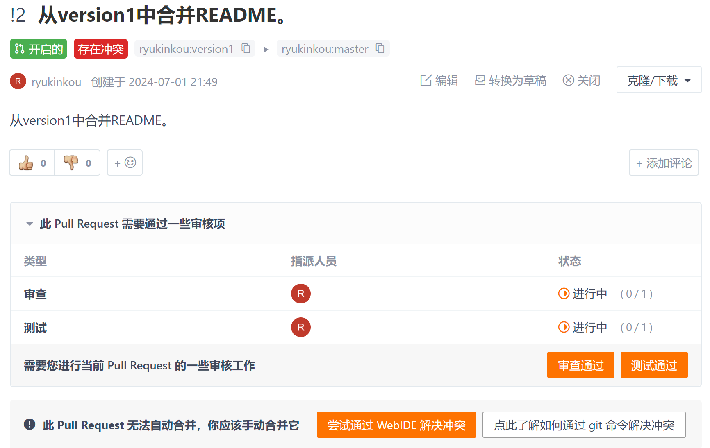

打开 WebIDE，发现README.md文件同时被两个分支所更新。

version0在前，version1在后。符合前面的操作流程。

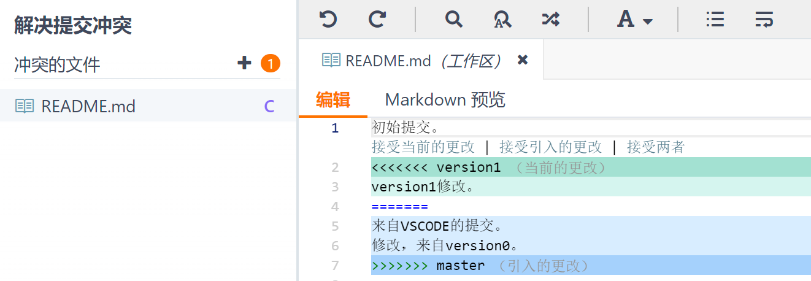

这里有三个选择，接受后来者的更新（当前的更改），不接受后来者的更新（引入的更改），和接受两者的更新。


**通过选择并点击其中一项，即可完成冲突的消解。**

这里选择接受两者更新。然后点击暂存更改。

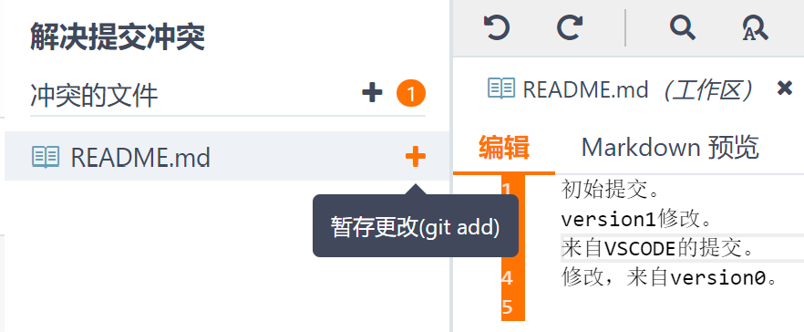

最后点击提交。

这时，回到审核界面，发现存在冲突已经消失，可以正常审核并合并了。

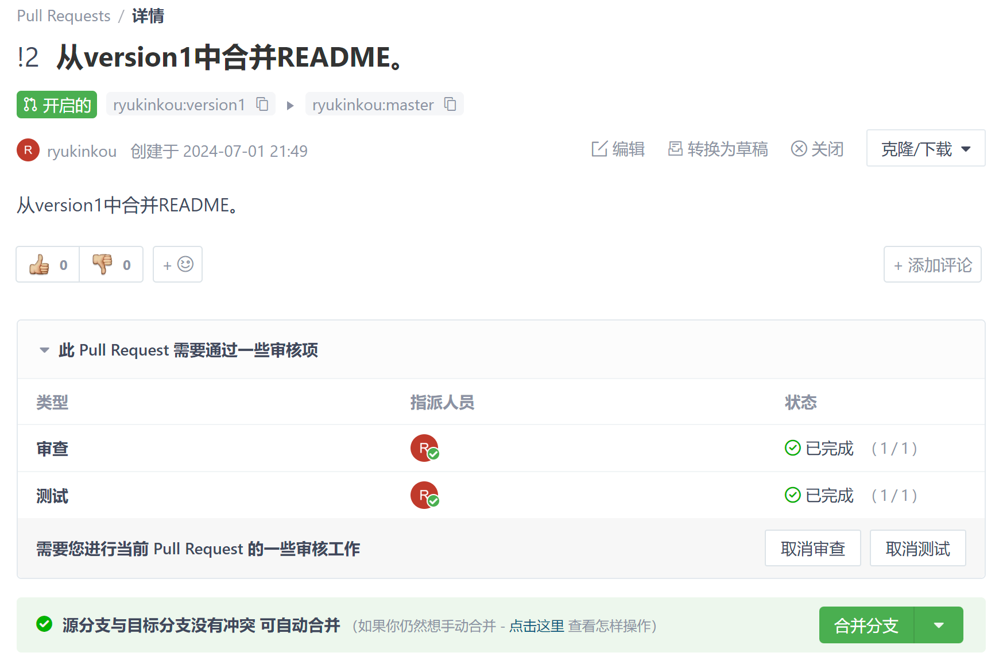

就这样，冲突消解就完成了。

## 分支保护机制

为了防止随意提交到master主线导致代码劣化，可以在 Gitee 中设置分支保护规则。

### 设置分支保护

1. 进入仓库主页，点击 `设置 -> 保护分支`
2. 点击 `添加保护分支`
3. 选择要保护的分支（通常是 `master` 或 `main`）
4. 配置以下规则：

#### 推荐配置
- [ ] **不允许直接推送** - 禁止直接向保护分支推送代码
- [ ] **不允许强制推送** - 禁止使用 `git push --force` 覆盖历史
- [ ] **不允许删除分支** - 防止误删除保护分支
- [ ] **要求合并前通过审核** - 必须至少1人审核通过才能合并
- [ ] **要求流水线通过** - CI/CD流水线必须通过才能合并
- [ ] **限制合并者** - 只有指定成员可以合并到保护分支

### 分支保护的作用

1. **防止代码劣化** - 所有代码必须经过审核才能合并
2. **保证代码质量** - 强制代码审查和测试验证
3. **记录完整历史** - 所有变更都有完整的审核记录
4. **团队协作规范** - 统一的提交流程和标准

设置分支保护后，所有开发者都必须通过分支合并请求的方式将代码合并到保护分支，不能直接推送。

## 最后

通过创建分支并最后合并主线的方式进行代码的版本管理，乍一看比master主线直接提交要复杂和难以理解的多。

但它却最大程度的保证了提交代码的严肃性，确保了代码审核过程的刚性执行，防止了随意提交导致的代码劣化情况发生。

在训练有素的程序员中，开发者既不想随意提交代码到master导致master主线被劣化或污染，也不想个人功能模块被别人随意提交的master代码所劣化感染导致测试用例失效。

所以在修改代码时，创建一个仅属于自己的分支，在自己的分支上尽情的修改、发挥，把代码合并的流程交给代码审核者，完全不需要考虑上述的情景会发生。

这就是分支管理的魅力所在。

---

## ❓ 常见问题 FAQ

### 环境配置相关

#### Q1: Git安装失败怎么办？
**A:** 
- 检查系统要求：Windows 10/11
- 确认下载的是Windows版本安装包
- 查看Git官方文档：https://git-scm.com/
- 检查是否有杀毒软件阻止安装

#### Q2: Git基础配置后不生效？
**A:**
- 检查配置是否正确：`git config --list`
- 确认使用了--global参数（全局配置）
- 尝试重新配置：`git config --global user.name "你的姓名"`
- 重启终端或IDE

#### Q3: SSH密钥生成失败？
**A:**
- 检查是否已有SSH密钥：`ls ~/.ssh/`
- 使用ed25519算法：`ssh-keygen -t ed25519 -C "你的邮箱"`
- 一路回车使用默认设置
- 检查.ssh目录权限

---

### Git操作相关

#### Q4: Git克隆仓库失败？
**A:**
- 确认使用正确的SSH地址（git@gitee.com:...）
- 检查SSH密钥是否正确配置
- 尝试使用HTTPS地址克隆
- 检查网络连接是否稳定
- 测试SSH连接：`ssh -T git@gitee.com`

#### Q5: Git提交时出现身份验证错误？
**A:**
- 确认已配置user.name和user.email：`git config --list`
- 检查SSH密钥是否正确添加到Gitee
- 尝试重新测试SSH连接：`ssh -T git@gitee.com`
- 确认使用的是SSH地址而不是HTTPS地址

#### Q6: Git推送失败？
**A:**
- 检查是否有提交权限
- 确认远程仓库地址正确：`git remote -v`
- 先拉取远程更新再推送：`git pull origin master`
- 检查网络连接是否正常
- 确认分支名称正确

#### Q7: Git拉取时出现冲突？
**A:**
- 先查看状态：`git status`
- 查看冲突文件，寻找 `<<<<<<<`、`=======`、`>>>>>>>` 标记
- 手动编辑冲突文件，保留需要的内容
- 添加修改后的文件：`git add <文件名>`
- 完成合并：`git commit`

---

### 分支管理相关

#### Q8: 如何查看所有分支？
**A:**
- 查看本地分支：`git branch`
- 查看所有分支（本地+远程）：`git branch -a`
- 查看分支详情：`git branch -v`

#### Q9: 如何切换分支？
**A:**
- 切换到已存在的分支：`git checkout <分支名>`
- 创建并切换到新分支：`git checkout -b <新分支名>`
- 查看当前分支：`git branch`（当前分支前面有*号）

#### Q10: 如何删除分支？
**A:**
- 删除已合并的本地分支：`git branch -d <分支名>`
- 强制删除未合并的分支：`git branch -D <分支名>`
- 删除远程分支：`git push origin --delete <分支名>`

#### Q11: 分支合并时出现冲突？
**A:**
- 先查看状态：`git status`
- 打开冲突文件，寻找冲突标记
- 手动编辑文件，选择保留的内容
- 添加解决冲突后的文件：`git add <文件名>`
- 完成合并：`git commit`
- 或者使用图形化工具解决冲突

---

### IDE集成相关

#### Q12: IDEA中Git配置失败？
**A:**
- 确认Git已正确安装：`git --version`
- 在IDEA中设置Git路径：`File -> Settings -> Version Control -> Git`
- 点击Test按钮测试Git是否可用
- 重启IDEA

#### Q13: VSCode中Git不显示？
**A:**
- 确认在Git仓库目录中打开项目
- 检查左侧源代码管理面板（第三个图标）
- 尝试初始化Git仓库：`git init`
- 重启VSCode

#### Q14: IDE中提交后没有推送到远程？
**A:**
- 检查是否只做了Commit没有Push
- IDEA：点击提交后选择"Commit and Push"
- VSCode：提交后点击同步按钮
- 或者在命令行手动推送：`git push origin <分支名>`

---

### Gitee平台相关

#### Q15: Gitee账号无法注册？
**A:**
- 检查网络连接
- 确认邮箱格式正确
- 检查用户名是否已被占用
- 尝试使用手机号码注册
- 查看Gitee帮助文档

#### Q16: SSH公钥添加后无法使用？
**A:**
- 确认公钥内容完整复制（从ssh-ed25519开始）
- 测试SSH连接：`ssh -T git@gitee.com`
- 检查私钥权限：`chmod 600 ~/.ssh/id_ed25519`
- 尝试重新生成SSH密钥

#### Q17: Pull Request创建失败？
**A:**
- 确认源分支和目标分支选择正确
- 检查分支是否有新的提交
- 确认仓库权限足够
- 尝试刷新页面重新创建
- 查看Gitee帮助文档

#### Q18: 代码审查如何进行？
**A:**
- 在PR页面查看变更内容
- 逐行审查代码，添加评论
- 检查代码是否符合规范
- 运行测试验证功能
- 批准或请求修改

---

### Git提交相关

#### Q19: Git提交信息怎么写？
**A:**
- 使用约定式提交规范：`<类型>: <描述>`
- 常用类型：feat(新功能)、fix(修复)、docs(文档)、style(格式)、refactor(重构)、test(测试)、chore(构建)
- 示例：`feat: 添加用户登录功能`、`fix: 修复登录错误`
- 用中文或英文都可以，保持一致即可
- 提交信息要简洁明了

### 扩展学习相关

#### Q20: 想深入学习，有什么推荐资源？
**A:**
- Git官方文档：https://git-scm.com/doc
- Pro Git书籍：https://git-scm.com/book/zh/v2
- Gitee帮助文档：https://help.gitee.com/
- Git相关书籍：《Git权威指南》、《精通Git》
- 在线课程：Git入门与实战

#### Q21: 可以尝试其他Git平台吗？
**A:**
- 可以。除了Gitee，还有很多选择
- 推荐尝试：GitHub、GitLab、Bitbucket等
- 对比不同平台的特点和优势
- 记录不同平台的使用体验和差异
- 注意平台功能可能有所不同

---
