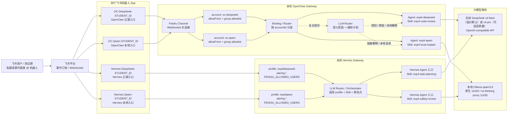
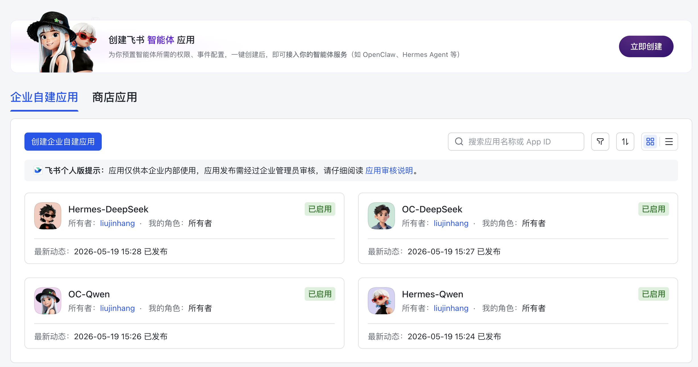
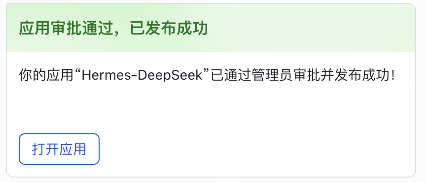
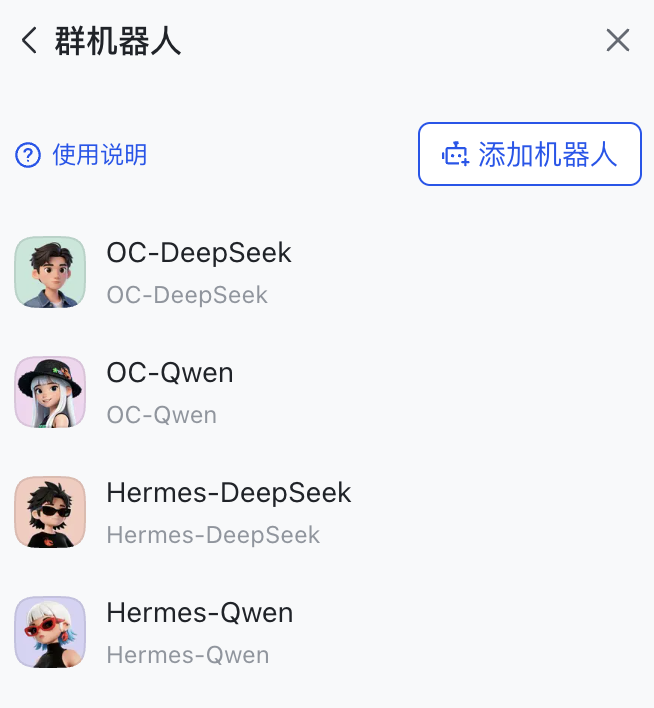
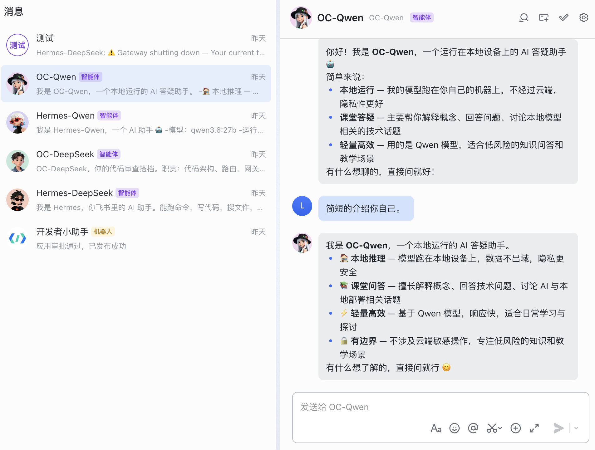

# 4. AgentOps 工业实战：多模型智能体网关部署 - 实验手册

## 实验主题

本实验围绕“多模型智能体网关如何在真实工程环境中运行”展开。前序实验已经让同学们体验了本地模型、MCP 风格工具抽象和 RAG 知识增强，本实验进一步把这些能力放到一个可运维的 AgentOps 网关中：通过 OpenClaw 与 Hermes Agent 两个框架，将云端模型、本地模型、消息通道、路由规则和配置文件组织为可验证、可对比的工程链路。

在进入 OpenClaw 配置之前，先补上一层直觉：什么是**多智能体**。在最简单的 Agent 应用中，系统通常只有一个 Agent，它接收用户问题，调用一个模型，必要时使用少量工具，然后直接给出回答。多智能体系统则不是把同一个 Agent 复制几份，而是把一个复杂任务拆给多个职责不同的 Agent：例如一个 Agent 负责写代码，一个 Agent 负责审查代码，一个 Agent 负责运行测试；或者一个 Agent 负责检索资料，一个 Agent 负责综合回答，一个 Agent 负责安全审核。每个 Agent 都有自己的任务边界、提示词、模型选择、工具权限和输出契约，系统再通过 Router、状态机或工作流把它们组织起来。

什么时候需要多智能体？可以先用一个朴素判断：**当一个任务已经超出“一个角色一次性回答”的能力边界时，才值得拆成多个 Agent**。常见场景包括：

- 任务需要多个专业角色协作，例如“需求分析 -> 代码生成 -> 测试 -> 审查 -> 修复”。
- 不同子任务适合不同模型，例如代码任务走更强的云端模型，普通问答走成本更低的本地模型。
- 不同子任务需要不同权限，例如资料检索 Agent 可以读知识库，但回复 Agent 不应直接访问敏感配置。
- 系统需要互相校验，例如生成 Agent 给出答案后，再由评估 Agent 检查格式、事实依据和安全风险。
- 任务链路较长，需要明确状态、重试、日志和责任边界，例如后续多 Agent 工作流编排实验。

也不是所有任务都应该拆成多智能体。如果任务很短、角色边界不清楚、上下文来回传递成本过高，或者只是把同一个提示词换几个名字重复调用，那么多智能体反而会增加复杂度、延迟和排错难度。本章要搭建的多模型智能体网关，正是为后续多智能体协作打基础：它先解决“多个 Agent 如何接入不同模型、从不同通道接收消息、按规则分发请求、留下可复盘日志”的工程问题。

本实验不把 OpenClaw 或 Hermes 当作“聊天机器人安装教程”，而是把它们作为 AgentOps 工程样例来观察：

```text
用户消息 -> Channel -> Router / LLM Router -> Agent 编排 -> Provider -> Model
                                      ↓
                              配置文件、日志、审计与复盘
```

同学们需要完成的核心事情不是“点通某个平台”，而是理解一个企业级 Agent 系统如何把模型来源、消息入口、能力边界、路由策略、任务编排和运行日志落到可复制、可检查、可迁移的工程对象中。

## 前后课程关系

第 2 章已经让同学们从传统 SaaS 过渡到 AI Agent，理解模型调用、工具抽象和 MCP 风格能力描述。第 3 章进一步讨论 RAG 如何接入外部资料，并强调引用来源、权限过滤和拒答边界。

本章位于“能构建 Agent 能力”和“能运维 Agent 系统”之间，重点补上 AgentOps 的系统视角。本章要求同学们实践两个框架：OpenClaw 用于观察传统多模型网关、飞书通道和前缀路由；Hermes Agent 用于观察新一代 Agent 框架中的模型切换、Gateway、记忆/Skill、子 Agent 与安全审批机制。

在系统对象上，可以先把两者放进同一张 AgentOps 图中：

- Provider 负责描述模型服务来源，例如火山引擎、OpenAI 兼容接口或 Ollama。
- Agent 负责绑定模型、系统提示词、能力和运行参数。
- Channel 负责接收外部消息，例如飞书 WebSocket。
- Router 负责把不同消息分发给不同 Agent；复杂场景中还要决定多个 Agent 的执行顺序、并行关系和交接方式。
- 配置文件和日志负责让系统可复现、可审计、可排错。

飞书在本章中不是附属聊天工具，而是外部消息入口和权限控制面。它让同学们能在企业 IM 场景中观察四件事：消息事件如何进入本机 Gateway，机器人身份如何映射到不同 Agent，平台权限如何约束私聊、群聊和回复能力，以及网关日志如何证明一次端到端调用真实发生。

后续第 5 章会专门讨论 Skill 如何沉淀可复用能力，第 6 章会讨论提示词版本和评估，第 7 章会讨论 Harness 如何守住工具调用的安全边界。因此，本章只要求同学们为四个 Agent/入口创建轻量角色 Skill，用它们标清职责边界；复杂工具实现、外部 MCP 服务和安全执行 Harness 留到后续章节展开。

## 核心概念与系统定位

进入配置之前，先把本实验中的几个对象放在一张表里。后续每一步操作都应能对应到表中的一个或多个对象。


| 对象           | 系统定位                         | 本实验中的观察方式                                                                                                                                         |
| :--------------- | :--------------------------------- | :----------------------------------------------------------------------------------------------------------------------------------------------------------- |
| Framework      | 承载 AgentOps 能力的框架或运行时 | OpenClaw、Hermes Agent                                                                                                                                     |
| Provider       | 模型服务来源和鉴权配置           | DeepSeek 或课堂云端 Provider、本地 Ollama Provider                                                                                                         |
| Agent          | 面向任务的智能体实例             | OpenClaw:`exp4-deepseek`、`exp4-qwen`；Hermes: `hermes-exp4-deepseek`、`hermes-exp4-qwen`                                                                  |
| Channel        | 外部消息进入网关的通道           | OpenClaw 飞书 WebSocket Channel、Hermes 飞书 Gateway                                                                                                       |
| Router         | 消息分发与任务编排规则           | OpenClaw 中可用`/code`、`/chat` 前缀或飞书 account binding 分流；Hermes 中用不同 profile Gateway 固定不同入口；LLM Router 可根据语义意图生成结构化编排计划 |
| Skill          | 面向 Agent 的能力说明            | 四个 Agent/入口必须各自绑定不同 Skill：代码审查、课堂解释、任务规划、安全复核                                                                              |
| MCP            | 工具协议和能力接口               | 本章只观察工具/能力字段，后续结合工具实验理解                                                                                                              |
| Config as Code | 用文件表达系统配置               | `openclaw.json`、`config.yaml` 或等价配置                                                                                                                  |
| Log            | 运行过程证据                     | 网关启动、Channel 连接、路由命中、模型调用失败原因                                                                                                         |

本章的工程目标可以概括为：

```text
先用最小配置启动两个框架
    -> OpenClaw 接入 DeepSeek 低价在线模型与 qwen 两个 Agent
    -> Hermes 接入 DeepSeek 低价在线模型与 qwen 两个 profile/入口
    -> 为四个 Agent/入口分别创建不同飞书机器人、角色和 Skill
    -> OpenClaw 用 account Binding 或规则 Router 完成分流
    -> 在两个 Gateway 中观察 LLM Router 如何把一条指令编排给多个 Agent
    -> Hermes 用 profile Gateway 完成对照验收
    -> 回到配置文件和日志中复盘系统结构
```

### 路由、编排与 LLM Router

在多智能体系统里，Router 不只是“把 `/code` 发给代码 Agent、把 `/chat` 发给聊天 Agent”。当用户发来的是一个复合指令时，例如“请设计一个飞书接入方案，检查权限风险，并给出本地模型兜底策略”，系统需要先判断任务类型，再决定哪些 Agent 参与、谁先执行、谁复核、最终由谁汇总。这一层就是任务编排。

本章把路由分成三层理解：


| 路由层次   | 决策依据                                       | 典型做法                               | 适合场景                                      |
| :----------- | :----------------------------------------------- | :--------------------------------------- | :---------------------------------------------- |
| 规则路由   | 前缀、机器人 account、用户、群组、固定命令     | `/code`、`/chat`、飞书 account binding | 验收稳定、成本低、可解释性强                  |
| LLM Router | 用户自然语言意图、任务复杂度、风险级别、上下文 | 让一个小模型或强模型输出结构化路由计划 | 用户不写前缀、任务语义复杂、需要多 Agent 协作 |
| 工作流编排 | 任务状态、依赖关系、失败重试、人工审批         | 串行、并行、fan-out/fan-in、复核后汇总 | 长链路任务、需要审计和回滚的工程场景          |

LLM Router 是一个“路由判断模型”或“路由 Agent”。它不直接完成全部任务，而是读入用户指令，输出一个结构化计划：应该调用哪些 Agent、调用顺序是什么、是否需要安全复核、置信度是多少、低置信度时是否反问用户。LLM Router 的输出必须尽量结构化，不能只是一段自然语言建议，否则 Gateway 很难稳定执行。

本章建议使用下面的结构化输出契约。结构化契约是 Router 与后续执行环节之间的接口约定：它规定 LLM Router 必须输出哪些字段、每个字段表示什么、哪些场景需要安全复核、低置信度时如何处理。这个 JSON 片段用于写入 `notes/llm_router_policy.md`，不要求直接作为框架配置；它定义的是一次路由计划的基本形状，包括任务意图、置信度、执行方式、参与 Agent、最终汇总者、安全门禁和兜底策略。`_comment` 字段是教学注释，真实系统中应使用 schema、Pydantic、Zod 或等价结构校验。

```json
{
  "_comment": "用途：定义 LLM Router 的结构化输出。真实系统中应删除 _comment，并使用 JSON Schema 或类型系统校验。",
  "route_id": "exp4-router-demo",
  "intent": "agentops_feishu_gateway_design",
  "confidence": 0.82,
  "execution_mode": "sequential_then_review",
  "agents": [
    {
      "_comment": "第一步由云端规划 Agent 拆解任务和列出操作顺序。",
      "agent": "hermes-exp4-deepseek",
      "role": "task_planning",
      "input": "设计飞书接入、Gateway 路由和验收步骤"
    },
    {
      "_comment": "第二步由本地安全复核 Agent 检查权限、日志和隐私风险。",
      "agent": "hermes-exp4-qwen",
      "role": "safety_review",
      "input": "检查权限最小化、日志脱敏和本地模型边界"
    },
    {
      "_comment": "第三步由云端代码审查 Agent 复核配置片段和命令可执行性。",
      "agent": "exp4-deepseek",
      "role": "code_review",
      "input": "复核 OpenClaw/Hermes 配置片段、命令和验证证据"
    }
  ],
  "final_responder": "hermes-exp4-deepseek",
  "safety_gate": {
    "_comment": "如果包含密钥、群聊标识或高权限操作，必须先进入安全复核。",
    "requires_review": true,
    "review_agent": "hermes-exp4-qwen"
  },
  "fallback": {
    "_comment": "低置信度时不要硬路由，应让 Gateway 或 Router 反问用户。",
    "when_confidence_below": 0.65,
    "action": "ask_clarifying_question"
  }
}
```

读这段契约时要注意：规则路由解决“稳定分发”，LLM Router 解决“语义判断”，工作流编排解决“多个 Agent 如何接力”。OpenClaw 更适合观察显式 Channel、Binding、Router 和 Agent 的边界；Hermes 更适合观察 profile、长期记忆、Skill、安全审批和子 Agent 式协作。两个 Gateway 都要能回答同一个问题：当一条指令进入系统时，系统凭什么决定谁来做、谁来复核、谁来汇总。

真实工程中，规则路由和 LLM Router 通常需要配合使用。规则路由负责不可变的安全边界，例如“这个飞书机器人只进入这个 Agent”“这个群不在白名单就拒绝”“高权限命令必须审批”；LLM Router 负责处理用户自然语言中的意图差异，例如判断任务是配置检查、权限复核还是最终汇总。换句话说，LLM Router 可以建议调度计划，但不能绕过规则路由、权限校验和审计日志。

### 本章学习梯度

本章内容较多，建议按“从对象到链路”的顺序推进，不要一开始就陷入配置文件。第一步先理解 Provider、Agent、Channel、Gateway、Router、Skill 和 Log 各自解决什么问题；第二步建立身份边界，区分飞书中看得见的机器人名称、框架内部的 Agent/Profile ID、以及 App ID/App Secret/open_id/chat_id 这类平台标识；第三步分别验证云端模型和本地模型；第四步把飞书作为外部消息入口接进两个 Gateway；第五步观察规则 Router 与 LLM Router 如何把请求交给不同智能体；最后再用四智能体案例复盘协作、日志和风险。

后文所有飞书机器人命名都遵循同一个规则：**飞书后台应用名称、机器人显示名称、群机器人列表中显示的名称，都必须包含本人完整学号**。例如学号为 `2024123456` 时，四个机器人应命名为 `OC-DeepSeek-2024123456`、`OC-Qwen-2024123456`、`Hermes-DeepSeek-2024123456`、`Hermes-Qwen-2024123456`。框架内部的 `exp4-deepseek`、`exp4-qwen`、`exp4deepseek`、`exp4qwen`、`oc-deepseek`、`oc-qwen` 是便于命令、日志和配置稳定的内部 ID，不要求带学号；但只要出现在飞书界面中给人看的名称，就必须带学号，避免多个同学的机器人在同一企业或测试群中重名。

### 贯穿案例：实验4作业初筛与风险检查助手

为了让四个智能体不是“各自聊天”，本章设计一个贯穿案例：**实验4作业初筛与风险检查助手**。它模拟授课老师收到一组实验4提交材料后，要求 AgentOps 系统先做一次机器初筛，判断提交材料是否证明了 OpenClaw 与 Hermes 双 Gateway、四个飞书机器人、DeepSeek 与本地 Qwen、qwen no-thinking、Router/LLM Router、权限设置和脱敏处理均已完成。

这里的风险检查不是给作业打分，而是提前发现 AgentOps 实践中容易造成失控或无法复现的问题，例如凭证是否出现在截图或日志中、飞书权限是否过大、四个机器人是否共用同一 App 导致双响应、群消息是否被过度开放、配置片段是否无法重建、云端模型调用是否缺少费用控制。本章要求智能体把这些问题标成“缺失证据、权限风险、脱敏风险、运行风险或成本风险”，供授课老师最终验收时参考。

这个案例的目标交付物是 `实验4作业初筛报告.md`。报告不代替授课老师评分，只用于把明显缺失项、风险项和需要补交的证据提前标出来。最终报告建议包含以下部分：

- 提交完整性。
- OpenClaw 与 Hermes 双 Gateway 检查。
- 四机器人与飞书接入检查。
- 本地 Qwen 与 no-thinking 检查。
- Router、LLM Router 与任务编排证据。
- 安全与隐私风险。
- 需要补交或修改的问题。
- 授课老师验收摘要。

四个智能体不是都接在 Hermes 上。标准实践是“双 Gateway、四智能体、人工回放式编排”：

表中的智能体入口名称是本章建议命名，不是框架强制值。同学们可以按本机框架约束自定义名称，但实践记录中必须保持同一套命名贯穿飞书机器人、Agent/Profile、日志和配置快照。Skill 来源有两类：一类是本实验创建的轻量 `SKILL.md`，用于说明角色职责、输入边界和输出要求；另一类是框架或课程后续章节沉淀的正式 Skill。本章只要求使用轻量 Skill 标清职责，不要求实现复杂工具能力。


| 智能体入口             | 所属框架 | 模型                                                 | 角色                             | Skill                | 在案例中的职责                                                     |
| :----------------------- | :--------- | :----------------------------------------------------- | :--------------------------------- | :--------------------- | :------------------------------------------------------------------- |
| `hermes-exp4-deepseek` | Hermes   | DeepSeek v4-flash（低价默认）或 v4-pro（可选高质量） | 项目经理、LLM Router、最终汇总者 | `exp4-task-planning` | 理解授课老师指令，输出结构化编排计划，最后汇总初筛报告             |
| `exp4-deepseek`        | OpenClaw | DeepSeek v4-flash（低价默认）或 v4-pro（可选高质量） | 工程配置审查员                   | `exp4-code-review`   | 检查 Provider、Agent、Channel、Gateway、Router、配置文件和日志证据 |
| `exp4-qwen`            | OpenClaw | 本地 qwen3.6                                         | 本地模型说明员、学生反馈生成员   | `exp4-local-explain` | 用本地模型生成面向同学的补交反馈，并验证 no-thinking 输出          |
| `hermes-exp4-qwen`     | Hermes   | 本地 qwen3.6                                         | 安全与隐私复核员                 | `exp4-safety-review` | 检查飞书权限、pairing/allowlist、群消息范围、日志和截图脱敏        |

一次完整协作可以按下面顺序理解：

1. 授课老师在飞书或 CLI 中提出复合指令：“请检查这份实验4提交材料，判断四机器人、双 Gateway、Router、no-thinking 和脱敏证据是否完整，并给出初筛报告。”
2. `hermes-exp4-deepseek` 先作为 LLM Router 输出结构化计划，决定哪些智能体参与、顺序如何、安全复核由谁完成、最后谁汇总。
3. `exp4-deepseek` 按计划检查 OpenClaw/Hermes 配置、命令、日志和 Gateway 证据。
4. `exp4-qwen` 用本地 no-thinking 模型生成学生可读的补交反馈，观察本地模型延迟和输出风格。
5. `hermes-exp4-qwen` 复核权限、群消息范围、pairing/allowlist、截图和日志脱敏。
6. `hermes-exp4-deepseek` 收回三个结果，生成最终 `实验4作业初筛报告.md`。

这个案例故意采用“人工回放式编排”：LLM Router 先输出计划，同学不让系统自动执行所有步骤，而是按计划逐个调用四个入口、记录输出、再把结果交回最终汇总者。这样做的好处是可观察、可审计、便于课堂验收；后续章节再讨论如何把这类计划接入自动状态机或工作流引擎。

## 实验目标

完成本实验后，同学们应能够：

1. 说明 AgentOps 网关在多模型、多通道、多 Agent 系统中的作用。
2. 区分 Provider、Agent、Channel、Router、Skill、MCP 的职责边界。
3. 使用 OpenClaw 完成基础安装、版本检查、健康检查、`OC-DeepSeek-<STUDENT_ID>` 与 `OC-Qwen-<STUDENT_ID>` 的端到端链路。
4. 接入 DeepSeek v4-flash（低价默认）、DeepSeek v4-pro（可选高质量）或课堂指定云端模型 Provider，并验证云端 Agent 能被调用。
5. 为 OpenClaw 与 Hermes 全新接入四个飞书机器人，理解最小权限、凭证保护和双响应风险。
6. 接入一个本地 Ollama qwen3.6 模型 Agent，观察本地模型在隐私、成本和性能上的差异。
7. 在 OpenClaw 中配置 `exp4-deepseek` 与 `exp4-qwen` 两个 Agent，并分别赋予不同角色、Skill 和飞书机器人。
8. 在 Hermes 中配置 `hermes-exp4-deepseek` 与 `hermes-exp4-qwen` 两个 Agent 入口，并分别赋予不同 profile、Skill 和飞书机器人。
9. 解释规则 Router、LLM Router 和工作流编排的区别，并能用结构化计划说明一条指令如何触发多个 Agent 协作。
10. 对比 OpenClaw 与 Hermes 在安装体验、通道能力、模型切换、Skill/记忆、安全控制、运维复杂度和课堂适配性上的优缺点。
11. 找到两个框架的配置文件和关键日志，能用配置文件解释系统实际运行结构。
12. 识别凭证泄露、权限过大、路由误配、日志暴露、云端费用误用等 AgentOps 风险。

## 课程概览

本实验建议安排 240 分钟。


| 时间段       | 教学环节                                            | 核心目标                                                                                              | 关键技术栈                           |
| :------------- | :---------------------------------------------------- | :------------------------------------------------------------------------------------------------------ | :------------------------------------- |
| **0-20'**    | **阶段一：AgentOps 网关概念导入**                   | 建立 Provider、Agent、Channel、Router 的系统图                                                        | AgentOps, Gateway                    |
| **20-45'**   | **环境准备与验证**                                  | 安装 OpenClaw 与 Hermes，确认 CLI、配置路径和网关状态                                                 | OpenClaw, Hermes, CLI                |
| **45-65'**   | **阶段二：OpenClaw 网关启动与健康检查**             | 启动本地网关，观察端口、日志和健康接口                                                                | OpenClaw Gateway, Log                |
| **65-95'**   | **阶段三：云端 Provider 与 Agent 接入**             | 配置 DeepSeek v4-flash（低价默认）、DeepSeek v4-pro（可选高质量）或课堂指定云端模型，完成一次云端调用 | DeepSeek/OpenAI-compatible, Provider |
| **95-120'**  | **阶段四：飞书 Channel/Gateway 与最小权限**         | 创建四个飞书自建应用，接入 OpenClaw Channel 与 Hermes Gateway                                         | Feishu, WebSocket, OAuth             |
| **120-145'** | **阶段五：本地 Ollama Agent 接入**                  | 配置 qwen3.6 或课堂指定本地模型 Agent，完成离线或半离线调用验证                                       | Ollama, Local Model                  |
| **145-170'** | **阶段六：Router、LLM Router 与端到端验收**         | 通过规则路由完成双 Agent 分发，并用 LLM Router 观察复合指令编排                                       | Router, LLM Router, E2E Test         |
| **170-205'** | **阶段七：Hermes 双模型 Agent 与飞书 Gateway 实践** | 完成 Hermes DeepSeek/Qwen 双入口、CLI 对话、飞书 Gateway 和编排观察                                   | Hermes, Gateway, Feishu, Skill       |
| **205-230'** | **阶段八：双框架配置落盘与优缺点对比**              | 对比 OpenClaw 与 Hermes 的配置、通道、模型、记忆和安全机制                                            | Config as Code, Comparison           |
| **230-240'** | **阶段九：AgentOps 风险分析与自检**                 | 完成风险清单和实验自检                                                                                | Observability, Risk Review           |

## 实验安全注意事项

1. DeepSeek、火山引擎或其他云端模型 API Key、飞书 App Secret、Hermes Gateway 凭证、访问 Token、Endpoint、企业内部群聊信息均属于敏感信息。真实值从对应控制台或平台日志获取后写入本机 `.env`、系统环境变量或框架密钥配置；共享模板和课堂记录使用占位符。
2. 配置文件如果包含密钥，共享片段统一使用占位符。云端模型 Key 从对应模型服务控制台获取，飞书 App Secret 从飞书开放平台“凭证与基础信息”页获取，Endpoint 或模型名从所选模型服务文档或控制台获取。
3. 飞书机器人只授予实验需要的最小权限。不要授予通讯录全量读取、群成员批量管理、文件读写等与本实验无关的权限。
4. 本实验使用测试群、测试消息和课堂指定账号，不要发送真实隐私、企业内部资料、个人身份证件、支付信息或未公开代码。
5. 若使用云端模型，注意区分订阅套餐接口与按量计费接口。错误的 Base URL 或模型名称可能导致额外费用。
6. 本地模型验证可以关闭网络观察行为，但不要关闭防火墙、杀毒软件或系统安全策略来“强行跑通”。
7. 日志中可能包含消息正文、用户标识和错误详情。截图前应检查是否需要打码。
8. 所有配置变更都应能回滚。实验结束后，建议重置临时 API Key、删除测试机器人或撤销不再需要的权限。

## 代码与配置片段阅读约定

本章的代码块和配置片段都服务于教学复现，不是要求同学们不加判断地整段复制。阅读时请先确认三件事：这个片段要放在哪里、它创建或修改什么对象、执行后应该观察到什么结果。

- 本实验所需资源、命令、模板和检查点均以本文档为准。
- 如果本文档中的命令与本机版本不一致，先记录实际报错和版本号，再与授课老师沟通确认替代路线。
- `bash`、`powershell` 代码块通常是终端命令；代码中的注释说明命令目的、风险点和验证点。
- `javascript`、`xml` 片段只在 no-thinking proxy 等辅助实践中出现；注释会标出核心逻辑、启动方式和需要替换的本机路径。
- `json` 片段用于解释 OpenClaw、Provider、Channel 或占位符快照结构。JSON 标准不允许 `#` 注释，因此手册用 `_comment` 字段表达教学注释；复制到真实配置前，应先删除 `_comment` 字段，除非本机版本明确支持额外字段。
- `yaml`、`toml`、`env` 类片段可以用 `#` 注释；注释用于说明字段用途、安全边界和是否需要替换为本机真实值。
- `text`、`markdown`、`mermaid` 片段是观察记录模板、消息模板或系统关系图；它们的用途会在片段前后说明。

所有真实配置文件都应先备份再修改。共享材料中只保留占位符片段和关键字段说明，不放入 API Key、App Secret、用户 `open_id`、群 `chat_id` 或完整原始日志。

本章凡是出现配置文件片段，都遵循三条要求：

1. 片段前说明它要放在哪个文件、适用于哪个运行环境、修改后需要如何重启或验证。
2. 片段可以作为模板复制；需要人工替换的位置统一使用 `<PLACEHOLDER>`，并在片段内或片段前说明到哪里获取，例如飞书开发者后台、飞书消息日志、`ollama list`、`whoami` 或 `pwd`。
3. YAML、TOML、XML、shell 片段用 `#` 或原生注释逐行说明关键字段；JSON 标准不支持注释，因此使用 `_comment` 字段解释相邻字段，复制到真实配置前应删除 `_comment`。

## 配置路线选择原则

本章按配置对象选择合适的落点。工业实践更看重**事实来源清楚、变更可审计、密钥不外泄、重启后可复现**：平台侧权限在平台后台配置，模型和 profile 尽量用框架正式 CLI 写入，批量路由和多账号绑定适合用结构化配置文件表达，凭证放在本机 `.env` 或密钥管理系统，临时验证再使用命令行。

推荐选择如下：


| 配置对象                              | 推荐落点                                              | 原因                                                             | 验证方式                                               |
| :-------------------------------------- | :------------------------------------------------------ | :----------------------------------------------------------------- | :------------------------------------------------------- |
| 飞书应用、机器人能力、权限、版本发布  | 飞书开放平台后台                                      | 这是飞书的控制平面，本机配置无法替代平台授权和发布               | 飞书后台状态、网关日志、消息回执                       |
| API Key、App Secret、用户`open_id`    | 本机`.env`、系统环境变量或密钥管理服务                | 凭证不应进入仓库、截图或共享材料                                 | `hermes config check`、网关启动日志、占位符快照        |
| OpenClaw Provider/Agent               | 当前版本正式 CLI 或主配置文件                         | 简单对象可用 CLI，批量 account/binding 更适合结构化配置          | `openclaw config validate`、`openclaw infer model run` |
| Hermes Profile/Provider               | `hermes profile`、`config set`、profile `config.yaml` | profile 是 Hermes 的运行边界，模型与 Gateway 要能随 profile 迁移 | `exp4* config check`、`exp4* chat`                     |
| Router、account binding、群 allowlist | 结构化配置文件或框架 Router 配置                      | 路由规则属于系统拓扑，适合审计、备份和复盘                       | `openclaw agents bindings --json`、Gateway 日志        |
| qwen no-thinking proxy                | 本机服务脚本和启动配置                                | 这是本机模型适配层，需要随服务启动并可健康检查                   | `/health`、`/v1/chat/completions`                      |
| 配置复盘材料                          | 占位符 Markdown 快照                                  | 用于证明结构和判断，不保存真实密钥                               | `config_snapshots/*_redacted.md`                       |

下面是建议先执行的初始化骨架，作用是记录版本、建立目录并做基本健康检查。它不是另一套配置方案，而是后续所有平台后台操作、配置文件修改和 CLI 写入之前的共同检查点。每一行注释都说明该行的用途；云端模型凭证只在本机环境变量或框架密钥配置中使用，后续在 `notes/` 中记录 Provider、Base URL、模型名、预算上限和调用结果摘要。

```bash
# 1. 进入本章实验目录，保证 notes、logs 和配置快照都落在同一个位置。
cd agentops_gateway_lab

# 2. 记录 OpenClaw 版本，后续报告需要解释命令差异。
openclaw --version

# 3. 校验 OpenClaw 当前配置，先确认不是在坏配置上继续叠加修改。
openclaw config validate

# 4. 记录 Hermes 版本，后续报告需要解释 profile 与 Gateway 行为。
hermes --version

# 5. 运行 Hermes 诊断，确认依赖、环境变量和常见配置问题。
hermes doctor

# 6. 查看 Ollama 模型列表，确认本地 qwen3.6:27b 已经存在。
ollama list

# 7. 创建本章记录目录，后续所有观察结果都写在这里。
mkdir -p notes config_snapshots logs
```

OpenClaw 的 Provider 和 Agent 属于框架内部对象。若当前版本的正式 CLI 能稳定写入这些对象，可优先使用 CLI；飞书 account、群 allowlist 和 binding 属于系统拓扑，建议在主配置文件中作为结构化配置维护，并通过备份、差异检查、配置校验和 Gateway 日志确认生效。不要把一次性的命令行 JSON 改写脚本当作标准配置方式；它更适合运维人员在明确理解配置结构后做小范围自动化。

```bash
# 1. 备份 OpenClaw 主配置，避免后续配置变更无法回滚。
cp ~/.openclaw/openclaw.json ~/.openclaw/openclaw.json.backup-exp4-$(date +%Y%m%d-%H%M%S)

# 2. 添加或确认在线 Provider；课堂低成本示例使用 DeepSeek 官方 OpenAI 兼容入口。
#    如果课程指定火山引擎、OpenRouter、OpenAI 兼容代理或其他在线 API，只需替换 provider 名称、base-url、模型名和密钥来源。
openclaw configure provider add --name deepseek --base-url "https://api.deepseek.com"

# 3. 创建 DeepSeek 代码审查 Agent，workspace 用于放置角色文件和 Skill。
openclaw agents add exp4-deepseek --model deepseek/deepseek-v4-flash --workspace ~/.openclaw/workspace-exp4-deepseek --non-interactive --json

# 4. 添加本地 no-thinking Provider，让 OpenClaw 访问 11435 proxy。
#    no-thinking 指对 Qwen 请求固定关闭推理过程输出，只保留最终答案，避免飞书里出现 <think> 内容或长推理轨迹。
openclaw configure provider add --name ollama-nothink --base-url "http://127.0.0.1:11435/v1"

# 5. 创建 Qwen 本地解释 Agent，模型名必须与 Provider 中的模型条目一致。
openclaw agents add exp4-qwen --model ollama-nothink/qwen3.6:27b --workspace ~/.openclaw/workspace-exp4-qwen --non-interactive --json

# 6. 将 qwen 标记为非 reasoning 模型；数组下标以本机配置为准。
openclaw config set 'models.providers.ollama-nothink.models[0].reasoning' false --strict-json

# 7. 用短问题验证 DeepSeek Provider 是否能被 OpenClaw 调用。
openclaw infer model run --local --model deepseek/deepseek-v4-flash --prompt "只回复：OC_DEEPSEEK_OK" --json

# 8. 用短问题验证 Qwen Provider 是否通过 no-thinking proxy 调用。
openclaw infer model run --local --model ollama-nothink/qwen3.6:27b --prompt $'/no_think\n只回复：OC_QWEN_NO_THINK_OK' --json
```

四机器人飞书 account 与 binding 的结构化配置放在“第四阶段：配置 OpenClaw 飞书通道”中统一说明。那里给出的 JSON 片段用于解释最终配置结构；实际写入时应以本机 OpenClaw 版本的正式配置文件为准，先备份，再编辑，再运行 `openclaw config validate` 和 `openclaw gateway restart`。

```bash
# 1. 校验配置文件语法和关键字段，防止带着错误配置重启 Gateway。
openclaw config validate

# 2. 重启 OpenClaw Gateway，让 Channel、Provider 和 Binding 生效。
openclaw gateway restart
```

Hermes 的 profile 和模型配置通常用 CLI 写入。profile 可以理解为一个独立运行入口：它有自己的默认模型、Gateway 凭证、Skill、记忆目录和运行状态。本章用 `exp4deepseek` 与 `exp4qwen` 两个 profile 把云端规划入口和本地安全复核入口分开，避免模型、权限和日志混在一起。飞书 App ID、App Secret 和用户 allowlist 属于凭证与环境差异，建议写入对应 profile 的 `.env`，并把文件权限限制为当前用户可读写。

```bash
# 1. 创建 DeepSeek profile；如果已存在，记录实际提示并继续复用。
hermes profile create exp4deepseek --clone --description "Experiment 4 Hermes DeepSeek planning agent."

# 2. 创建 Qwen profile；两个 profile 分开能避免日志和权限混在一起。
hermes profile create exp4qwen --clone --description "Experiment 4 Hermes Qwen safety review agent."

# 3. 将 DeepSeek profile 切到 custom provider。
exp4deepseek config set model.provider custom

# 4. 设置 DeepSeek profile 默认模型名。
exp4deepseek config set model.default deepseek-v4-flash

# 5. 设置 DeepSeek OpenAI 兼容 Base URL。
exp4deepseek config set model.base_url https://api.deepseek.com

# 6. 将 Qwen profile 切到 custom provider。
exp4qwen config set model.provider custom

# 7. 设置 Qwen profile 默认模型名。
exp4qwen config set model.default "qwen3.6:27b"

# 8. 将 Qwen profile 指向 no-thinking proxy。
exp4qwen config set model.base_url http://127.0.0.1:11435/v1

# 9. 关闭 Hermes-Qwen-<STUDENT_ID> 对应 profile 的框架级 reasoning effort。
exp4qwen config set agent.reasoning_effort none

# 10. 分别检查两个 profile 配置是否能被 Hermes 读取。
exp4deepseek config check

# 11. 检查 Qwen profile，重点确认 base_url 是 11435/v1。
exp4qwen config check
```

Hermes 飞书 `.env` 是 profile 的本机环境变量文件，用来保存不适合写入共享文档的运行时值，例如飞书 App ID、App Secret、测试群 `chat_id`、允许访问的用户 `open_id`、模型 API Key 或代理地址。下面命令只替换 `FEISHU_` 开头的变量，并保留 `.env` 中可能存在的模型密钥、代理地址等其他字段。执行 `exp4deepseek` 与 `exp4qwen` 时，只需要替换变量值并各执行一次。

```bash
# 1. 指定要写入的 Hermes profile；DeepSeek 用 exp4deepseek，Qwen 用 exp4qwen。
export HERMES_PROFILE="exp4deepseek"

# 2. 写入该 profile 对应的飞书 App ID；不同机器人必须使用不同 App ID。
export HERMES_FEISHU_APP_ID="<HERMES_DEEPSEEK_APP_ID>"

# 3. 写入该 profile 对应的飞书 App Secret；真实值只保存在本机。
export HERMES_FEISHU_APP_SECRET="<HERMES_DEEPSEEK_APP_SECRET>"

# 4. 写入测试群 chat_id；从飞书测试群消息事件、Hermes Gateway 日志或发送消息回执中获取。
export TEST_GROUP_CHAT_ID="<TEST_GROUP_CHAT_ID>"

# 5. 写入该 App 下看到的用户 open_id；不同 App 下不能混用。
export HERMES_FEISHU_USER_OPEN_ID="<HERMES_DEEPSEEK_USER_OPEN_ID>"

# 6. 拼出当前 profile 的 .env 路径，避免手动输入路径出错。
env_file="$HOME/.hermes/profiles/$HERMES_PROFILE/.env"

# 7. 确保 profile 目录存在；若目录不存在，说明 profile 尚未创建。
mkdir -p "$(dirname "$env_file")"

# 8. 若已有 .env，先备份；备份文件用于回滚误写入。
[ -f "$env_file" ] && cp "$env_file" "$env_file.backup-exp4-$(date +%Y%m%d-%H%M%S)"

# 9. 创建临时文件，避免写入中断时破坏原 .env。
tmp_env="$(mktemp)"

# 10. 保留非 FEISHU_ 变量，例如模型 API Key 或代理配置。
[ -f "$env_file" ] && grep -v '^FEISHU_' "$env_file" > "$tmp_env"

# 11. 写入飞书 App ID。
printf '%s\n' "FEISHU_APP_ID=$HERMES_FEISHU_APP_ID" >> "$tmp_env"

# 12. 写入飞书 App Secret。
printf '%s\n' "FEISHU_APP_SECRET=$HERMES_FEISHU_APP_SECRET" >> "$tmp_env"

# 13. 指定飞书平台域。
printf '%s\n' "FEISHU_DOMAIN=feishu" >> "$tmp_env"

# 14. 指定 WebSocket 或长连接模式。
printf '%s\n' "FEISHU_CONNECTION_MODE=websocket" >> "$tmp_env"

# 15. 设置测试群为主动发送和验收目标。
printf '%s\n' "FEISHU_HOME_CHANNEL=$TEST_GROUP_CHAT_ID" >> "$tmp_env"

# 16. 设置测试群名称，便于日志辨认。
printf '%s\n' "FEISHU_HOME_CHANNEL_NAME=AgentOps实验4测试群" >> "$tmp_env"

# 17. 默认关闭其他群，只由 config.yaml 中的测试群规则放行。
printf '%s\n' "FEISHU_GROUP_POLICY=disabled" >> "$tmp_env"

# 18. 正式验收建议 false；全测试群观察模式可临时设为 true 并在报告说明风险。
printf '%s\n' "FEISHU_ALLOW_ALL_USERS=false" >> "$tmp_env"

# 19. 写入该 App 下授权用户 open_id。
printf '%s\n' "FEISHU_ALLOWED_USERS=$HERMES_FEISHU_USER_OPEN_ID" >> "$tmp_env"

# 20. 设置权限为当前用户可读写，避免密钥被其他本机用户读取。
install -m 600 "$tmp_env" "$env_file"

# 21. 删除临时文件，减少密钥残留。
rm -f "$tmp_env"
```

`exp4qwen` 的 `.env` 生成方式相同：把 `HERMES_PROFILE` 改为 `exp4qwen`，并替换为 `Hermes-Qwen-<STUDENT_ID>` 的 App ID、App Secret 和该 App 下的用户 `open_id`。两个 profile 都生成后，执行以下命令完成 Gateway 安装、重启和验收。

```bash
# 1. 安装或更新 DeepSeek profile 的 Gateway 服务。
exp4deepseek gateway install

# 2. 重启 DeepSeek profile Gateway，使新的飞书 .env 生效。
exp4deepseek gateway restart

# 3. 安装或更新 Qwen profile 的 Gateway 服务。
exp4qwen gateway install

# 4. 重启 Qwen profile Gateway，使 no-thinking 和飞书配置生效。
exp4qwen gateway restart

# 5. 查看所有 Hermes Gateway 状态。
hermes gateway list

# 6. 用 DeepSeek profile 做最小 CLI 验证。
exp4deepseek chat -q "只回复：HERMES_DEEPSEEK_OK" -Q --provider custom:exp4-deepseek -m deepseek-v4-flash --max-turns 2 --ignore-rules

# 7. 用 Qwen profile 做 no-thinking 最小 CLI 验证。
exp4qwen chat -q $'/no_think\n只回复：HERMES_QWEN_NO_THINK_OK' -Q --provider custom:exp4-ollama-qwen36 -m "qwen3.6:27b" --max-turns 2 --ignore-rules
```

## 环境准备与验证

### 1. 基础环境

建议环境：

- Windows 10/11、macOS、Linux 或 WSL2。Windows 同学若遇到本机服务不稳定，可优先使用 WSL2。
- Node 22.16+ 或 Node 24。当前 OpenClaw 官方安装脚本会自动处理 Node 依赖；Hermes 安装脚本会处理 Python 3.11、Node、`ripgrep`、`ffmpeg` 等依赖。若课堂使用旧版包，以授课老师说明为准。
- Git、VS Code 或其他文本编辑器。
- Ollama，用于本地模型验证。
- 飞书网页版或 PC 客户端、飞书开发者后台访问权限。没有安装本地飞书客户端时，可使用飞书网页版观察群聊消息。
- 课堂指定云端模型服务。本章示例使用 OpenAI 兼容接口，课堂可选择 DeepSeek v4-flash（低价默认）或 v4-pro（可选高质量）、火山引擎方舟、OpenRouter 或统一代理服务。

### 2. 创建实验目录

下面这组命令用于创建本实验的独立工作目录。`notes/` 用来记录观察结果，`config_snapshots/` 用来保存占位符配置片段，`logs/` 用来保存实验过程中的关键日志摘录。

```bash
# 创建本章实验目录。
mkdir agentops_gateway_lab

# 进入实验目录，后续命令和记录都以这里为起点。
cd agentops_gateway_lab

# 保存课堂观察、配置片段和日志摘录。
mkdir -p notes config_snapshots logs
```

建议最终形成如下结构：

```text
agentops_gateway_lab/
├── notes/
│   ├── environment.md
│   ├── gateway_health.md
│   ├── cloud_agent_check.md
│   ├── feishu_channel_check.md
│   ├── local_agent_check.md
│   ├── router_e2e_check.md
│   ├── llm_router_check.md
│   ├── hermes_check.md
│   ├── framework_comparison.md
│   └── config_review.md
├── config_snapshots/
│   ├── provider_agent_redacted.md
│   ├── channel_router_redacted.md
│   ├── hermes_redacted.md
│   └── config_path_notes.md
└── logs/
    ├── gateway_start.log
    ├── hermes_gateway.log
    ├── route_hit.log
    └── error_cases.log
```

### 3. 安装 OpenClaw

OpenClaw 版本迭代较快，命令名称可能随版本变化。本章以“官方安装脚本 + 配置文件复盘”为主线；如果本机命令与手册略有差异，请记录实际版本、等价命令和差异原因。

Windows PowerShell 可以使用以下安装方式：

```powershell
# 使用官方安装脚本安装 OpenClaw，并按提示完成初始引导。
iwr -useb https://openclaw.ai/install.ps1 | iex
```

macOS、Linux 或 WSL2 可以使用以下安装方式：

```bash
# 使用官方安装脚本安装 OpenClaw，并按提示完成初始引导。
curl -fsSL https://openclaw.ai/install.sh | bash
```

如果同学已经自行管理 Node 环境，也可以使用 npm 安装：

```bash
# 安装 OpenClaw CLI。
npm install -g openclaw@latest

# 启动 OpenClaw 初始配置流程。
openclaw onboard --install-daemon
```

如果课堂环境提供的是旧版 Python 包，可按授课老师说明使用 `pip install openclaw openclaw-cli`。报告和课堂记录中应写清楚所用版本，避免把不同版本的配置文件路径混在一起。

### 4. 安装 Hermes Agent

Hermes Agent 是 Nous Research 维护的开源 Agent 框架。和本章中用于观察多模型网关、通道与路由的 OpenClaw 相比，Hermes 更强调长期运行的自治 Agent、持久记忆、Skills、MCP、Gateway 多平台接入、子 Agent 并行和命令审批。本章不要求同学们把 Hermes 的全部能力都跑完，但要求完成与 OpenClaw 对应的双模型实践：配置一个 DeepSeek v4-flash（低价默认）或 v4-pro（可选高质量）入口、一个本地 qwen3.6 入口，并把 Hermes Gateway 从零接入飞书完成验收。

macOS、Linux 或 WSL2 可以使用官方安装脚本：

```bash
# 安装 Hermes Agent。脚本会自动处理依赖、虚拟环境、全局 hermes 命令和初始配置。
curl -fsSL https://raw.githubusercontent.com/NousResearch/hermes-agent/main/scripts/install.sh | bash

# 重新加载 shell 配置；如果使用 zsh，可改为 source ~/.zshrc。
source ~/.bashrc
```

Windows 同学建议优先在 WSL2 中完成课堂验收。如果希望体验 Windows 原生安装，可在 PowerShell 中按官方 Windows 指南运行：

```powershell
# Windows 原生安装。安装完成后需要重新打开终端。
irm https://raw.githubusercontent.com/NousResearch/hermes-agent/main/scripts/install.ps1 | iex
```

安装后先做健康检查：

```bash
# 查看 Hermes CLI 是否可用。
hermes --version

# 检查依赖、配置和常见问题。
hermes doctor

# 选择或修改模型 Provider。可选择 OpenRouter、OpenAI 兼容接口或本地 Ollama Custom endpoint。
hermes model
```

如果同学使用本地 Ollama，可在 `hermes model` 中选择 Custom endpoint，并填入：

```text
API base URL: http://127.0.0.1:11435/v1
Model: qwen3.6:27b
```

这里的 `11435/v1` 指本章后续配置的 no-thinking proxy；如果同学此时尚未创建 proxy，可以先用 Ollama 默认的 `11434/v1` 完成连通性观察，最终验收前再切回 `11435/v1`。

配置完成后，运行一次基础对话：

```bash
# 启动交互式 Hermes。
hermes

# 或使用单次查询方式验证模型配置。
hermes chat -q "用两句话解释 AgentOps 和普通聊天机器人的区别。"
```

在 `notes/hermes_check.md` 中记录：

```markdown
## Hermes 基础检查

- 安装方式：macOS / Linux / WSL2 / Windows Native
- Hermes 版本：
- `hermes doctor` 结果：
- 模型 Provider：
- 模型名或 Custom endpoint：
- CLI 对话是否成功：
- 配置目录或数据目录：
- 遇到的问题：
```

### 5. 验证安装和配置路径

安装后先验证 OpenClaw 与 Hermes 的 CLI 是否可用，并记录版本信息。下面命令用于检查本机实际安装状态。

```bash
# 确认 OpenClaw CLI 可用。
openclaw --version

# 检查 OpenClaw 配置、依赖和常见问题。
openclaw doctor

# 查看网关状态。若当前版本不支持该命令，可记录错误并使用课堂给出的等价命令。
openclaw gateway status

# 确认 Hermes CLI 可用。
hermes --version

# 检查 Hermes 配置、依赖和常见问题。
hermes doctor
```

在 `notes/environment.md` 中记录：

- 操作系统和终端类型。
- OpenClaw 版本。
- Hermes 版本。
- Node 或 Python 版本。
- Ollama 版本。
- OpenClaw 实际配置文件路径。
- Hermes 实际配置目录或数据目录。
- 遇到的安装问题和解决方式。

OpenClaw 常见配置文件位置包括：

```text
~/.openclaw/openclaw.json
~/.openclaw/agents/main/agent/models.json
~/.openclaw/config.yaml
./.openclaw/config.yaml
```

Hermes 常见数据目录包括：

```text
~/.hermes/
~/.hermes/config.toml
~/.hermes/hermes-agent/
%LOCALAPPDATA%\hermes\    # Windows 原生安装时常见
```

不同版本可能使用 JSON、YAML、TOML 或命令式配置。不要强行改成手册中的某一种格式，关键是能找到本机真实生效的配置文件，并解释其中字段的含义。

### 6. 准备本地 Ollama 模型

本地 Agent 依赖 Ollama 或课堂指定本地模型服务。下面命令用于验证 Ollama 守护进程和模型是否可用。

```bash
# 查看 Ollama 是否安装。
ollama --version

# 查看本机已有模型。
ollama list

# 拉取或运行课堂指定模型；本章示例使用 qwen3.6:27b。
ollama run qwen3.6:27b
```

看到交互提示符后，输入一句中文问题，确认模型能回复，再输入 `/bye` 退出。此步骤的目的不是比较模型能力，而是确认本地模型服务、模型权重和推理环境已经准备好。

## 第一阶段：AgentOps 网关概念导入

### 目标

本阶段先建立系统图，避免后续配置变成“照着命令敲”。同学们需要能用自己的话说明：为什么一个飞书 Channel 可以通过不同机器人或 account 进入不同 Agent，为什么同一个 Agent 可以切换不同 Provider，以及 Router/Binding 为什么是运维层而不是提示词技巧。本章还要额外观察：当一条复合指令进入 Gateway 时，系统如何通过规则 Router 或 LLM Router 编排多个智能体协作。

### 概念拆解

可以从一个课堂场景理解本章：

```text
同学在飞书中发送：
@OC-DeepSeek-<STUDENT_ID> /code 写一个 Python 单元测试

网关需要完成：
1. 飞书 Channel 接收消息。
2. Router 识别 `/code` 前缀。
3. Router 把请求交给代码 Agent。
4. 代码 Agent 使用云端 Provider 调用模型。
5. 回复通过飞书 Channel 返回。
6. 过程写入日志，配置写入文件。
```

如果同学发送：

```text
@OC-Qwen-<STUDENT_ID> /chat 用一句话解释 RAG 为什么需要拒答
```

Router 或 account binding 可以把请求分给本地模型 Agent。这样，网关入口就能根据任务特点选择不同模型：代码任务走更强的云端模型，普通解释任务走成本更低、隐私更可控的本地模型。

再看一个更接近多智能体编排的指令：

```text
@Hermes-DeepSeek-<STUDENT_ID> 请规划飞书四机器人接入流程，
再让本地安全复核智能体检查权限风险，
最后给出 OpenClaw 配置复盘清单。
```

这条指令不适合只靠一个前缀判断。LLM Router 应先识别出它包含“规划、权限复核、配置复盘”三个子任务，再生成类似下面的编排判断：

```text
1. 任务规划 -> Hermes-DeepSeek-<STUDENT_ID> / exp4-task-planning
2. 权限与隐私复核 -> Hermes-Qwen-<STUDENT_ID> / exp4-safety-review
3. 配置与路由复盘 -> OC-DeepSeek-<STUDENT_ID> / exp4-code-review
4. 最终汇总 -> Hermes-DeepSeek-<STUDENT_ID>
```

这就是本章要强调的路由概念：Router 决定“谁来做”，LLM Router 决定“这条自然语言指令应该拆成哪些子任务、按什么顺序交给哪些 Agent 做”，Gateway 负责让这件事可控、可审计、可回滚。

### 课堂记录

在 `notes/environment.md` 末尾追加一段系统图说明：

```markdown
## 本章系统图

- Channel：
- Router：
- LLM Router：
- Cloud Agent：
- Local Agent：
- Provider：
- OpenClaw 配置文件路径：
- Hermes 配置目录：
- 日志观察位置：
```

这段记录后续会帮助同学们复盘配置文件，而不是只保留几张截图。

## 第二阶段：OpenClaw 网关启动与健康检查

### 目标

本阶段验证本地网关是否能稳定启动，并确认同学们知道如何查看端口、日志和健康状态。

### 操作步骤

先将网关日志调到便于课堂排错的级别。不同版本命令可能略有变化，如果 `gateway` 子命令不可用，可使用旧版等价命令 `openclaw configure gateway --log-level debug` 和 `openclaw start`。

```bash
# 设置网关日志级别，方便观察启动、连接和路由命中。
openclaw configure gateway --log-level debug

# 启动网关。若本机版本使用 daemon，可改用 openclaw gateway start。
openclaw gateway start
```

新开一个终端查看状态：

```bash
# 查看网关运行状态。
openclaw gateway status
```

如果本机版本提供健康接口，可以在浏览器访问：

```text
http://127.0.0.1:18789/health
```

若返回 `{"status":"ok"}` 或类似健康信息，说明网关核心服务已经启动。若端口不同，以本机日志输出为准。

### 观察要点

在 `notes/gateway_health.md` 中记录：

```markdown
## 网关健康检查

- 启动命令：
- 网关监听地址：
- 健康检查返回：
- 是否出现防火墙提示：
- 日志中能看到的关键字段：
- 遇到的问题：
```

Windows 同学若遇到防火墙提示，应允许当前实验需要的本地服务访问网络，但不要关闭整个系统防火墙。若出现端口占用，应先查明占用进程，再决定是否更换端口或停止旧进程。

## 第三阶段：云端 Provider 与 Agent 接入

### 目标

本阶段配置一个云端模型 Provider，并创建一个面向代码任务的 Agent。重点是理解“模型服务来源”和“Agent 任务角色”的分离：Provider 管鉴权和模型入口，Agent 管系统提示词、温度、模型选择和任务风格。

### 接口类型确认

课堂云端模型可以来自不同平台，但在网关中都要先回答三个问题：Base URL 是什么、模型 ID 是什么、鉴权字段放在哪里。不要把套餐接口、在线推理接口和第三方 OpenAI 兼容接口混在一起。


| 类型                               | 常见 Base URL                                     | 模型字段特点                                              | 风险提示                                                                   |
| :----------------------------------- | :-------------------------------------------------- | :---------------------------------------------------------- | :--------------------------------------------------------------------------- |
| DeepSeek 官方 OpenAI 兼容接口      | `https://api.deepseek.com`                        | 低价默认`deepseek-v4-flash`；高质量可选 `deepseek-v4-pro` | 先小额充值或使用赠送额度；不要使用即将废弃或未确认的模型别名               |
| OpenRouter 免费/低价 DeepSeek 路线 | `https://openrouter.ai/api/v1`                    | 可用`openrouter/free` 或当前可用的 `:free` DeepSeek 模型  | 免费模型有请求上限、排队和可用性波动，适合课堂试跑，不适合作为唯一验收依据 |
| 火山引擎 Coding Plan               | `https://ark.cn-beijing.volces.com/api/coding/v3` | 使用 Coding Plan 支持的 Model Name，如`ark-code-latest`   | 适合课堂统一套餐，注意不要填在线推理 Model ID                              |
| 在线推理 Chat API                  | `https://ark.cn-beijing.volces.com/api/v3`        | 使用控制台中的模型或 Endpoint 配置                        | 可能按量计费，需确认账户和费用                                             |
| 本地或课堂代理                     | 由本文档指定                                      | 通常兼容`/v1/chat/completions`                            | 必须确认是否会记录学生请求正文                                             |

### DeepSeek 免费或低价使用方案

本章不要求同学购买昂贵模型服务。DeepSeek 官方 API 当前提供 `deepseek-v4-flash` 与 `deepseek-v4-pro` 两个 OpenAI 兼容模型，其中 `deepseek-v4-flash` 的输入和输出单价明显更低，适合作为课堂默认；`deepseek-v4-pro` 只建议用于最终汇总、复杂路由判断或需要更高质量的少量请求。模型价格会调整，实验开始前应以 DeepSeek 官方 Models & Pricing 页面为准，并在 `notes/cloud_agent_check.md` 中记录查询日期、模型名和预算设置。

以 2026-05-20 查询到的 DeepSeek 官方价格页为例，单位为每 100 万 token：


| 模型                | 输入缓存命中 | 输入缓存未命中 |    输出 | 本章建议                                               |
| :-------------------- | -------------: | ---------------: | --------: | :------------------------------------------------------- |
| `deepseek-v4-flash` |    `$0.0028` |        `$0.14` | `$0.28` | 默认使用，适合绝大多数课堂调用                         |
| `deepseek-v4-pro`   |  `$0.003625` |       `$0.435` | `$0.87` | 少量用于 LLM Router 或最终汇总；价格优惠可能随时间变化 |

推荐按下面三档选择：


| 方案                   | 适用对象                                 | Base URL                       | 模型名                                               | 成本控制建议                                                             |
| :----------------------- | :----------------------------------------- | :------------------------------- | :----------------------------------------------------- | :------------------------------------------------------------------------- |
| A. 官方低价默认        | 大多数同学                               | `https://api.deepseek.com`     | `deepseek-v4-flash`                                  | 小额充值或使用赠送额度；`max_tokens` 设为 256-1024；默认关闭 thinking    |
| B. 官方高质量少量调用  | 需要更稳定规划/汇总的同学                | `https://api.deepseek.com`     | `deepseek-v4-pro`                                    | 只给 LLM Router 或最终报告使用；同一实验不要反复长上下文调用             |
| C. OpenRouter 免费试跑 | 没有 DeepSeek 余额、只做连通性验证的同学 | `https://openrouter.ai/api/v1` | `openrouter/free` 或当前可用的 DeepSeek `:free` 模型 | 免费层请求数有限且模型可能变化；在 `notes/cloud_agent_check.md` 中写明实际返回的模型和失败重试情况 |

成本控制的具体做法：

1. 能用本地 qwen3.6 完成的解释、反馈和安全复核，优先交给本地 Agent。
2. DeepSeek 默认用 `deepseek-v4-flash`，只有复合规划和最终汇总才考虑 `deepseek-v4-pro`。
3. 普通验收命令把 `max_tokens` 控制在 64-256，案例汇总控制在 800-1200。
4. 不需要推理链时显式设置 `thinking: {"type": "disabled"}`；需要观察 LLM Router 推理质量时再开启。
5. 系统提示词和固定上下文尽量放在消息开头，便于命中上下文缓存；报告记录一次实际 token 用量或平台账单截图。
6. 账户只保留本次实验所需的小额余额；如果使用课堂统一 Key，应按授课老师给出的限额执行。

本章课堂验收推荐使用“一个在线大模型 + 一个本地模型”的组合。低成本示例组合如下：

```text
在线模型：DeepSeek v4-flash，Provider 名称 deepseek，模型名 deepseek-v4-flash
本地模型：Ollama qwen3.6:27b，Provider 名称 ollama-nothink 或 local-ollama-nothink，模型名 qwen3.6:27b
```

### 先做直连烟测

在写入网关配置前，先直接调用模型服务。这样可以把“模型服务不可用”和“网关配置错误”区分开。下面命令使用官方低价模型 `deepseek-v4-flash`，同学只需要把环境变量设置为自己的 DeepSeek API Key；在 `notes/cloud_agent_check.md` 中记录命令、模型名、返回是否成功和 token 用量摘要。

```bash
# 1. 在当前终端设置 DeepSeek API Key；Key 从 DeepSeek 控制台 API Keys 页面获取。
export DEEPSEEK_API_KEY="<DEEPSEEK_API_KEY>"

# 2. 使用官方低价模型做最小烟测，max_tokens 控制成本。
curl -sS https://api.deepseek.com/chat/completions \
  -H "Authorization: Bearer ${DEEPSEEK_API_KEY}" \
  -H "Content-Type: application/json" \
  -d '{
    "model": "deepseek-v4-flash",
    "messages": [
      {"role": "user", "content": "只回复一句：DeepSeek v4-flash 已经可以调用。"}
    ],
    "thinking": {"type": "disabled"},
    "max_tokens": 64,
    "stream": false
  }'
```

如果选择 OpenRouter 免费路线，可先做下面的替代烟测。注意 `openrouter/free` 会自动选择当前可用免费模型，不保证每次都是 DeepSeek；若课堂要求“必须是 DeepSeek 模型”，应在 OpenRouter 模型页选择当前仍可用的 DeepSeek `:free` 模型，并把实际模型名记录到 `notes/cloud_agent_check.md`。

```bash
# 1. 设置 OpenRouter API Key；免费层通常有请求数限制。
export OPENROUTER_API_KEY="<OPENROUTER_API_KEY>"

# 2. 使用免费模型路由做连通性验证。
curl -sS https://openrouter.ai/api/v1/chat/completions \
  -H "Authorization: Bearer ${OPENROUTER_API_KEY}" \
  -H "Content-Type: application/json" \
  -d '{
    "model": "openrouter/free",
    "messages": [
      {"role": "user", "content": "只回复一句：OpenRouter free 路线已经可以调用。"}
    ],
    "max_tokens": 64
  }'
```

OpenRouter 路线写入网关时，建议使用单独 Provider 名称，避免和官方 DeepSeek Provider 混淆。下面片段只作为低成本替代路线；如果免费模型当天不可用，应回到方案 A 使用 `deepseek-v4-flash`。

```bash
# OpenClaw 备用免费 Provider；模型可以先用 openrouter/free 做连通性验证。
openclaw configure provider add \
  --name openrouter-free \
  --base-url "https://openrouter.ai/api/v1"

# Hermes 备用免费 Provider；如果课堂要求固定 DeepSeek，应把模型改成当前可用的 DeepSeek :free 模型。
exp4deepseek config set model.provider custom
exp4deepseek config set model.base_url https://openrouter.ai/api/v1
exp4deepseek config set model.default openrouter/free
```

如果直连失败，先检查 API Key、Base URL、模型名和账户额度，不要急着修改 OpenClaw 或 Hermes 配置。

### 写入 OpenClaw Provider 与 Agent

OpenClaw 版本之间的配置命令可能不同。本章建议优先使用当前版本提供的向导或配置命令；如果 CLI 没有对应子命令，可以编辑本机真实配置文件，但必须先备份。

```bash
# 记录 OpenClaw 版本和配置路径。
openclaw --version
openclaw config validate

# 备份配置。时间戳便于回滚和报告复盘。
cp ~/.openclaw/openclaw.json ~/.openclaw/openclaw.json.backup-exp4-$(date +%Y%m%d-%H%M%S)
```

OpenClaw 的关键配置对象应包含：

```json
{
  "_comment": "教学示意：定义 DeepSeek Provider。复制到真实配置前请删除所有 _comment 字段；共享配置快照使用占位符。",
  "models": {
    "_comment": "models 描述框架可调用的模型服务来源。",
    "providers": {
      "deepseek": {
        "_comment": "Provider 负责 Base URL、鉴权方式和可用模型列表；Agent 只引用这里的 provider/model。",
        "_comment_api": "api=openai-completions 表示使用 OpenAI 兼容聊天补全接口。",
        "api": "openai-completions",
        "_comment_baseUrl": "DeepSeek 官方 OpenAI 兼容 Base URL。",
        "baseUrl": "https://api.deepseek.com",
        "_comment_apiKey": "真实 Key 来自 DeepSeek 控制台 API Keys 页面；共享配置快照使用占位符。",
        "apiKey": "<DEEPSEEK_API_KEY>",
        "models": [
          {
            "_comment": "模型条目用于声明模型名、输入类型、上下文窗口和单次输出上限。",
            "_comment_id": "id 是框架调用时使用的模型标识。",
            "id": "deepseek-v4-flash",
            "_comment_name": "name 是展示名，通常与 id 保持一致。",
            "name": "deepseek-v4-flash",
            "_comment_reasoning": "烟测阶段关闭推理轨迹，避免日志中出现不必要内容。",
            "reasoning": false,
            "_comment_input": "只声明文本输入，避免误以为本章要求多模态。",
            "input": ["text"],
            "_comment_contextWindow": "记录模型上下文窗口；以当前官方文档和本机实际限制为准。",
            "contextWindow": 1000000,
            "_comment_maxTokens": "限制单次输出上限，防止烟测产生过长回复。",
            "maxTokens": 8192
          }
        ]
      }
    }
  }
}
```

如果当前版本支持 `openclaw agents add`，可以为实验创建一个隔离 Agent：

```bash
# 创建使用在线 DeepSeek 的实验 Agent。
openclaw agents add exp4-deepseek \
  --model deepseek/deepseek-v4-flash \
  --workspace ~/.openclaw/workspace-exp4-deepseek \
  --non-interactive \
  --json
```

### 验证

先验证模型级调用，再验证 Agent 级调用：

```bash
# 模型级烟测：确认 Provider 与模型名正确。
openclaw infer model run \
  --local \
  --model deepseek/deepseek-v4-flash \
  --prompt "只回复一句：OpenClaw DeepSeek v4-flash 低价路线已经跑通。" \
  --json

# Agent 级烟测：确认 Agent 能通过 Gateway 完成一次回合。
openclaw agent \
  --agent exp4-deepseek \
  --local \
  --message "只回复一句：exp4-deepseek agent 已经跑通。" \
  --json
```

若调用成功，在 `notes/cloud_agent_check.md` 中记录：

```markdown
## 云端 Agent 验证

- Provider 名称：deepseek 或课堂指定名称
- Base URL 类型：DeepSeek / Coding Plan / 在线推理 / 课堂统一服务
- Agent 名称：exp4-deepseek 或本机实际名称
- 模型名或 Endpoint：deepseek-v4-flash 或课堂指定模型
- 验证命令：
- 返回是否成功：
- 日志中能看到的请求状态：
- 密钥字段是否已用占位符表示：
```

### 观察要点

请重点观察两个问题：

1. Provider 和 Agent 为什么要拆开？
2. 如果模型名、Endpoint、Base URL 或 API Key 填错，错误信息分别出现在哪里？

将一次失败或一次排错过程记录到 `logs/error_cases.log`。如果没有遇到真实失败，可以故意把模型名改成一个明显错误的占位符，观察报错后再改回正确配置。

## 第四阶段：飞书 Channel/Gateway 与最小权限配置

### 目标

本阶段把外部消息入口接入本地网关。飞书 Channel/Gateway 的教学重点不是“创建一个机器人”，而是理解消息入口的职责：它把企业 IM 中的消息事件转换为网关可处理的输入，并负责把 Agent 回复送回 IM。

在本章系统里，飞书承担四个角色：

- **消息入口**：同学和授课老师不直接访问本机端口，而是在群聊或私聊中向机器人发消息；飞书把这些消息变成事件推给本机 Gateway。
- **身份边界**：每个机器人对应一个飞书自建应用和一组 App ID/App Secret，因此可以把 `OC-DeepSeek-<STUDENT_ID>`、`OC-Qwen-<STUDENT_ID>`、`Hermes-DeepSeek-<STUDENT_ID>`、`Hermes-Qwen-<STUDENT_ID>` 分成四个可审计入口。
- **权限边界**：能否收私聊、能否收群内 `@` 消息、能否读取群消息、能否以机器人身份回复，都在开放平台权限和版本发布中控制。
- **课堂协作界面**：测试群把四个 Agent 放在同一个可见场景里，便于观察 Router、LLM Router、权限误配、双响应和日志脱敏。

为什么选飞书而不是微信？本实验需要的是企业 IM 的开放平台能力：自建应用、机器人能力、事件订阅、WebSocket/长连接、精细权限、测试范围发布和可审计日志。个人微信没有面向课堂实验的稳定官方机器人接入和事件订阅能力；微信公众号/小程序偏向公网服务和用户侧授权，不适合在本机 Gateway 上演示四个 Agent 同时接入；企业微信、钉钉、Slack、Teams、Discord 也可以作为同类替代通道，但课堂统一选择飞书，能把平台变量收敛到同一套权限、事件和截图证据。

本章要求从零开始创建本实验使用的飞书入口。也就是说，同学们应新建四个飞书自建应用，分别配置机器人能力、事件订阅、权限、版本发布、网关凭证和消息链路，不直接复用之前课程或个人项目留下的飞书 App、群聊 allowlist、Webhook 或 WebSocket 配置。标准做法是创建四个飞书自建应用，每个 Agent/入口一个机器人；如果课堂账号只能创建更少机器人，必须经授课老师确认，否则不视为本章标准验收。

四机器人标准映射如下。`<STUDENT_ID>` 表示本人完整学号，例如 `2024123456`。飞书应用名称、机器人显示名称和群机器人列表中显示的名称都必须使用带学号的版本；框架内部入口和 account ID 保持短名称，是为了让命令、日志和配置示例更稳定。

命名时不要混淆三层身份。第一层是飞书可见身份，也就是应用名称、机器人名称和群机器人列表中的显示名，必须包含学号；第二层是框架内部身份，例如 `exp4-deepseek`、`exp4qwen`、`oc-deepseek`，用于配置绑定、日志检索和命令调用，推荐保持短而稳定；第三层是平台标识和凭证，例如 App ID、App Secret、用户 `open_id`、群 `chat_id`，这些值来自飞书开放平台或消息事件日志，只放入本机运行配置和占位符模板中。三层身份各司其职，不能用 App ID 当机器人名称，也不要把一个 App 下看到的 `open_id` 复制给另一个 App。

| 飞书应用/机器人显示名              | 框架入口                     | 内部 account/profile | 模型                               | 角色                         | Skill                |
| :------------------------------------ | :----------------------------- | :---------------------- | :----------------------------------- | :----------------------------- | :--------------------- |
| `OC-DeepSeek-<STUDENT_ID>`          | OpenClaw`exp4-deepseek`      | `oc-deepseek`         | `deepseek/deepseek-v4-flash`       | 云端代码架构与代码审查 Agent | `exp4-code-review`   |
| `OC-Qwen-<STUDENT_ID>`              | OpenClaw`exp4-qwen`          | `oc-qwen`             | `ollama-nothink/qwen3.6:27b`       | 本地课堂答疑与低敏解释 Agent | `exp4-local-explain` |
| `Hermes-DeepSeek-<STUDENT_ID>`      | Hermes profile`exp4deepseek` | `exp4deepseek`        | `deepseek-v4-flash`                | 云端任务规划与编排 Agent     | `exp4-task-planning` |
| `Hermes-Qwen-<STUDENT_ID>`          | Hermes profile`exp4qwen`     | `exp4qwen`            | `qwen3.6:27b`（no-thinking proxy） | 本地隐私与安全复核 Agent     | `exp4-safety-review` |

四个飞书机器人、Gateway、Agent 和大模型之间的关系可以理解为下面这张图。图中用 `STUDENT_ID` 表示学号占位；实际飞书界面中应显示自己的完整学号。飞书机器人是外部消息入口身份，Gateway 负责接收事件并交给框架，Agent 负责按照角色和 Skill 处理任务，大模型负责实际生成回答。



读图时注意四条边界：

1. 飞书机器人不是大模型本身，它只代表一个 App 身份和消息入口。
2. Gateway 不是 Agent，它负责连接飞书、校验权限、接收事件和转发回复。
3. Router 不是简单转发器。规则 Router 负责稳定分流，LLM Router 负责根据语义生成编排计划，但它不应绕过权限、审计和人工确认。
4. DeepSeek 低价在线模型与 qwen3.6 是模型服务，可以被不同框架的不同 Agent 复用，但每个 Agent 的角色、Skill、权限和日志应分开。

### 飞书后台配置

飞书后台配置必须在浏览器中完成，因为这是平台侧授权、事件订阅和版本发布的事实来源。本机配置文件只能保存凭证和路由规则，不能替代开放平台中的应用能力和权限。入口为 `https://open.feishu.cn/`，登录后进入“开发者后台”；如果使用国际版 Lark，则进入对应的 Lark 开放平台。

在飞书开发者后台完成以下步骤：

1. 创建四个“企业自建应用”，名称必须嵌入本人完整学号，推荐使用 `OC-DeepSeek-<STUDENT_ID>`、`OC-Qwen-<STUDENT_ID>`、`Hermes-DeepSeek-<STUDENT_ID>`、`Hermes-Qwen-<STUDENT_ID>`。若只能创建较少应用，应先与授课老师沟通，再在 `notes/feishu_channel_check.md` 中说明分时启停 Gateway 的风险。
2. 进入每个应用的“凭证与基础信息”，记录 `App ID` 和 `App Secret`。这两个值来自飞书开放平台，只写入本机 `.env` 或框架密钥配置；共享配置片段中使用 `<..._APP_ID>` 和 `<..._APP_SECRET>` 占位符。
3. 进入“添加应用能力”，添加“机器人”。没有机器人能力时，即使 App ID/App Secret 正确，群里也无法像机器人一样收发消息。
4. 进入“事件与回调”或“事件订阅”，订阅消息接收事件，例如 `im.message.receive_v1`。本章推荐选择“使用长连接接收事件”或 WebSocket 模式，因为本机 Gateway 主动连到飞书，不需要公网回调 URL。
5. 进入“权限管理”，只申请实验需要的消息读取和发送权限。私聊验收需要读取发给机器人的私聊消息；群聊 `@` 机器人验收需要接收群内 `@` 机器人的消息；机器人回复需要“以机器人身份发送消息”。
6. 如果要观察全群上下文或 `@所有人` 是否触发，需要额外申请读取群聊消息类权限。这是高权限实验项，只能用于测试群，并且必须在 `notes/feishu_channel_check.md` 中说明风险和回收措施。
7. 创建版本并发布到测试企业或测试范围。权限变更后必须重新发布；只在后台勾选权限但没有发布，Gateway 往往会表现为“已连接但收不到事件”。
8. 在飞书客户端或网页版中把四个机器人加入同一个测试群，并分别私聊一次或在群里直接 `@` 一次，用于获取各 App 作用域下的用户 `open_id` 和测试群 `chat_id`。

飞书后台完成后，同学们应得到四类材料：四个应用的 App ID/App Secret、四个机器人均已发布的截图、测试群中四机器人已添加的截图，以及至少一条消息事件或网关日志。App Secret 来自每个应用的“凭证与基础信息”页；`open_id` 可从对应机器人收到的私聊事件、pairing 提示或 Gateway 日志中读取；测试群 `chat_id` 可从群消息事件、发送消息回执或 Gateway 日志中读取。真实值写入本机 `.env` 或框架配置，占位符写入共享配置片段。

下面截图展示了飞书后台中四个智能体应用已经创建并启用的状态。同学们可以使用同类截图证明“四个机器人是从零创建出来的”。截图为教师示例，实际截图中的四个应用名称应包含本人完整学号；截图前要确认页面中没有 App Secret、Token 或其他敏感字段。



应用创建后，还要完成版本发布。发布成功后，飞书会提示应用已通过审批；同学们应点击“打开应用”，进入机器人会话或应用入口，确认应用已经能在飞书中被真实访问，而不是只停留在开发者后台。发布成功截图同样应能对应到带学号的机器人名称。



建议最小权限包括：

```text
im:message:send_as_bot
im:message.p2p_msg:readonly
im:message.group_at_msg:readonly
```

如果课程要求读取群聊历史或在群中回复，再按飞书后台提示补充 `im:message:readonly`、`im:chat:read` 等权限。不要为了省事一次性授予所有权限。权限申请后通常需要创建版本并发布，否则本地配置正确也可能收不到事件。

### 配置 OpenClaw 飞书通道

如果当前版本支持 CLI 添加 Channel，可以参考下面命令：

```bash
# 添加飞书 WebSocket Channel。App Secret 只应放在本地安全配置中。
openclaw configure channel add \
  --name feishu-ws \
  --type feishu \
  --app-id "<FEISHU_APP_ID>" \
  --app-secret "<FEISHU_APP_SECRET>" \
  --mode websocket
```

如果当前版本使用向导或配置文件，请完成同等字段：Channel 名称、类型、App ID、App Secret、连接模式。

四机器人模式下，OpenClaw 侧需要把同一个 `feishu` Channel 配成两个 account，再分别绑定到两个 Agent。下面片段用于 `~/.openclaw/openclaw.json` 或当前版本实际生效的 OpenClaw 主配置；适用于已经在飞书后台创建 `OC-DeepSeek-<STUDENT_ID>`、`OC-Qwen-<STUDENT_ID>` 两个自建应用，并已把两个机器人加入同一个测试群的环境。复制前先运行 `cp ~/.openclaw/openclaw.json ~/.openclaw/openclaw.json.backup-exp4-$(date +%Y%m%d-%H%M%S)`；复制后删除所有 `_comment` 字段，替换占位符并重启 `openclaw gateway restart`。

占位符来源如下：

- `<STUDENT_ID>`：本人完整学号，用于飞书应用名称和机器人显示名称。
- `<TEST_GROUP_CHAT_ID>`：在飞书测试群消息事件日志、OpenClaw Channel 日志或飞书 OpenAPI 消息回执中获取。
- `<OC_DEEPSEEK_APP_ID>`、`<OC_DEEPSEEK_APP_SECRET>`：飞书开发者后台中 `OC-DeepSeek-<STUDENT_ID>` 应用的“凭证与基础信息”页。
- `<OC_QWEN_APP_ID>`、`<OC_QWEN_APP_SECRET>`：飞书开发者后台中 `OC-Qwen-<STUDENT_ID>` 应用的“凭证与基础信息”页。
- `<OC_DEEPSEEK_USER_OPEN_ID>`、`<OC_QWEN_USER_OPEN_ID>`：分别向两个机器人私聊一次后，从各自网关日志、pairing 提示或消息事件中读取；不同 App 下不要互相复用。

```json
{
  "_comment": "教学示意：OpenClaw 飞书 Channel + 两个 account + 两条 Agent 绑定。复制到真实配置前删除 _comment 字段。",
  "channels": {
    "_comment": "Channel 负责连接飞书平台；account 负责区分同一 Channel 下的不同机器人身份。",
    "feishu": {
      "_comment": "顶层 feishu 配置定义连接模式、群策略和默认 mention 要求。",
      "enabled": true,
      "_comment_domain": "domain 固定为 feishu，表示使用飞书通道插件。",
      "domain": "feishu",
      "_comment_connectionMode": "websocket 表示使用飞书长连接接收消息事件；需在飞书后台启用事件订阅。",
      "connectionMode": "websocket",
      "_comment_requireMention": "true 表示群聊中必须直接 @ 机器人，避免普通群消息误触发。",
      "requireMention": true,
      "_comment_groupPolicy": "allowlist 表示只允许下方 groupAllowFrom 和 groups 中列出的测试群。",
      "groupPolicy": "allowlist",
      "_comment_groupAllowFrom": "替换为课堂测试群 chat_id，可从飞书消息事件日志或发送回执中获取。",
      "groupAllowFrom": ["<TEST_GROUP_CHAT_ID>"],
      "groups": {
        "<TEST_GROUP_CHAT_ID>": {
          "_comment": "这一项只开放课堂测试群；key 本身也要替换为真实测试群 chat_id。",
          "enabled": true,
          "requireMention": true
        }
      },
      "accounts": {
        "_comment": "四机器人标准中，OpenClaw 侧使用两个 account：一个给 DeepSeek，一个给 Qwen。",
        "oc-deepseek": {
          "_comment": "OC-DeepSeek-<STUDENT_ID> 只绑定云端代码审查 Agent；私聊和测试群都使用 allowlist 收敛权限。",
          "enabled": true,
          "name": "OC-DeepSeek-<STUDENT_ID>",
          "_comment_appId": "来自飞书开发者后台 OC-DeepSeek-<STUDENT_ID> 应用的 App ID。",
          "appId": "<OC_DEEPSEEK_APP_ID>",
          "_comment_appSecret": "来自同一应用的 App Secret；真实值写入本机运行配置，仓库模板保留占位符。",
          "appSecret": "<OC_DEEPSEEK_APP_SECRET>",
          "domain": "feishu",
          "connectionMode": "websocket",
          "_comment_dmPolicy": "allowlist 表示私聊只接受 allowFrom 中的用户。",
          "dmPolicy": "allowlist",
          "_comment_allowFrom": "替换为 OC-DeepSeek-<STUDENT_ID> 这个 App 看到的用户 open_id。",
          "allowFrom": ["<OC_DEEPSEEK_USER_OPEN_ID>"],
          "groupPolicy": "allowlist",
          "groupAllowFrom": ["<TEST_GROUP_CHAT_ID>"],
          "groups": {
            "<TEST_GROUP_CHAT_ID>": {
              "_comment": "群内仍要求 @OC-DeepSeek-<STUDENT_ID>，且只允许指定用户触发。",
              "enabled": true,
              "requireMention": true,
              "allowFrom": ["<OC_DEEPSEEK_USER_OPEN_ID>"]
            }
          }
        },
        "oc-qwen": {
          "_comment": "OC-Qwen-<STUDENT_ID> 只绑定本地课堂解释 Agent；用户 open_id 不能直接复用另一个 App 下的 open_id。",
          "enabled": true,
          "name": "OC-Qwen-<STUDENT_ID>",
          "_comment_appId": "来自飞书开发者后台 OC-Qwen-<STUDENT_ID> 应用的 App ID。",
          "appId": "<OC_QWEN_APP_ID>",
          "_comment_appSecret": "来自同一应用的 App Secret；真实值写入本机运行配置，仓库模板保留占位符。",
          "appSecret": "<OC_QWEN_APP_SECRET>",
          "domain": "feishu",
          "connectionMode": "websocket",
          "dmPolicy": "allowlist",
          "_comment_allowFrom": "替换为 OC-Qwen-<STUDENT_ID> 这个 App 看到的用户 open_id。",
          "allowFrom": ["<OC_QWEN_USER_OPEN_ID>"],
          "groupPolicy": "allowlist",
          "groupAllowFrom": ["<TEST_GROUP_CHAT_ID>"],
          "groups": {
            "<TEST_GROUP_CHAT_ID>": {
              "_comment": "群内仍要求 @OC-Qwen-<STUDENT_ID>，且只允许指定用户触发。",
              "enabled": true,
              "requireMention": true,
              "allowFrom": ["<OC_QWEN_USER_OPEN_ID>"]
            }
          }
        }
      }
    }
  },
  "bindings": [
    {
      "_comment": "这条绑定把 oc-deepseek 机器人收到的飞书消息路由到 exp4-deepseek。",
      "type": "route",
      "agentId": "exp4-deepseek",
      "match": {
        "channel": "feishu",
        "accountId": "oc-deepseek"
      }
    },
    {
      "_comment": "这条绑定把 oc-qwen 机器人收到的飞书消息路由到 exp4-qwen。",
      "type": "route",
      "agentId": "exp4-qwen",
      "match": {
        "channel": "feishu",
        "accountId": "oc-qwen"
      }
    }
  ]
}
```

#### OpenClaw 私聊与测试群权限收敛

`allowFrom` 是课堂安全控制的一部分。飞书 `open_id` 通常与 App 相关，同一个人在四个机器人下可能对应四个不同 `open_id`；应从各自机器人日志、pairing 提示或会话文件中记录，而不是把一个机器人看到的 `open_id` 复制给所有机器人。建议只加入自己的 open_id 和测试群 `chat_id`，不要用 `*` 开放给所有人。

OpenClaw 的 Feishu Channel 通常有两层权限：私聊由 `dmPolicy/allowFrom` 控制，群聊先由 `groupPolicy/groups` 控制哪些群可以进入，再由每个群规则中的 `allowFrom` 控制群内哪些用户可以触发。部分 OpenClaw 或飞书插件版本仍会在入站路径中检查旧字段 `groupAllowFrom`；如果日志出现 `not in groupAllowFrom (groupPolicy=allowlist)`，应把测试群 `chat_id` 同步写入 Channel 和对应 account 的 `groupAllowFrom`，同时保留 `groups` 配置。标准配置过程如下：

1. 分别向 `OC-DeepSeek-<STUDENT_ID>` 和 `OC-Qwen-<STUDENT_ID>` 私聊一次，或在测试群中直接 `@` 对应机器人一次。
2. 查看 OpenClaw Gateway 日志、会话文件或 Channel 事件记录，记录两个 App 下各自看到的用户 `open_id`。同一个同学在两个 OpenClaw App 下也可能不是同一个 `open_id`。
3. 将 `dmPolicy` 改为 `allowlist`，把该 App 下的用户 `open_id` 写入私聊 `allowFrom`。
4. 将测试群 `chat_id` 写入 `groups`，并在该群规则中设置 `requireMention: true` 与群内 `allowFrom`；若本机版本仍检查 `groupAllowFrom`，也把同一个测试群 `chat_id` 写入 `groupAllowFrom`。
5. 重启 Gateway 后分别验证：授权用户私聊能触发回复，测试群中直接 `@` 机器人能触发回复，非测试群或未授权用户不应触发回复。

配置后重启并检查：

```bash
openclaw gateway restart
openclaw status
openclaw doctor
openclaw channels status --json
openclaw agents bindings --json
```

### 配置 Hermes 飞书通道

Hermes 也必须接入飞书 Gateway。四机器人模式下，Hermes 推荐用两个 profile 固定两套模型、角色、Skill 和飞书凭证。这样 `Hermes-DeepSeek-<STUDENT_ID>` 与 `Hermes-Qwen-<STUDENT_ID>` 可以同时运行，日志也能自然分开。

先创建两个 profile：

```bash
hermes profile create exp4deepseek --clone \
  --description "Experiment 4 Hermes DeepSeek planning agent."

hermes profile create exp4qwen --clone \
  --description "Experiment 4 Hermes Qwen safety review agent."
```

在两个 profile 的 `.env` 中分别写入飞书凭证。`.env` 是本机运行环境文件，不应提交到仓库；修改前先备份对应 profile 目录，修改后重启该 profile 的 Gateway。下面两个片段分别保存到 `~/.hermes/profiles/exp4deepseek/.env` 和 `~/.hermes/profiles/exp4qwen/.env`。占位符从飞书开放平台“凭证与基础信息”、Gateway 消息日志、pairing 记录或测试群消息事件中获取。

```bash
# ~/.hermes/profiles/exp4deepseek/.env
# 用途：exp4deepseek profile 的飞书身份和安全边界。
# 注意：真实 App Secret 写在本机 .env，模板和共享片段保留占位符。
# App ID 来自 Hermes-DeepSeek-<STUDENT_ID> 应用的“凭证与基础信息”页。
FEISHU_APP_ID=<HERMES_DEEPSEEK_APP_ID>
# App Secret 来自同一页面；真实值只保存在本机。
FEISHU_APP_SECRET=<HERMES_DEEPSEEK_APP_SECRET>
# domain=feishu 表示使用飞书中国区开放平台；国际版 Lark 按框架文档调整。
FEISHU_DOMAIN=feishu
# websocket 表示使用长连接接收事件，不需要公网 Webhook URL。
FEISHU_CONNECTION_MODE=websocket
# 默认发送目标设置为课堂测试群，chat_id 从消息事件或发送回执中获取。
FEISHU_HOME_CHANNEL=<TEST_GROUP_CHAT_ID>
# 只用于日志可读性，建议写测试群名，不写真实业务群名。
FEISHU_HOME_CHANNEL_NAME=AgentOps实验4测试群
# 默认禁用未知群，避免机器人被拉进其他群后自动响应。
FEISHU_GROUP_POLICY=disabled
# 正式验收保持 false；调试时如临时改 true，结束后必须改回。
FEISHU_ALLOW_ALL_USERS=false
# 写入 Hermes-DeepSeek-<STUDENT_ID> 这个 App 下看到的用户 open_id，不能复用其他机器人看到的 open_id。
FEISHU_ALLOWED_USERS=<HERMES_DEEPSEEK_USER_OPEN_ID>
```

```bash
# ~/.hermes/profiles/exp4qwen/.env
# 用途：exp4qwen profile 的飞书身份和安全边界。
# 注意：Qwen 与 DeepSeek 使用不同 App，open_id 也要分别记录。
# App ID 来自 Hermes-Qwen-<STUDENT_ID> 应用的“凭证与基础信息”页。
FEISHU_APP_ID=<HERMES_QWEN_APP_ID>
# App Secret 来自同一页面；真实值只保存在本机。
FEISHU_APP_SECRET=<HERMES_QWEN_APP_SECRET>
# domain=feishu 表示使用飞书中国区开放平台；国际版 Lark 按框架文档调整。
FEISHU_DOMAIN=feishu
# websocket 表示使用长连接接收事件，不需要公网 Webhook URL。
FEISHU_CONNECTION_MODE=websocket
# 两个 Hermes profile 可以指向同一个测试群，但不共享机器人凭证。
FEISHU_HOME_CHANNEL=<TEST_GROUP_CHAT_ID>
# 只用于日志可读性，建议写测试群名，不写真实业务群名。
FEISHU_HOME_CHANNEL_NAME=AgentOps实验4测试群
# 默认禁用未知群，避免机器人被拉进其他群后自动响应。
FEISHU_GROUP_POLICY=disabled
# 正式验收保持 false；调试时如临时改 true，结束后必须改回。
FEISHU_ALLOW_ALL_USERS=false
# 写入 Hermes-Qwen-<STUDENT_ID> 这个 App 下看到的用户 open_id，不能复用其他机器人看到的 open_id。
FEISHU_ALLOWED_USERS=<HERMES_QWEN_USER_OPEN_ID>
```

如果刚开始还不知道自己的 `open_id`，课堂临时验收可以短时间使用 `FEISHU_ALLOW_ALL_USERS=true`，等日志中拿到用户标识后必须改回对应机器人的 `FEISHU_ALLOWED_USERS=<APP_SCOPED_USER_OPEN_ID>`。不要在正式环境长期开放所有用户。

#### Hermes 私聊 Pairing 与测试群权限收敛

Hermes 的飞书权限也应分成两层理解：第一层是“这个用户是否被 Hermes Gateway 认识”，由 `FEISHU_ALLOWED_USERS`、`FEISHU_ALLOW_ALL_USERS` 或 pairing 审批结果控制；第二层是“这个群是否允许进入 Hermes”，由 `FEISHU_HOME_CHANNEL`、`FEISHU_GROUP_POLICY` 和 `group_rules` 控制。只配置测试群 `chat_id` 不够，如果用户没有被授权，Hermes 在私聊中会返回类似下面的提示，群聊中则可能因为未授权而静默不回复：

```text
Hi~ I don't recognize you yet!
Here's your pairing code: <PAIRING_CODE>
Ask the bot owner to run:
hermes pairing approve feishu <PAIRING_CODE>
```

标准处理流程如下：

1. 分别向 `Hermes-DeepSeek-<STUDENT_ID>` 和 `Hermes-Qwen-<STUDENT_ID>` 私聊一条测试消息，取得各自的 pairing code；也可以从 Gateway 日志中读取同一用户在该 App 下的 `open_id`。
2. 在本机执行对应 profile 的 pairing 审批命令。不同 profile 不共用授权记录。
3. 将审批后的用户 `open_id` 写入该 profile 的 `FEISHU_ALLOWED_USERS`，保持 `FEISHU_ALLOW_ALL_USERS=false`。
4. 将测试群写入 `FEISHU_HOME_CHANNEL` 和 `group_rules`，并设置 `default_group_policy: disabled`，使其他群默认不响应。
5. 重启对应 Gateway 后，分别验证私聊和测试群直接 `@` 机器人都能回复。

示例命令如下：

```bash
# 批准 Hermes-DeepSeek-<STUDENT_ID> 私聊用户。
exp4deepseek pairing approve feishu <PAIRING_CODE_FROM_HERMES_DEEPSEEK>
exp4deepseek pairing list

# 批准 Hermes-Qwen-<STUDENT_ID> 私聊用户。
exp4qwen pairing approve feishu <PAIRING_CODE_FROM_HERMES_QWEN>
exp4qwen pairing list
```

如果选择直接写 `FEISHU_ALLOWED_USERS`，仍然要注意 `open_id` 的 App 作用域：`Hermes-DeepSeek-<STUDENT_ID>` 与 `Hermes-Qwen-<STUDENT_ID>` 应分别使用各自机器人看到的 `open_id`。配置完成后重启两个 profile：

```bash
exp4deepseek gateway restart
exp4qwen gateway restart
hermes gateway list
```

Hermes 如果要限制只服务某个测试群，可以在两个 profile 的 `config.yaml` 中加入同样的 `chat_id` 规则。下面片段分别复制到 `~/.hermes/profiles/exp4deepseek/config.yaml` 和 `~/.hermes/profiles/exp4qwen/config.yaml` 的对应位置；适用于两个 Hermes profile 已完成飞书 `.env` 配置、两个机器人已加入测试群的环境。`<TEST_GROUP_CHAT_ID>` 从飞书测试群消息事件、Hermes Gateway 日志或 `hermes send --json` 返回中获取；修改后运行 `exp4deepseek gateway restart` 和 `exp4qwen gateway restart`。`default_group_policy: disabled` 表示其他群默认不响应，指定群中仍要求直接 `@` 具体机器人：

```yaml
# 用途：限制 Hermes 飞书 Gateway 只在课堂测试群中响应。
platforms:
  # feishu 表示下面规则只作用于飞书 Gateway，不影响其他平台。
  feishu:
    # home_channel 用于 hermes send --to feishu 这类主动发送测试。
    home_channel:
      # home_channel 是主动发送测试消息时的默认目标。
      platform: feishu
      # 从飞书测试群消息事件或 Hermes 发送回执中获取 chat_id。
      chat_id: <TEST_GROUP_CHAT_ID>
      # 只用于本地显示，建议写课堂测试群名称，不写真实业务群名。
      name: AgentOps实验4测试群
    # extra 放置飞书平台的群策略扩展字段。
    extra:
      # 默认关闭其他群，避免机器人被拉进未知群后自动响应。
      default_group_policy: disabled
      # group_rules 按 chat_id 为测试群单独开白名单。
      group_rules:
        <TEST_GROUP_CHAT_ID>:
          # 只对测试群放行，且仍要求直接 @ 具体机器人。
          policy: open
          # true 表示群聊中必须直接 @ 当前机器人。
          require_mention: true
```

然后配置模型并启动两个 Gateway。下面给出的是最终验收配置：`exp4qwen` 指向 `11435/v1` no-thinking proxy；如果此时 proxy 尚未创建，可以先完成 `exp4deepseek` 验证，待第五阶段配置 proxy 后再重启 `exp4qwen`。

```bash
exp4deepseek config set model.provider custom
exp4deepseek config set model.default deepseek-v4-flash
exp4deepseek config set model.base_url https://api.deepseek.com
exp4deepseek gateway install
exp4deepseek gateway restart
exp4deepseek status

exp4qwen config set model.provider custom
exp4qwen config set model.default "qwen3.6:27b"
exp4qwen config set model.base_url http://127.0.0.1:11435/v1
exp4qwen gateway install
exp4qwen gateway restart
exp4qwen status

hermes gateway list
```

OpenClaw 和 Hermes 可以同时服务。四机器人模式下，`OC-DeepSeek-<STUDENT_ID>`、`OC-Qwen-<STUDENT_ID>`、`Hermes-DeepSeek-<STUDENT_ID>`、`Hermes-Qwen-<STUDENT_ID>` 分别对应不同飞书 App、不同框架入口和不同 Skill，两个框架可以并行运行，互不抢同一条事件。

需要分时启停的情况只出现在“多个框架共用同一个飞书 App/机器人”时：群里 `@机器人` 的同一条消息可能被两个 Gateway 同时处理，出现两条回复。四机器人模式可以直接避免这个问题；如果没有四个机器人，课堂建议采用以下任一方式避免混乱：

- 使用不同的飞书测试机器人，分别给不同框架和模型入口。
- 或者测试 OpenClaw 时执行 `hermes gateway stop`，测试 Hermes 时执行 `openclaw gateway stop`。

Hermes 飞书验收至少要证明两件事：

- `exp4deepseek` 与 `exp4qwen` 两个 profile Gateway 都已经读取新的飞书配置，`hermes gateway list` 或等价日志显示两个 profile running。
- Hermes 的 DeepSeek 入口和 qwen3.6 入口都完成过调用验证，且两个入口使用不同 Skill。

### 验证

保持网关运行，在飞书网页版或客户端中向四个机器人分别发送测试消息。群聊中必须使用飞书真正的 `@` 选择机器人，不能只手打 `@机器人` 文本。

在群组中添加机器人时，应能看到 `OC-DeepSeek-<STUDENT_ID>`、`OC-Qwen-<STUDENT_ID>`、`Hermes-DeepSeek-<STUDENT_ID>`、`Hermes-Qwen-<STUDENT_ID>` 四个机器人都已加入同一个测试群。下面截图适合作为“群内四机器人已添加”的证据；截图为教师示例，实际机器人名称必须包含本人完整学号。如果整理自己的截图，应避免暴露真实群名、成员列表或非实验消息。



```text
@OC-DeepSeek-<STUDENT_ID> 请用代码审查角色回复：OpenClaw DeepSeek 飞书入口已跑通。
@OC-Qwen-<STUDENT_ID> 请用本地课堂解释角色回复：OpenClaw Qwen 飞书入口已跑通。
@Hermes-DeepSeek-<STUDENT_ID> 请用任务规划角色回复：Hermes DeepSeek 飞书入口已跑通。
@Hermes-Qwen-<STUDENT_ID> 请用安全复核角色回复：Hermes Qwen 飞书入口已跑通。
```

默认不要用 `@所有人` 或 `@全员` 作为四机器人验收方法。飞书机器人最稳定的触发方式是直接 `@` 具体机器人；`@全员` 主要面向群成员通知，不等价于逐个 `@` 机器人。若 `@全员` 时只有部分机器人响应，不能据此判断其他机器人没有接入，应改用上面四条“分别点选具体机器人”的消息逐一验证。

完成对话后，应保存一张机器人真实回复截图，证明消息进入了对应机器人并产生了回答。下面截图展示了教师示例中的本地 Qwen 机器人在飞书中收到“简短介绍你自己”后返回本地模型角色说明；同学自己的截图中应显示 `OC-Qwen-<STUDENT_ID>` 或其他带学号的机器人名称。类似截图可用于验证“打开应用后能够和机器人对话、机器人能按自己的角色输出”。



如果课堂确实要观察“`@所有人` 触发四个机器人”的效果，需要同时满足平台侧和网关侧条件：

1. 飞书后台必须把消息推给机器人。四个自建应用都要订阅 `im.message.receive_v1`。如果只有“接收群内 @ 机器人消息”权限，`@所有人` 可能不会被视为“@了该机器人”；此时需要为四个应用补充“获取群组中所有消息/读取群聊消息”类权限，权限标识以飞书后台显示为准，常见为 `im:message.group_msg`。这是敏感权限，必须只在测试群中使用，并重新创建版本、发布生效。
2. OpenClaw 侧要允许 `@所有人` 绕过“必须直接 @ 机器人”的门槛。可在 Channel 或 account 配置中设置 `respondToMentionAll: true`：

```bash
openclaw config set channels.feishu.respondToMentionAll true --strict-json
openclaw config set channels.feishu.accounts.oc-deepseek.respondToMentionAll true --strict-json
openclaw config set channels.feishu.accounts.oc-qwen.respondToMentionAll true --strict-json
openclaw gateway restart
```

3. Hermes 侧已经把飞书消息中的 `@_all` 视为一次 mention；保持 `require_mention: true` 即可。它仍然会继续执行 `FEISHU_ALLOWED_USERS`、`FEISHU_GROUP_POLICY` 和 `group_rules`，所以未授权用户或测试群外消息不应触发。如果没有收到 `@所有人` 事件，优先回到第 1 步检查飞书权限和事件订阅，而不是直接把 `require_mention` 改成 `false`。

不推荐为了让 `@所有人` 生效而把 Hermes 测试群的 `require_mention` 改成 `false`，因为这会让测试群里的每一条普通消息都可能触发 Agent。若临时这样做，必须在 `notes/feishu_channel_check.md` 中说明它是调试手段，并在验证后改回。

如果课程实践目标是让四个智能体都能“看见整个测试群”的上下文，而不只看见直接 `@` 自己的消息，需要同时打开平台侧事件权限和本机侧会话策略。这个模式适合课堂观察群聊上下文共享，但风险更高：每条测试群消息都可能进入四个 Agent 的上下文，必须只用于测试群，不能用于真实业务群。

平台侧应在四个飞书自建应用中都完成以下设置：

1. 权限管理中申请“获取群组中所有消息”或“获取群聊中所有的用户聊天消息”，常见权限标识为 `im:message.group_msg` 或 `im:message.group_msg:readonly`。这个权限高于“接收群内 @ 机器人消息”，属于敏感权限。
2. 事件订阅中继续订阅消息接收事件，例如 `im.message.receive_v1`。
3. 重新创建版本并发布到测试企业或测试范围。只改权限但不发布版本，机器人通常仍收不到新事件。
4. 确认四个机器人都已经在同一个测试群内。

本机侧 OpenClaw 可以将测试群规则改成“群 allowlist + 不要求 mention + 群内用户放开”。下面片段用于 `~/.openclaw/openclaw.json` 中已有 `channels.feishu` 配置的场景；只适合课堂测试群临时观察“全群消息可见”，不能用于真实业务群。复制前先备份 OpenClaw 主配置；`<TEST_GROUP_CHAT_ID>` 仍然要替换为课堂测试群的 `chat_id`，不要把 `groupPolicy` 改成全局开放。

```json
{
  "_comment": "用途：让 OpenClaw 的两个飞书 account 接收测试群内所有用户消息。复制到真实配置前删除 _comment。",
  "channels": {
    "feishu": {
      "_comment_requireMention": "false 表示顶层飞书通道不再要求直接 @ 机器人；只限测试群观察使用。",
      "requireMention": false,
      "_comment_groupPolicy": "allowlist 表示仍只允许白名单中的测试群进入。",
      "groupPolicy": "allowlist",
      "_comment_groupAllowFrom": "替换为测试群 chat_id；从飞书消息事件或发送回执中获取。",
      "groupAllowFrom": ["<TEST_GROUP_CHAT_ID>"],
      "groups": {
        "<TEST_GROUP_CHAT_ID>": {
          "_comment": "只开放这一个测试群；allowFrom=[\"*\"] 表示群内所有成员消息可进入网关。",
          "enabled": true,
          "requireMention": false,
          "allowFrom": ["*"]
        }
      },
      "accounts": {
        "oc-deepseek": {
          "_comment": "OC-DeepSeek-<STUDENT_ID> 对应 account 继承同样的测试群策略，确保 account 级检查也放行。",
          "requireMention": false,
          "groupPolicy": "allowlist",
          "groupAllowFrom": ["<TEST_GROUP_CHAT_ID>"],
          "groups": {
            "<TEST_GROUP_CHAT_ID>": {
              "_comment": "只在课堂测试群中允许所有群成员触发 OC-DeepSeek-<STUDENT_ID>。",
              "enabled": true,
              "requireMention": false,
              "allowFrom": ["*"]
            }
          }
        },
        "oc-qwen": {
          "_comment": "OC-Qwen-<STUDENT_ID> 对应 account 继承同样的测试群策略，避免只放行一个机器人。",
          "requireMention": false,
          "groupPolicy": "allowlist",
          "groupAllowFrom": ["<TEST_GROUP_CHAT_ID>"],
          "groups": {
            "<TEST_GROUP_CHAT_ID>": {
              "_comment": "只在课堂测试群中允许所有群成员触发 OC-Qwen-<STUDENT_ID>。",
              "enabled": true,
              "requireMention": false,
              "allowFrom": ["*"]
            }
          }
        }
      }
    }
  }
}
```

Hermes 侧还要注意一个容易忽略的字段：如果 `group_sessions_per_user: true`，同一个群里的不同发送者会进入不同会话，Agent 看起来就像“只能看到自己的聊天内容”。下面片段复制到 `~/.hermes/profiles/exp4deepseek/config.yaml` 和 `~/.hermes/profiles/exp4qwen/config.yaml` 的对应位置；适用于课堂测试群临时观察共享上下文。`<TEST_GROUP_CHAT_ID>` 从飞书事件或 Hermes 发送回执中获取，修改后必须重启两个 profile Gateway。要做全群共享上下文，应把两个 profile 都改成共享群会话，并让测试群规则不要求 mention。

```yaml
# 用途：让 Hermes 在测试群中使用共享群会话，而不是按发送者隔离上下文。
# false 表示同一个群只使用一个共享会话；true 会按发送者拆分会话。
group_sessions_per_user: false

platforms:
  # 下面规则只作用于飞书 Gateway。
  feishu:
    # extra 存放飞书平台的群策略扩展配置。
    extra:
      # 默认禁用未知群，避免机器人进入非测试群后自动响应。
      default_group_policy: disabled
      # group_rules 按 chat_id 配置允许进入的测试群。
      group_rules:
        <TEST_GROUP_CHAT_ID>:
          # 只开放测试群；其他群仍由 default_group_policy 拦截。
          policy: open
          # false 表示未直接 @ 机器人的群消息也可以进入 Gateway。
          require_mention: false
```

如果还希望 Hermes 接受测试群内所有人的消息，而不是只接受 pairing 过的单个用户，需要在测试期间设置 `FEISHU_ALLOW_ALL_USERS=true`，并依赖 `default_group_policy: disabled` 和指定测试群 `group_rules` 控制范围。更稳妥的做法是收集测试群成员在四个 App 下各自的 `open_id`，逐个写入 `FEISHU_ALLOWED_USERS`；这样权限最小，但配置工作量更大。

观察网关日志中是否出现消息事件、用户标识、消息正文或 Channel 连接成功记录。不要把未脱敏的完整日志直接粘贴到共享文档中。

如果只想确认机器人是否能主动发消息，可以使用发送命令。下面命令中的 `chat_id` 应替换成测试群 ID。

```bash
# OpenClaw 发送一条测试消息到飞书群。四机器人模式下可以指定 account。
openclaw message send \
  --channel feishu \
  --account oc-deepseek \
  --target "<TEST_GROUP_CHAT_ID>" \
  --message "实验4 OC-DeepSeek-<STUDENT_ID> 飞书通道连通性测试：已跑通。" \
  --json

# Hermes 发送一条测试消息到飞书 home channel。
exp4deepseek send --to feishu --json "实验4 Hermes-DeepSeek-<STUDENT_ID> 飞书通道连通性测试：已跑通。"
```

若本机没有安装飞书客户端，可打开飞书网页版查看群聊消息：

```text
https://www.feishu.cn/messenger/
```

如果账号不在对应组织或不在测试群里，网页版也看不到群消息；这时需要加入测试群，或用飞书 OpenAPI 根据 `message_id` 做只读验证。

在 `notes/feishu_channel_check.md` 中记录：

```markdown
## 飞书 Channel 验证

- `OC-DeepSeek-<STUDENT_ID>` 应用名称与 App ID 后四位：
- `OC-Qwen-<STUDENT_ID>` 应用名称与 App ID 后四位：
- `Hermes-DeepSeek-<STUDENT_ID>` 应用名称与 App ID 后四位：
- `Hermes-Qwen-<STUDENT_ID>` 应用名称与 App ID 后四位：
- OpenClaw Channel 名称：
- Hermes Gateway 名称或状态：
- 连接模式：
- 已申请权限：
- 是否完成版本发布：
- 测试群 `chat_id` 来源：飞书消息事件 / 发送消息回执 / Gateway 日志
- `OC-DeepSeek-<STUDENT_ID>` 私聊用户 `open_id` 是否已加入对应 `allowFrom`：
- `OC-Qwen-<STUDENT_ID>` 私聊用户 `open_id` 是否已加入对应 `allowFrom`：
- OpenClaw 测试群 `groups` 是否设置 `requireMention` 与群内 `allowFrom`：
- OpenClaw 如出现 `not in groupAllowFrom`，测试群 `chat_id` 是否也已写入 `groupAllowFrom`：
- `Hermes-DeepSeek-<STUDENT_ID>` pairing 是否已批准或写入 `FEISHU_ALLOWED_USERS`：
- `Hermes-Qwen-<STUDENT_ID>` pairing 是否已批准或写入 `FEISHU_ALLOWED_USERS`：
- Hermes 是否设置 `FEISHU_GROUP_POLICY=disabled` 或等价 `default_group_policy: disabled`：
- 测试群外是否默认不响应：
- OpenClaw 测试消息是否抵达网关：
- Hermes 测试消息是否抵达 Gateway：
- 日志中的连接状态：
- 是否使用四个机器人：
- 敏感字段来源与占位符处理说明：
```

### 角色与 Skill 文件

每个 Agent/入口都必须有不同角色和不同 Skill。Skill 可以是框架内置 Skill，也可以是本实验创建的轻量 Skill；重点是角色边界清楚，不能四个入口都只是“通用聊天助手”。

本机实践采用的文件布局如下：

```text
~/.openclaw/workspace-exp4-deepseek/
├── AGENTS.md
├── IDENTITY.md
└── skills/exp4-code-review/SKILL.md

~/.openclaw/workspace-exp4-qwen/
├── AGENTS.md
├── IDENTITY.md
└── skills/exp4-local-explain/SKILL.md

~/.hermes/profiles/exp4deepseek/
├── SOUL.md
└── skills/domain/exp4-task-planning/SKILL.md

~/.hermes/profiles/exp4qwen/
├── SOUL.md
└── skills/domain/exp4-safety-review/SKILL.md
```

CLI 验证可以参考：

```bash
openclaw agent \
  --agent exp4-deepseek \
  --local \
  --message "请使用 exp4-code-review 角色，只回复一句：OC-DeepSeek-<STUDENT_ID> code review skill check passed." \
  --json

openclaw agent \
  --agent exp4-qwen \
  --local \
  --message $'/no_think\n请使用 exp4-local-explain 角色，只回复一句：OC-Qwen-<STUDENT_ID> local explain skill check passed.' \
  --json

exp4deepseek chat \
  -q "使用 exp4-task-planning skill，只回复一句：Hermes-DeepSeek-<STUDENT_ID> task planning skill check passed." \
  -Q \
  --provider custom:exp4-deepseek \
  -m deepseek-v4-flash \
  --max-turns 2 \
  --ignore-rules \
  --skills exp4-task-planning

exp4qwen chat \
  -q $'/no_think\n使用 exp4-safety-review skill，只回复一句：Hermes-Qwen-<STUDENT_ID> safety review skill check passed.' \
  -Q \
  --provider custom:exp4-ollama-qwen36 \
  -m "qwen3.6:27b" \
  --max-turns 2 \
  --ignore-rules \
  --skills exp4-safety-review
```

如果本地 qwen3.6 响应超过 2 分钟，应如实记录为本地模型性能或预热问题。可以用 `ollama ps`、网关日志和超时记录证明模型已加载但响应慢。若使用的是带 thinking 的 qwen 版本，应先关闭 thinking，再判断是否仍然是硬件或框架超时问题。

### 本机实践记录（2026-05-19）

以下记录来自本机完整重配过程，用于给同学们展示“什么证据算跑通，什么问题必须如实记录”。其中机器人名称按本章规范写成带学号占位符；同学实践时把 `<STUDENT_ID>` 替换为本人完整学号。App Secret、API Key 和用户标识均以占位符或后四位方式呈现。


| 入口              | 飞书 App ID 后四位 | 模型                         | Skill                | 本机验证结果                                                                                                                                                                                      |
| :------------------ | :------------------- | :----------------------------- | :--------------------- | :-------------------------------------------------------------------------------------------------------------------------------------------------------------------------------------------------- |
| `OC-DeepSeek-<STUDENT_ID>`     | `1bcb`             | `deepseek/deepseek-v4-flash` | `exp4-code-review`   | OpenClaw`oc-deepseek` account WebSocket running；CLI Skill 验证通过                                                                                                                               |
| `OC-Qwen-<STUDENT_ID>`         | `9bb3`             | `ollama-nothink/qwen3.6:27b` | `exp4-local-explain` | OpenClaw`oc-qwen` account WebSocket running；已切换到本地 no-thinking proxy，qwen 模型 `reasoning=false`，Agent/Skill 加入 `/no_think`；完整 Agent 上下文较大，若仍超时应继续裁剪工具和启动上下文 |
| `Hermes-DeepSeek-<STUDENT_ID>` | `1bee`             | `deepseek-v4-flash`          | `exp4-task-planning` | `exp4deepseek` Gateway running；本地 Skill enabled；CLI Skill 验证通过                                                                                                                            |
| `Hermes-Qwen-<STUDENT_ID>`     | `5bd8`             | `qwen3.6:27b`                | `exp4-safety-review` | `exp4qwen` Gateway running；本地 Skill enabled；已将 `agent.reasoning_effort` 设为 `none`，profile/Skill 加入 `/no_think`，并通过 no-thinking proxy 完成 CLI 短问验证                             |

本机关键状态摘录：

```text
openclaw channels status --json
  oc-deepseek: configured=true, running=true, domain=feishu
  oc-qwen: configured=true, running=true, domain=feishu

hermes gateway list
  default: running
  exp4deepseek: running
  exp4qwen: running

ollama ps（qwen 测试时）
  qwen3.6:27b loaded, 42 GB, 100% GPU, context 262144

no-thinking proxy
  http://127.0.0.1:11435/health -> {"ok":true,"model":"qwen3.6:27b","think":false}
  /v1/chat/completions -> NO_THINK_OK

Hermes-Qwen-<STUDENT_ID> CLI
  exp4qwen chat -> HERMES_QWEN_NO_THINK_OK
```

这里要区分三类“跑通”：飞书凭证、Gateway/Channel、Agent/Profile、Skill 文件和绑定关系已经跑通；本地 `qwen3.6:27b` 模型服务能在 `think:false` 下直接响应；框架级 Agent 是否能在完整上下文中按时返回，还受工具清单、启动上下文大小和超时设置影响。如果 qwen3.6 在框架调用中先输出较长 thinking，容易在可见答案出现前触发超时或空闲检测。处理顺序是：先关闭 thinking，再重新做短问题验收；若仍超时，继续裁剪工具、Skill 和启动上下文，或把 qwen 入口限定为低复杂度短任务。

### 观察要点

请回答：

1. 为什么本地网关能通过 WebSocket 接收到飞书云端事件？
2. 飞书 App Secret 泄露后可能造成什么后果？
3. 如果只收到消息但不能回复，应该优先检查 Channel/Gateway、Router 或默认模型、Agent 还是权限？

## 第五阶段：本地 Ollama Agent 接入

### 目标

本阶段接入一个本地模型 Agent，用来和云端 Agent 形成对比。云端模型通常推理能力更强、响应更稳定，但涉及网络、费用和数据出境；本地模型隐私和成本更可控，但受限于本机硬件和模型大小。

### 操作步骤

先确认 Ollama 服务正在运行：

```bash
# 查看本地模型服务是否可用。
ollama list

# 如果模型尚未加载，可以先运行一次进行预热。课堂示例使用 qwen3.6:27b。
ollama run qwen3.6:27b
```

如果使用的 qwen 模型默认会输出 thinking，应在框架配置和提示词中同时关闭。OpenClaw 的模型数组下标以本机配置为准，下面示例中的 `4` 表示 `qwen3.6:27b` 在 `models.providers.ollama.models` 中的实际位置；如果本机已经新建 `ollama-nothink` Provider，则应在该 Provider 的 qwen 模型条目上做同等设置。

```bash
# OpenClaw：将本地 qwen 标记为非 reasoning 模型；实际数组下标必须以本机配置为准。
openclaw config set 'models.providers.ollama.models[4].reasoning' false --strict-json

# Hermes qwen profile：关闭框架级 reasoning 配置。
exp4qwen config set agent.reasoning_effort none
```

同时在 qwen Agent/Profile 的角色文件和 Skill 中写明：请求以 `/no_think` 开头，不输出 `<think>` 块或推理轨迹，只返回最终答案。需要注意，`/no_think` 是提示层约束；在 Ollama 原生 API 中，真正关闭 thinking 的字段是 `think:false`。

```bash
# Ollama 原生 API 验证：响应中不应再出现 thinking 字段。
curl -s http://127.0.0.1:11434/api/chat \
  -d '{"model":"qwen3.6:27b","messages":[{"role":"user","content":"只回复：NO_THINK_OK"}],"think":false,"stream":false}'
```

若 OpenClaw 或 Hermes 只能通过 Ollama 的 OpenAI 兼容 `/v1/chat/completions` 调用，而本机测试仍返回 `reasoning` 字段，可以增加一个本地 no-thinking proxy：框架继续访问 `http://127.0.0.1:11435/v1`，proxy 再调用 Ollama 原生 `/api/chat` 并固定传入 `think:false`。本机实践中，`Hermes-Qwen-<STUDENT_ID>` 与 `OC-Qwen-<STUDENT_ID>` 对应的本地入口均切换到这个 proxy，以避免 qwen 在飞书入口先输出长 thinking。

本机实践采用的 no-thinking proxy 是一个轻量本地服务，建议放在 `~/.hermes/profiles/exp4qwen/proxy/ollama-no-think-proxy.mjs` 或同等实验目录中。下面是可直接保存并运行的完整文件，适用于 macOS/Linux、Node 18+、Ollama 已在 `127.0.0.1:11434` 运行且本地已有 `qwen3.6:27b` 的环境。若本机模型名不同，先用 `ollama list` 查看真实名称，再修改 `MODEL`；若端口冲突，修改 `PORT` 并同步修改 OpenClaw/Hermes Provider 的 `base_url`。

```javascript
// 文件位置：~/.hermes/profiles/exp4qwen/proxy/ollama-no-think-proxy.mjs
// 用途：把 OpenAI 兼容 /v1/chat/completions 请求转换为 Ollama /api/chat，并固定 think:false。
// 运行环境：Node 18+，本机 Ollama 已启动，且已通过 ollama list 确认模型名称。
import http from "node:http";

// 监听端口；如果 11435 被占用，可改成其他端口，并同步修改 Provider 的 base_url。
const PORT = Number(process.env.PORT || 11435);
// Ollama 原生接口地址；默认 Ollama 服务在 127.0.0.1:11434。
const OLLAMA_CHAT_URL = process.env.OLLAMA_CHAT_URL || "http://127.0.0.1:11434/api/chat";
// 默认模型名；如本机模型不同，执行 ollama list 后替换为实际名称。
const MODEL = process.env.OLLAMA_MODEL || "qwen3.6:27b";

// 读取 HTTP 请求体，限制大小可以避免意外把大文件发给本地模型。
async function readJsonBody(request) {
  const chunks = [];
  for await (const chunk of request) chunks.push(chunk);
  const text = Buffer.concat(chunks).toString("utf8");
  return text ? JSON.parse(text) : {};
}

// 统一返回 JSON，便于 OpenClaw/Hermes 这类 OpenAI 兼容客户端解析。
function sendJson(response, statusCode, payload) {
  response.writeHead(statusCode, { "content-type": "application/json; charset=utf-8" });
  response.end(JSON.stringify(payload));
}

// 把框架消息规范化为 Ollama 能理解的 role/content，避免透传工具字段或多模态对象。
function normalizeMessages(messages = []) {
  return messages.map((message) => ({
    role: message.role || "user",
    content: typeof message.content === "string"
      ? message.content
      : JSON.stringify(message.content)
  }));
}

// 调用 Ollama 原生接口；think:false 是关闭 thinking/reasoning 的关键字段。
async function callOllamaWithoutThinking(openAiBody) {
  const ollamaBody = {
    model: openAiBody.model || MODEL,
    messages: normalizeMessages(openAiBody.messages),
    stream: false,
    think: false
  };

  const response = await fetch(OLLAMA_CHAT_URL, {
    method: "POST",
    headers: { "content-type": "application/json" },
    body: JSON.stringify(ollamaBody)
  });

  if (!response.ok) {
    throw new Error(`Ollama returned HTTP ${response.status}`);
  }
  return response.json();
}

// 转换为 OpenAI chat.completions 风格响应，只返回最终答案，不返回 thinking 字段。
function toOpenAiResponse(ollamaJson, model) {
  return {
    id: `chatcmpl-${Date.now()}`,
    object: "chat.completion",
    created: Math.floor(Date.now() / 1000),
    model,
    choices: [{
      index: 0,
      message: {
        role: "assistant",
        content: ollamaJson.message?.content || ""
      },
      finish_reason: "stop"
    }],
    usage: {
      prompt_tokens: 0,
      completion_tokens: 0,
      total_tokens: 0
    }
  };
}

// 提供 /health、/v1/models 和 /v1/chat/completions 三个最小接口，满足框架烟测。
const server = http.createServer(async (request, response) => {
  try {
    if (request.method === "GET" && request.url === "/health") {
      return sendJson(response, 200, { ok: true, model: MODEL });
    }

    if (request.method === "GET" && request.url === "/v1/models") {
      return sendJson(response, 200, {
        object: "list",
        data: [{ id: MODEL, object: "model", owned_by: "ollama-local" }]
      });
    }

    if (request.method === "POST" && request.url === "/v1/chat/completions") {
      const body = await readJsonBody(request);
      const ollamaJson = await callOllamaWithoutThinking(body);
      return sendJson(response, 200, toOpenAiResponse(ollamaJson, body.model || MODEL));
    }

    return sendJson(response, 404, { error: "not_found" });
  } catch (error) {
    return sendJson(response, 500, { error: error.message });
  }
});

// 启动本地服务；终端看到这一行后，再配置 OpenClaw/Hermes 指向 http://127.0.0.1:11435/v1。
server.listen(PORT, "127.0.0.1", () => {
  console.log(`ollama no-thinking proxy listening on http://127.0.0.1:${PORT}`);
});
```

如果希望 macOS 登录后自动启动 proxy，可以使用 LaunchAgent。下面片段保存为 `~/Library/LaunchAgents/ai.exp4.qwen-nothink-proxy.plist`，适用于 macOS + Homebrew Node 的环境。复制前先用 `which node` 获取 Node 绝对路径，用 `pwd` 或 Finder 获取 proxy 脚本绝对路径；将 `<NODE_ABSOLUTE_PATH>` 和 `<PROXY_SCRIPT_ABSOLUTE_PATH>` 替换后执行 `launchctl load ~/Library/LaunchAgents/ai.exp4.qwen-nothink-proxy.plist`。

```xml
<?xml version="1.0" encoding="UTF-8"?>
<!DOCTYPE plist PUBLIC "-//Apple//DTD PLIST 1.0//EN"
  "http://www.apple.com/DTDs/PropertyList-1.0.dtd">
<!-- 用途：让 no-thinking proxy 作为本机后台服务运行，供 OpenClaw Qwen 入口和 Hermes Qwen 入口共用。 -->
<plist version="1.0">
  <dict>
    <!-- Label 是 launchctl 管理服务时使用的唯一名称。 -->
    <key>Label</key>
    <string>ai.exp4.qwen-nothink-proxy</string>

    <!-- ProgramArguments 第一个值是 Node 绝对路径；运行 which node 获取。 -->
    <key>ProgramArguments</key>
    <array>
      <string><NODE_ABSOLUTE_PATH></string>
      <!-- 第二个值是 proxy 脚本绝对路径；建议放在 ~/.hermes/profiles/exp4qwen/proxy/ 下。 -->
      <string><PROXY_SCRIPT_ABSOLUTE_PATH></string>
    </array>

    <!-- RunAtLoad/KeepAlive 让服务在登录后启动，并在异常退出后自动拉起。 -->
    <key>RunAtLoad</key>
    <true/>
    <key>KeepAlive</key>
    <true/>
  </dict>
</plist>
```

`OC-Qwen-<STUDENT_ID>` 对应的 OpenClaw 本地入口切换到 proxy 后，Provider 片段可按下面方式写入 `~/.openclaw/openclaw.json` 或当前版本实际生效的 `models.json`。适用环境是 no-thinking proxy 已经在 `127.0.0.1:11435` 运行，且 `curl http://127.0.0.1:11435/health` 返回可用状态。复制前先备份配置文件；复制后删除 `_comment` 字段并重启 OpenClaw Gateway。

```json
{
  "_comment": "用途：让 OC-Qwen-<STUDENT_ID> 对应的 OpenClaw 本地入口访问 11435 no-thinking proxy，而不是直接访问 Ollama 的 /v1 兼容入口。",
  "models": {
    "_comment": "models 是 OpenClaw 模型 Provider 的集合；此处只展示新增的 ollama-nothink。",
    "providers": {
      "ollama-nothink": {
        "_comment": "该 Provider 不保存真实密钥；apiKey 只用于满足 OpenAI 兼容客户端的字段要求。",
        "_comment_api": "api=openai-completions 表示框架按 OpenAI 兼容接口访问 proxy。",
        "api": "openai-completions",
        "_comment_baseUrl": "baseUrl 指向 no-thinking proxy；若 proxy 端口改了，这里也要同步修改。",
        "baseUrl": "http://127.0.0.1:11435/v1",
        "_comment_apiKey": "本地 Ollama 不校验真实 API Key，此处使用固定占位值。",
        "apiKey": "ollama-local",
        "models": [
          {
            "_comment": "reasoning=false 告诉框架不要把该模型当作需要展示推理轨迹的模型。",
            "_comment_id": "id 必须与框架调用时填写的模型名一致。",
            "id": "qwen3.6:27b",
            "_comment_name": "name 用于显示，通常与 id 保持一致。",
            "name": "qwen3.6:27b",
            "_comment_reasoning": "false 表示不要求输出或展示推理过程。",
            "reasoning": false
          }
        ]
      }
    }
  }
}
```

`Hermes-Qwen-<STUDENT_ID>` 对应的 Hermes profile 切换到 proxy 后，应同时关闭框架级 reasoning，并把 custom provider 指向 `11435/v1`。下面片段复制到 `~/.hermes/profiles/exp4qwen/config.yaml` 的对应位置；适用环境是 no-thinking proxy 已启动、本地模型名称通过 `ollama list` 确认为 `qwen3.6:27b`。如果模型名称或 proxy 端口不同，按本机实际值修改 `default`、`model` 和 `base_url`。

```yaml
# 用途：让 Hermes-Qwen-<STUDENT_ID> 对应 profile 使用 no-thinking proxy，并禁止框架层要求输出推理轨迹。
agent:
  # none 表示该 profile 不要求模型生成或展示 reasoning effort。
  reasoning_effort: none

model:
  # custom provider 指向下方命名 endpoint。
  provider: custom
  # default 必须与 custom_providers 中的 model 一致；如模型不同，用 ollama list 获取真实名称。
  default: qwen3.6:27b
  # base_url 指向 no-thinking proxy 的 OpenAI 兼容入口。
  base_url: http://127.0.0.1:11435/v1

custom_providers:
  # name 是 Hermes 调用时使用的 Provider 名称。
  - name: exp4-ollama-qwen36
    # 11435 是 no-thinking proxy；proxy 再调用 Ollama 原生 11434/api/chat。
    base_url: http://127.0.0.1:11435/v1
    # 模型名必须与 ollama list 中的本机模型名一致。
    model: qwen3.6:27b
    # 本地 Ollama 不需要真实 API Key，这里只填占位值。
    api_key: ollama-local
    # chat_completions 表示 proxy 对外提供 OpenAI 兼容聊天补全接口。
    api_mode: chat_completions
```

切换后至少做一次短问题验收：proxy 的 `/health` 应返回可用状态，`/v1/chat/completions` 的响应中不应出现 `thinking`、`reasoning` 或 `<think>`。如果短问题已经通过，但完整 OpenClaw Agent 仍超时，应把问题定位为“框架启动上下文或工具清单过大”，而不是继续纠结 thinking 开关。

然后添加本地 Provider 和 Agent。若本机模型名称不同，请替换为 `ollama list` 中实际存在的模型。本章推荐使用 OpenAI 兼容路径或 OpenClaw 内置 Ollama Provider，两种方式任选其一，并在 `notes/local_agent_check.md` 中写清楚实际使用方式。

```bash
# 添加本地 Qwen Provider。这里指向 no-thinking proxy，proxy 再访问 Ollama 原生接口。
openclaw configure provider add \
  --name local-ollama-nothink \
  --base-url "http://127.0.0.1:11435/v1"

# 添加本地聊天 Agent，用于普通解释和低敏任务。
openclaw configure agent add \
  --name exp4-qwen \
  --provider local-ollama-nothink \
  --model "qwen3.6:27b" \
  --temperature 0.6 \
  --system-prompt "你是课程实验中的本地助手。回答应清楚、简短，并主动说明不确定之处。"
```

如果当前 OpenClaw 版本支持 `agents add`，也可以直接创建隔离 Agent：

```bash
# 创建使用本地 Ollama qwen3.6 的实验 Agent。
openclaw agents add exp4-qwen \
  --model ollama-nothink/qwen3.6:27b \
  --workspace ~/.openclaw/workspace-exp4-qwen \
  --non-interactive \
  --json
```

### 验证

```bash
# 模型级烟测：确认 OpenClaw 能调用本地 Ollama 模型。
openclaw infer model run \
  --local \
  --model ollama-nothink/qwen3.6:27b \
  --prompt $'/no_think\n最终答案只输出这一句：OpenClaw Ollama qwen3.6 已经跑通。' \
  --json

# Agent 级烟测：确认本地 Agent 能完成一次回合。
openclaw agent \
  --agent exp4-qwen \
  --local \
  --message $'/no_think\n只回复一句：exp4-qwen agent 已经跑通。' \
  --json
```

如果课堂条件允许，可以短暂关闭 Wi-Fi 或断开外网，再调用本地 Agent。测试结束后立即恢复网络。不要用断网测试云端 Agent。

在 `notes/local_agent_check.md` 中记录：

```markdown
## 本地 Agent 验证

- Ollama 版本：
- 本地模型名称：
- Provider 名称：
- Agent 名称：
- 验证命令：
- 是否断网测试：
- 响应耗时主观观察：
- CPU/内存/显存占用观察：
```

### 观察要点

请比较云端 Agent 与本地 Agent：

- 哪一个更适合代码生成？
- 哪一个更适合处理课堂低敏信息？
- 哪一个更容易受到本机硬件限制？
- 哪一个更需要关注调用费用？

## 第六阶段：Router、LLM Router 与端到端验收

### 目标

本阶段把前面的 Channel、Agent 和 Provider 串起来。Router 是网关中的调度层，它根据前缀、上下文、用户、群组或其他规则，把消息发给不同 Agent。本实验先使用最容易观察的前缀路由和 account binding，再引入 LLM Router：让模型根据自然语言意图输出结构化编排计划，说明一条指令如何让多个智能体配合运转。

### 操作步骤

先配置两条规则路由。不同 OpenClaw 版本的路由能力可能表现为前缀 Router、Channel Binding 或默认 Agent 绑定。课堂目标是证明“同一个入口可以把请求交给不同 Agent”，因此应优先使用当前版本支持的正式命令；如果当前版本没有前缀路由 CLI，就记录等价的绑定方式和限制。

```bash
# 代码类任务走云端代码 Agent。
openclaw configure router add --prefix "/code" --target exp4-deepseek

# 普通解释类任务走本地聊天 Agent。
openclaw configure router add --prefix "/chat" --target exp4-qwen
```

如果当前版本支持路由列表查看，执行：

```bash
# 查看当前路由规则，确认前缀和目标 Agent 正确。
openclaw configure router list
```

如果当前版本使用 Agent Binding 而不是前缀 Router，可先查看绑定，再把飞书 Channel 绑定到一个实验 Agent：

```bash
# 查看当前绑定。
openclaw agents bindings

# 示例：把飞书消息临时绑定到 DeepSeek 实验 Agent。
openclaw agents bind --agent exp4-deepseek --bind feishu

# 移除绑定时要显式执行，避免后续实验误用。
openclaw agents unbind --agent exp4-deepseek --bind feishu
```

四机器人模式下，更推荐把 `OC-DeepSeek-<STUDENT_ID>` 这个飞书 account 绑定到 `exp4-deepseek`，把 `OC-Qwen-<STUDENT_ID>` 绑定到 `exp4-qwen`。如果当前版本不支持同一 Channel 的前缀路由，也能通过“不同机器人 -> 不同 account -> 不同 Agent”的绑定关系完成等价分流；在 `notes/router_check.md` 中写清楚实际采用的是前缀 Router 还是 account binding。

### LLM Router 语义编排观察

规则路由适合稳定验收，但它要求用户写清楚 `/code`、`/chat` 或直接选择某个机器人。真实 AgentOps 系统中，用户常常发来的是自然语言复合指令。此时可以引入 LLM Router：先让模型只做“路由和编排判断”，输出结构化计划，再由 Gateway、工作流或人工按计划调用各个 Agent。

下面命令用于用 DeepSeek 做一次 LLM Router 观察。它不直接执行配置变更，只输出 JSON 计划，适合写入 `notes/llm_router_check.md`。命令中每一行都有注释，便于同学们理解它为什么属于“路由判断”而不是“直接做任务”。

```bash
# 1. 调用 OpenClaw 的模型级推理能力，让云端模型临时扮演 LLM Router。
openclaw infer model run \
  --local \
  --model deepseek/deepseek-v4-flash \
  --prompt '你是实验4的 LLM Router。只输出 JSON，不要解释。用户指令是：请规划飞书四机器人接入流程，检查权限风险，并给出 OpenClaw 配置复盘清单。JSON 字段必须包含 intent、execution_mode、agents、final_responder、safety_gate、confidence。可选 Agent 只有 exp4-deepseek、exp4-qwen、hermes-exp4-deepseek、hermes-exp4-qwen。' \
  --json
```

如果希望在 Hermes 中观察同一件事，可以让 `exp4deepseek` 充当 Router/Orchestrator。这里仍然只要求输出结构化计划，不要求自动调用其他 Agent。

```bash
# 1. 用 Hermes-DeepSeek-<STUDENT_ID> 对应 profile 做 LLM Router 观察。
exp4deepseek chat \
  -q '你是实验4的 LLM Router。只输出 JSON，不要解释。用户指令是：请规划飞书四机器人接入流程，检查权限风险，并给出 OpenClaw 配置复盘清单。JSON 字段必须包含 intent、execution_mode、agents、final_responder、safety_gate、confidence。可选 Agent 只有 exp4-deepseek、exp4-qwen、hermes-exp4-deepseek、hermes-exp4-qwen。' \
  -Q \
  --provider custom:exp4-deepseek \
  -m deepseek-v4-flash \
  --max-turns 2 \
  --ignore-rules \
  --skills exp4-task-planning
```

得到结构化计划后，同学们需要人工执行一次“编排回放”：把同一条任务按 LLM Router 的计划拆给两个或三个 Agent，并记录每个 Agent 的输出。这个过程不要求框架已经自动实现工作流引擎，重点是观察路由计划是否合理、权限边界是否清楚、最后由谁汇总。

建议使用下面的记录模板：

```markdown
## LLM Router 编排观察

- 原始用户指令：
- 使用的 Router：OpenClaw 模型级推理 / Hermes-DeepSeek-<STUDENT_ID> 对应 profile
- Router 输出是否为结构化 JSON：
- `intent`：
- `execution_mode`：
- `confidence`：
- 被选择的 Agent 顺序：
- 是否包含安全复核：
- 低置信度时是否要求反问：

| 步骤 | 计划中的 Agent | 实际调用方式 | 输出摘要 | 是否需要修正 |
| --- | --- | --- | --- | --- |
| 1 | hermes-exp4-deepseek |  |  |  |
| 2 | hermes-exp4-qwen |  |  |  |
| 3 | exp4-deepseek |  |  |  |

## 反思

- 规则 Router 能解决的问题：
- LLM Router 比规则 Router 更适合的问题：
- LLM Router 可能误判的地方：
- 如果 Router 置信度低，系统应该如何 fail closed：
```

LLM Router 的安全要求是：只负责判断和编排，不直接绕过权限执行高风险操作。凡是涉及密钥、飞书权限、群聊全量消息、文件写入或费用较高的云端调用，都应进入安全复核或人工确认。

### 四智能体作业初筛案例回放

完成 Router 观察后，用“实验4作业初筛与风险检查助手”做一次完整回放。这个回放不要求框架自动调用下一个 Agent，而是要求同学们按 LLM Router 的计划逐个调用四个入口，把结果收集到同一个临时目录，最后由 `hermes-exp4-deepseek` 汇总。

下面命令是贯穿案例的人工回放路线。每条命令都只使用示例任务文本，不读取真实学生隐私材料；如果使用真实提交材料，必须先完成脱敏，再把摘要交给智能体。

```bash
# 创建一次性实验目录，所有本轮输出都放在这里，便于课后删除。
RUN_DIR="$(mktemp -d /tmp/exp4-agentops-case.XXXXXX)"

# 1. 让 Hermes-DeepSeek-<STUDENT_ID> 扮演 LLM Router，输出四智能体编排计划。
#    这一步只生成计划，不直接修改配置，也不读取真实密钥。
exp4deepseek chat \
  -q '你是实验4的项目经理和 LLM Router。请为“实验4作业初筛与风险检查助手”输出严格 JSON，不要解释。任务：授课老师要求四个智能体协作检查一份实验4提交材料是否包含 OpenClaw/Hermes 双 gateway、四个飞书机器人、DeepSeek 与本地 Qwen、qwen no-thinking、Router/LLM Router 证据、权限与脱敏证据，并生成实验4作业初筛报告。可选 agent 只有 hermes-exp4-deepseek、exp4-deepseek、exp4-qwen、hermes-exp4-qwen。JSON 字段必须包含 project、intent、execution_mode、agents、final_responder、safety_gate、confidence、missing_info_policy。' \
  -Q \
  --provider custom:exp4-deepseek \
  -m deepseek-v4-flash \
  --max-turns 2 \
  --ignore-rules \
  --skills exp4-task-planning \
  > "$RUN_DIR/router.json" 2>&1

# 2. 调用 OpenClaw-DeepSeek，检查双 Gateway、Provider、Agent、Channel 与 Router 证据。
#    OpenClaw 可能把诊断信息写到 stderr，因此这里用 2>&1 一并保存。
openclaw agent \
  --agent exp4-deepseek \
  --local \
  --timeout 180 \
  --thinking off \
  --message '你是 OC-DeepSeek-<STUDENT_ID>，角色是工程配置审查员，Skill 是 exp4-code-review。请基于实验4作业初筛案例输出检查清单：通过项、风险项、建议补证项。不要输出任何真实密钥、chat_id 或 open_id。' \
  --json \
  > "$RUN_DIR/oc_deepseek_review.json" 2>&1

# 3. 调用 OpenClaw-Qwen，生成面向同学的补交反馈。
#    /no_think 和 --thinking off 用于验证本地 Qwen 不输出推理过程。
openclaw agent \
  --agent exp4-qwen \
  --local \
  --timeout 300 \
  --thinking off \
  --message $'/no_think\n你是 OC-Qwen-<STUDENT_ID>，角色是本地模型说明员和学生反馈生成员，Skill 是 exp4-local-explain。请输出不超过 300 字的学生反馈模板，说明缺少哪些证据时应如何补交。不要展示推理过程，不要输出任何真实密钥、chat_id 或 open_id。' \
  --json \
  > "$RUN_DIR/oc_qwen_feedback.json" 2>&1

# 4. 调用 Hermes-Qwen-<STUDENT_ID>，检查权限、pairing/allowlist、群消息范围和日志脱敏。
#    本地模型响应可能较慢，应在 notes/agentops_case_delivery.md 中记录实际耗时。
exp4qwen chat \
  -q $'/no_think\n你是 Hermes-Qwen-<STUDENT_ID>，角色是安全与隐私复核员，Skill 是 exp4-safety-review。请检查四个智能体、飞书群全量消息、pairing/allowlist、日志、截图和配置片段的安全风险。只输出清单，必须声明不得出现真实 API Key、App Secret、chat_id、open_id。不要展示推理过程。' \
  -Q \
  --provider custom:exp4-ollama-qwen36 \
  -m 'qwen3.6:27b' \
  --max-turns 2 \
  --ignore-rules \
  --skills exp4-safety-review \
  > "$RUN_DIR/hermes_qwen_safety.md" 2>&1

# 5. 由 Hermes-DeepSeek-<STUDENT_ID> 汇总最终初筛报告。
#    汇总时只传入脱敏摘要，不传入原始密钥、完整群聊或未打码截图。
exp4deepseek chat \
  -q '你是 Hermes-DeepSeek-<STUDENT_ID>，角色是项目经理、LLM Router 和最终汇总负责人，Skill 是 exp4-task-planning。请根据四个智能体的脱敏摘要生成“实验4作业初筛报告”的 Markdown。必须包含：提交完整性、双 Gateway 检查、四机器人与飞书检查、本地 Qwen/no-thinking 检查、安全与隐私风险、需要补交的问题、授课老师验收摘要。不要输出任何真实密钥、chat_id 或 open_id。' \
  -Q \
  --provider custom:exp4-deepseek \
  -m deepseek-v4-flash \
  --max-turns 2 \
  --ignore-rules \
  --skills exp4-task-planning \
  > "$RUN_DIR/final_report.md" 2>&1

# 6. 用字符串扫描做最低限度脱敏检查；命中真实值时必须先修正再提交。
rg -n 'sk-[A-Za-z0-9]{20,}|cli_[A-Za-z0-9_]{10,}|oc_[0-9a-f]{10,}|ou_[0-9a-f]{10,}|<think>|</think>' "$RUN_DIR" || true
```

如果同学只想单独验证 OpenClaw-Qwen 的 no-thinking proxy，可以先跑一个最小哨兵命令。输出应只包含 `OPENCLAW_QWEN_NO_THINK_OK`，且不应出现 `<think>` 或 `</think>`。

```bash
# 只验证本地 qwen3.6 no-thinking Provider，不经过完整 Agent 上下文。
openclaw infer model run \
  --local \
  --model ollama-nothink/qwen3.6:27b \
  --prompt $'/no_think\n只输出这一行：OPENCLAW_QWEN_NO_THINK_OK' \
  --json
```

在 `notes/agentops_case_delivery.md` 中记录本次回放：

```markdown
## 实验4作业初筛与风险检查助手

- 回放日期：
- 临时输出目录：
- LLM Router 输出文件：
- OC-DeepSeek-<STUDENT_ID> 检查结果摘要：
- OC-Qwen-<STUDENT_ID> 反馈结果摘要：
- Hermes-Qwen-<STUDENT_ID> 安全复核摘要：
- 最终报告文件：
- 是否发现真实密钥、chat_id、open_id 或 `<think>` 标签：

| 步骤 | 智能体 | 框架 | 模型 | Skill | 结果 | 耗时 | 备注 |
| --- | --- | --- | --- | --- | --- | --- | --- |
| 1 | hermes-exp4-deepseek | Hermes | DeepSeek v4-flash（低价默认）或 v4-pro（可选高质量） | exp4-task-planning |  |  |  |
| 2 | exp4-deepseek | OpenClaw | DeepSeek v4-flash（低价默认）或 v4-pro（可选高质量） | exp4-code-review |  |  |  |
| 3 | exp4-qwen | OpenClaw | qwen3.6 | exp4-local-explain |  |  |  |
| 4 | hermes-exp4-qwen | Hermes | qwen3.6 | exp4-safety-review |  |  |  |
| 5 | hermes-exp4-deepseek | Hermes | DeepSeek v4-flash（低价默认）或 v4-pro（可选高质量） | exp4-task-planning |  |  |  |

## 最终报告结构

- 提交完整性：
- 双 Gateway 检查：
- 四机器人与飞书检查：
- 本地 Qwen/no-thinking 检查：
- Router/LLM Router 编排证据：
- 安全与隐私风险：
- 需要补交的问题：
- 授课老师验收摘要：
```

### 本机实测参考记录（2026-05-20）

本手册整理时在一台 macOS 本机完成了上述流程的 CLI 回放，结果如下。该记录用于给同学们提供可比对的观察口径，不要求本机路径、耗时或版本完全一致。


| 检查项         | 本机观察结果                                                                                                                                                                                                  |
| :--------------- | :-------------------------------------------------------------------------------------------------------------------------------------------------------------------------------------------------------------- |
| OpenClaw 版本  | `OpenClaw 2026.4.15`                                                                                                                                                                                          |
| Hermes 版本    | `Hermes Agent v0.14.0`                                                                                                                                                                                        |
| 本地模型       | Ollama 中存在`qwen3.6:27b`                                                                                                                                                                                    |
| Hermes Gateway | `default`、`exp4deepseek`、`exp4qwen` 均显示 running                                                                                                                                                          |
| OpenClaw Agent | `exp4-deepseek` 绑定 `OC-DeepSeek-<STUDENT_ID>`；`exp4-qwen` 绑定 `OC-Qwen-<STUDENT_ID>`                                                                                                                      |
| 四机器人群发   | 通过`openclaw message send` 与 `exp4deepseek/exp4qwen send --to feishu` 分别使用 `OC-DeepSeek-<STUDENT_ID>`、`OC-Qwen-<STUDENT_ID>`、`Hermes-DeepSeek-<STUDENT_ID>`、`Hermes-Qwen-<STUDENT_ID>` 向测试群发送验收短消息，四次均返回成功状态和脱敏后的 `message_id` |
| LLM Router     | `exp4deepseek chat` 成功生成四智能体 JSON 编排计划                                                                                                                                                            |
| OC-DeepSeek-<STUDENT_ID> | `openclaw agent --agent exp4-deepseek` 成功返回检查结果，另一次哨兵验证返回 `OPENCLAW_OC_DEEPSEEK_AGENT_OK`                                                                                          |
| OC-Qwen-<STUDENT_ID>     | `openclaw agent --agent exp4-qwen` 成功生成学生反馈模板，耗时约 108 秒；no-thinking 哨兵返回 `OPENCLAW_QWEN_NO_THINK_OK`                                                                             |
| Hermes-Qwen-<STUDENT_ID> | `exp4qwen chat` 成功生成安全与隐私复核清单，未出现 `<think>` 标签                                                                                                                                    |
| 最终汇总       | `exp4deepseek chat` 成功生成 `实验4作业初筛报告.md` 结构化报告                                                                                                                                                |
| 注意事项       | OpenClaw 插件层出现飞书工具名冲突提示，但本轮 Agent CLI 与模型调用未被阻断；应在 `notes/error_cases.log` 或 `notes/agentops_case_delivery.md` 中记录这类警告                                        |

### 飞书端到端验收

在飞书中向 OpenClaw 的两个机器人分别发送以下消息。若当前版本使用单机器人前缀 Router，可以保留 `/code` 与 `/chat`；若使用四机器人 account binding，机器人本身已经承担了分流职责。

```text
@OC-DeepSeek-<STUDENT_ID> /code 用 Java 写一个线程安全的单例模式，并指出适用场景。
```

```text
@OC-Qwen-<STUDENT_ID> /chat 用 30 个字解释为什么 RAG 系统需要资料外拒答。
```

端到端验收时应同时观察三处证据：

1. 飞书客户端是否收到回复。
2. 网关日志是否出现 Channel 收到消息、Router 命中规则、Agent 调用完成等信息。
3. 云端 Agent 与本地 Agent 的响应速度、输出风格和资源占用是否不同。
4. 对于复合指令，LLM Router 是否输出了可执行、可审计、可安全复核的编排计划。

在 `notes/router_e2e_check.md` 中记录：

```markdown
## Router 端到端验收

| 测试消息 | 预期 Agent | 是否命中 | 是否回复 | 观察到的日志 | 备注 |
| --- | --- | --- | --- | --- | --- |
| @OC-DeepSeek-<STUDENT_ID> /code ... | exp4-deepseek |  |  |  |  |
| @OC-Qwen-<STUDENT_ID> /chat ... | exp4-qwen |  |  |  |  |
| 复合指令：规划 + 权限复核 + 配置复盘 | LLM Router -> 多 Agent |  |  |  |  |

## 对比观察

- 云端 Agent 响应特点：
- 本地 Agent 响应特点：
- LLM Router 输出的 Agent 顺序：
- LLM Router 是否需要人工确认：
- 路由误配或未命中的表现：
- 需要改进的地方：
```

### 故意构造一次路由失败

为了理解失败模式，请发送一条没有匹配前缀的消息：

```text
@OC-DeepSeek-<STUDENT_ID> /unknown 请解释单元测试是什么
```

观察网关如何处理未知前缀：是进入默认 Agent、返回帮助信息，还是没有响应。将结果记录到 `logs/error_cases.log`。

再构造一次 LLM Router 失败或低置信度案例：

```text
请处理一下那个配置，顺便看一下安全问题。
```

这条指令缺少“哪个配置、哪个平台、期望输出是什么”等关键信息。合格的 LLM Router 不应强行编排，而应输出低置信度并要求反问。将结果记录到 `notes/llm_router_check.md`。

## 第七阶段：Hermes 双模型 Agent 与飞书 Gateway 实践

### 目标

本阶段让同学们在 OpenClaw 之外再实践一个 AgentOps 框架。Hermes 的重点不只在“把消息路由给某个模型”，还包括长期运行的 Agent、记忆、Skills、MCP、Gateway 多平台接入、子 Agent 并行和命令审批。课堂要求是：配置 DeepSeek v4-flash（低价默认）或 v4-pro（可选高质量）与本地 qwen3.6 两个 Hermes Agent 入口，跑通 CLI 对话，把 Hermes Gateway 从零接入飞书，并观察它如何承担 Router/Orchestrator 的角色，再把它与 OpenClaw 做对比。

### 模型配置与 CLI 验证

如果前面已经运行过 `hermes model`，可以直接验证一次对话；如果还没有配置模型，先运行模型向导。

```bash
# 配置或切换模型 Provider。可选择 OpenRouter、OpenAI 兼容接口或本地 Ollama Custom endpoint。
hermes model

# 单次查询验证模型配置是否可用。
hermes chat -q "请用三句话说明 Hermes Agent 和 OpenClaw 的定位差异。"
```

本章要求 Hermes 与 OpenClaw 使用同一组模型：一个指向 DeepSeek v4-flash（低价默认）或 v4-pro（可选高质量），一个指向本地 Ollama qwen3.6。由于 Hermes 的不同版本对“Agent/Profile/Provider”的命名不完全一致，本文统一把下面两个 profile 称为 Hermes Agent 入口：


| Hermes Agent 入口      | Profile        | Provider                    | 模型                | 角色               | Skill                |
| :----------------------- | :--------------- | :---------------------------- | :-------------------- | :------------------- | :--------------------- |
| `hermes-exp4-deepseek` | `exp4deepseek` | `custom:exp4-deepseek`      | `deepseek-v4-flash` | 云端任务规划与编排 | `exp4-task-planning` |
| `hermes-exp4-qwen`     | `exp4qwen`     | `custom:exp4-ollama-qwen36` | `qwen3.6:27b`       | 本地隐私与安全复核 | `exp4-safety-review` |

下面命令展示低成本配置思路。默认把 `Hermes-DeepSeek-<STUDENT_ID>` 对应 profile 指向官方 `deepseek-v4-flash`；在 `notes/hermes_check.md` 中记录 Provider 名称、Base URL、模型名、预算或余额状态，以及一次调用后的 token 用量摘要。

```bash
# 1. 从 DeepSeek 控制台的 API Keys 页面获取 Key；只在当前 shell 或 ~/.hermes/.env 中保存。
export OPENAI_API_KEY="<DEEPSEEK_API_KEY>"

# 2. DeepSeek 官方 OpenAI 兼容 Base URL；课堂低价路线使用这个入口。
export OPENAI_BASE_URL="https://api.deepseek.com"

# 3. 将 Hermes 默认 Provider 切到 custom，表示使用自定义 OpenAI 兼容接口。
hermes config set model.provider custom

# 4. 默认模型使用低价 deepseek-v4-flash；若要少量使用 v4-pro，可只在命令行 -m 中临时覆盖。
hermes config set model.default deepseek-v4-flash

# 5. 写入 DeepSeek Base URL；修改后用 hermes config check 验证。
hermes config set model.base_url https://api.deepseek.com
```

在 `~/.hermes/config.yaml` 中可记录命名 custom provider，便于分别测试在线模型和本地模型。这个片段适用于已经把 `OPENAI_API_KEY=<DEEPSEEK_API_KEY>` 写入当前 shell 或 `~/.hermes/.env`、且 no-thinking proxy 已在 `127.0.0.1:11435` 运行的环境。复制前先备份 `~/.hermes/config.yaml`；如果本机 Hermes 版本使用不同字段名，以 `hermes config check` 提示和当前版本文档为准。

```yaml
# 用途：为 Hermes 命名两个 custom provider，便于分别验证云端 DeepSeek 和本地 Qwen。
# custom_providers 是 Hermes 自定义 OpenAI 兼容端点列表。
custom_providers:
  # exp4-deepseek 是在线 DeepSeek 低价路线 Provider。
  - name: exp4-deepseek
    # 在线模型走 DeepSeek OpenAI 兼容接口，密钥从环境变量读取。
    base_url: https://api.deepseek.com
    # 默认模型使用 deepseek-v4-flash；少量高质量任务可在命令行临时指定 deepseek-v4-pro。
    model: deepseek-v4-flash
    # key_env 表示从环境变量 OPENAI_API_KEY 读取密钥，不把真实 Key 写进 YAML。
    key_env: OPENAI_API_KEY
    # chat_completions 表示使用 OpenAI 兼容聊天补全接口。
    api_mode: chat_completions
  # exp4-ollama-qwen36 是本地 Qwen no-thinking Provider。
  - name: exp4-ollama-qwen36
    # 本地 Qwen 走 no-thinking proxy，避免框架调用时返回 reasoning 字段。
    base_url: http://127.0.0.1:11435/v1
    # 模型名必须与 ollama list 中看到的本机模型名一致。
    model: qwen3.6:27b
    # 本地 Ollama 不需要真实密钥，保留占位值用于兼容客户端字段。
    api_key: no-key-required
    # proxy 对外模拟 OpenAI chat completions 接口。
    api_mode: chat_completions
```

然后分别做两次单轮验证。在 `notes/hermes_check.md` 中把这两次调用分别标记为 `hermes-exp4-deepseek` 与 `hermes-exp4-qwen`：

```bash
# 验证 Hermes 在线 DeepSeek Provider。
hermes chat \
  -q "只回复一句：Hermes 命名 provider exp4-deepseek 已经跑通。" \
  -Q \
  --provider custom:exp4-deepseek \
  -m deepseek-v4-flash \
  --max-turns 2 \
  --ignore-rules

# 验证 Hermes 本地 Ollama Provider。本地大模型可能需要几十秒。
hermes chat \
  -q $'/no_think\n只回复一句：Hermes 命名 provider exp4-ollama-qwen36 已经跑通。' \
  -Q \
  --provider custom:exp4-ollama-qwen36 \
  -m "qwen3.6:27b" \
  --max-turns 2 \
  --ignore-rules
```

如果同学更希望观察交互式体验，可以直接运行：

```bash
# 启动 DeepSeek profile 的交互式 Hermes。
exp4deepseek

# 启动 Qwen profile 的交互式 Hermes。
exp4qwen
```

在交互式会话中可以观察：模型选择、工具审批、上下文文件、记忆提示、Skill 触发提示等信息。不要让 Hermes 读取真实隐私文件或执行危险系统命令。

### Hermes 飞书 Gateway 与工具入口观察

Hermes 支持通过 Gateway 接入 Telegram、Discord、Slack、WhatsApp、Teams、飞书、钉钉、企业微信等多种通道。本章不要求同学接入所有通道，但要求接入飞书，并观察它和 OpenClaw Channel 配置的差异。本章标准做法是 `exp4deepseek` 和 `exp4qwen` 两个 profile 分别使用不同飞书机器人，并各自绑定不同模型、角色和 Skill。

在 Router 视角下，Hermes 的两个 profile 可以理解为两个稳定入口：`exp4deepseek` 更适合承担任务规划、编排和最终汇总，`exp4qwen` 更适合承担本地安全复核与隐私边界检查。若要模拟 LLM Router，建议先让 `exp4deepseek` 输出结构化编排计划，再把计划中的安全复核部分交给 `exp4qwen`，最后回到 `exp4deepseek` 汇总。这样可以让同学们观察“Gateway 收消息、Router 选入口、Agent 按角色协作、最终汇总”的完整闭环。

```bash
# 分别安装和启动两个 profile 的 Gateway。
exp4deepseek gateway install
exp4deepseek gateway restart
exp4deepseek status

exp4qwen gateway install
exp4qwen gateway restart
exp4qwen status

# 统一查看 Gateway 列表。
hermes gateway list

# 查看工具配置入口，理解 Hermes 如何控制可用工具范围。
hermes tools

# 检查配置一致性。
hermes config check
```

若 `exp4deepseek status`、`exp4qwen status`、`hermes gateway list` 或 `hermes config check` 在当前版本不可用，应记录实际错误，并说明使用了哪个等价观察方式，例如 `hermes doctor`、配置文件查看、Gateway 日志或向导截图。

完成飞书配置后，在飞书群中分别验证两个 Hermes Agent 入口：

```text
@Hermes-DeepSeek-<STUDENT_ID> 请只回复一句：hermes-exp4-deepseek 飞书入口已跑通。
@Hermes-Qwen-<STUDENT_ID> 请不要展开推理，只回复一句：hermes-exp4-qwen 飞书入口已跑通。
```

如果课堂账号确实无法创建两个 Hermes 机器人，必须经授课老师确认后才能采用分时切换默认模型的方式；在 `notes/hermes_check.md` 中明确说明这不是本章标准做法，并分析双响应和日志混淆风险。

### 安全审批与 Skill/记忆观察

Hermes 的教学价值之一，是让同学看到“能长期运行的 Agent”必须配套安全与记忆机制。请重点观察：

- Hermes 是否要求确认某些命令或工具调用。
- 记忆和 Skill 文件保存在哪里。
- 是否支持 MCP 或外部工具扩展。
- Gateway 接入多个平台时，凭证如何保存。
- 子 Agent 或并行任务能力是否需要更强的日志与权限控制。
- Hermes 是否更适合作为 LLM Router 输出计划后的 Orchestrator，为什么。

在 `notes/hermes_check.md` 中补充：

```markdown
## Hermes Gateway 与安全观察

- Gateway 向导中看到的平台：
- 飞书是否已配置成功：
- `hermes-exp4-deepseek` CLI 验证：
- `hermes-exp4-qwen` CLI 验证：
- `hermes-exp4-deepseek` 飞书验证：
- `hermes-exp4-qwen` 飞书验证：
- 工具配置入口：
- 是否看到命令审批或安全提示：
- Router/Orchestrator 观察：
- 复合指令如何拆给两个 profile：
- 记忆/Skill/配置目录：
- 与 OpenClaw 最大的体验差异：
- 当前课堂环境下不适合启用的能力：
```

## 第八阶段：双框架配置落盘与优缺点对比

### 目标

本阶段回到配置文件，验证刚才通过 CLI、向导或后台完成的配置是否已经落盘。AgentOps 的关键思想之一是 Config as Code：系统结构不应只存在于某个界面的点击状态中，而应能被文件表达、版本控制、迁移和审计。完成配置复盘后，同学们需要比较 OpenClaw 与 Hermes 的优缺点。

### 查找配置文件

根据本机版本查找配置文件。下面命令用于辅助定位，不要求所有命令都成功。

```bash
# 查看 OpenClaw 相关目录。
ls -la ~/.openclaw

# 查找常见 JSON 配置文件。
find ~/.openclaw -maxdepth 4 -name "*.json"

# 查找常见 YAML 配置文件。
find ~/.openclaw -maxdepth 4 \( -name "*.yaml" -o -name "*.yml" \)
```

Windows PowerShell 可参考：

```powershell
# 查看用户目录下的 OpenClaw 配置目录。
Get-ChildItem $HOME\.openclaw -Recurse -File | Select-Object FullName
```

Hermes 可以参考：

```bash
# 查看 Hermes 数据目录。
ls -la ~/.hermes

# 查找 Hermes 常见配置文件。
find ~/.hermes -maxdepth 4 \( -name "*.toml" -o -name "*.yaml" -o -name "*.json" \)

# 使用 Hermes 自带诊断命令复核配置。
hermes doctor
```

### 占位符配置片段

找到配置文件后，只摘录必要字段到 `config_snapshots/provider_agent_redacted.md`。这个文件是实践复盘材料，不是运行时配置；它用于说明 Provider、Agent、模型名和成本策略已经被同学理解。下面 JSON 可以直接复制到 Markdown 代码块中，API Key 使用占位符；真实 Key 从对应模型服务控制台获取，`priceCheckedDate` 填写同学查价当天日期。

```json
{
  "_comment": "用途：用占位符记录云端 Provider 与 Agent 的绑定关系；复制到真实配置前删除 _comment。",
  "_comment_provider": "Provider 名称应与 OpenClaw/Hermes 中实际配置一致。",
  "provider": "deepseek",
  "_comment_baseUrl": "DeepSeek 官方 OpenAI 兼容入口。",
  "baseUrl": "https://api.deepseek.com",
  "_comment_apiKey": "真实 Key 来自 DeepSeek 控制台 API Keys 页面；共享片段中使用占位符。",
  "apiKey": "<DEEPSEEK_API_KEY>",
  "_comment_agent": "Agent 名称应与本机实际创建的 OpenClaw Agent 或 Hermes profile 对应。",
  "agent": "exp4-deepseek",
  "_comment_model": "课堂低价默认模型；如使用 v4-pro，在 notes/cloud_agent_check.md 中说明原因和调用次数。",
  "model": "deepseek-v4-flash",
  "_comment_costPlan": "记录采用官方低价路线或其他低成本方案。",
  "costPlan": "official-low-cost",
  "_comment_thinking": "烟测阶段建议关闭或避免展示推理轨迹。",
  "thinking": "disabled for smoke tests",
  "_comment_maxTokensForSmokeTest": "限制烟测输出长度，控制费用和日志体积。",
  "maxTokensForSmokeTest": 64,
  "_comment_priceCheckedDate": "填写查阅 DeepSeek 价格页面的日期。",
  "priceCheckedDate": "YYYY-MM-DD"
}
```

如果采用 OpenRouter 免费试跑路线，可在同一文件中额外记录：

```json
{
  "_comment": "用途：记录 OpenRouter 免费路线。openrouter/free 可能自动选择非 DeepSeek 模型，因此必须记录实际返回模型。",
  "_comment_provider": "Provider 名称用于区分官方 DeepSeek 与 OpenRouter 免费试跑。",
  "provider": "openrouter-free",
  "_comment_baseUrl": "OpenRouter 的 OpenAI 兼容入口。",
  "baseUrl": "https://openrouter.ai/api/v1",
  "_comment_apiKey": "真实 Key 来自 OpenRouter 控制台；共享片段中使用占位符。",
  "apiKey": "<OPENROUTER_API_KEY>",
  "_comment_model": "openrouter/free 是免费路由，不保证固定落到 DeepSeek。",
  "model": "openrouter/free",
  "_comment_actualReturnedModel": "从 API 响应或日志中记录当天实际返回模型。",
  "actualReturnedModel": "<MODEL_RETURNED_BY_API>",
  "_comment_dailyLimitObserved": "记录账号当日观察到的免费额度或当前限制。",
  "dailyLimitObserved": "50 requests/day or current account limit",
  "_comment_useCase": "免费路线只用于连通性烟测，不替代课堂指定 DeepSeek 低价路线。",
  "useCase": "connectivity smoke test only"
}
```

本地模型可记录为：

```json
{
  "_comment": "用途：用占位符记录本地 Qwen Agent；若关闭 thinking，可记录 no-thinking proxy 地址。",
  "_comment_provider": "Provider 名称应与框架中实际配置一致。",
  "provider": "ollama-nothink",
  "_comment_baseUrl": "11435 是本机 no-thinking proxy，不是 Ollama 原生 11434。",
  "baseUrl": "http://127.0.0.1:11435/v1",
  "_comment_agent": "OpenClaw 本地解释 Agent 名称。",
  "agent": "exp4-qwen",
  "_comment_model": "模型名从 ollama list 获取；如果本机不同，应记录真实名称。",
  "model": "qwen3.6:27b"
}
```

飞书和 Router 可以记录到 `config_snapshots/channel_router_redacted.md`。这个文件也是实践复盘材料，不是运行时配置；它用于说明飞书入口、Router/Binding 和 LLM Router 策略。`<FEISHU_APP_ID>` 来自飞书开放平台“凭证与基础信息”，`<FEISHU_APP_SECRET>` 来自同一页面，`<TEST_GROUP_CHAT_ID>` 来自飞书消息事件、发送消息回执或 Gateway 日志。

```yaml
# 用途：用占位符记录飞书 Channel 和 Router/Binding 的关键字段。
channel:
  # 飞书入口名称，真实字段名以本机框架版本为准。
  name: feishu-ws
  # type=feishu 表示这是飞书 Channel/Gateway，不是本地 CLI 或 Webhook 模拟入口。
  type: feishu
  # App ID 来自飞书开放平台“凭证与基础信息”；共享片段使用占位符。
  app_id: "<FEISHU_APP_ID>"
  # App Secret 来自同一页面；共享片段使用占位符。
  app_secret: "<FEISHU_APP_SECRET>"
  # websocket 表示使用飞书长连接接收消息事件。
  mode: websocket

router:
  # 代码任务进入云端代码 Agent。
  - prefix: /code
    # 目标是云端 DeepSeek 代码审查 Agent。
    target: exp4-deepseek
  # 普通解释任务进入本地 Qwen Agent。
  - prefix: /chat
    # 目标是本地 Qwen 解释 Agent。
    target: exp4-qwen

llm_router:
  # LLM Router 只输出结构化编排计划，不直接绕过权限执行任务。
  enabled_for_observation: true
  # 低于阈值时应反问或人工确认。
  confidence_threshold: 0.65
  # 复合任务必须经过本地安全复核 Agent。
  safety_review_agent: hermes-exp4-qwen
```

注意：上面片段是教学示意，不要求与本机真实配置格式完全一致。同学们应以本机实际配置文件为准，并使用占位符表示敏感字段。

Hermes 可以额外记录到 `config_snapshots/hermes_redacted.md`。这个片段只用于实践复盘，不直接覆盖 `~/.hermes/config.yaml`；字段名以本机 Hermes 实际版本为准。`home_channel` 对应测试群 `chat_id`，从飞书消息事件、发送消息回执或 Hermes Gateway 日志中获取；密钥来源用环境变量名表示。

```toml
# 教学示意：字段名以本机实际配置为准。
[model]
# 用途：记录 Hermes 默认模型入口。
provider = "custom"
# DeepSeek 官方 OpenAI 兼容入口；本地 Qwen profile 应记录 11435/v1。
base_url = "https://api.deepseek.com"
# 默认模型；低价路线使用 deepseek-v4-flash。
model = "deepseek-v4-flash"

[gateway]
# 用途：记录 Hermes Gateway 是否启用飞书，以及默认测试群。
enabled = true
# platforms 只展示启用平台；本章必须包含 feishu。
platforms = ["feishu"]
# 测试群 chat_id 从飞书消息事件、发送消息回执或 Hermes Gateway 日志获取；共享片段使用占位符。
home_channel = "<TEST_GROUP_CHAT_ID>"

[[custom_providers]]
# 在线 DeepSeek Provider，真实密钥从 OPENAI_API_KEY 环境变量读取。
name = "exp4-deepseek"
# 在线模型访问 DeepSeek 官方入口。
base_url = "https://api.deepseek.com"
# 低价默认模型。
model = "deepseek-v4-flash"
# 真实 Key 不写入 TOML，只记录环境变量名。
key_env = "OPENAI_API_KEY"

[[custom_providers]]
# 本地 Qwen Provider；若关闭 thinking，推荐记录 11435 no-thinking proxy。
name = "exp4-ollama-qwen36"
# 11435 是 no-thinking proxy，对外模拟 OpenAI 兼容接口。
base_url = "http://127.0.0.1:11435/v1"
# 模型名从 ollama list 获取。
model = "qwen3.6:27b"
```

### OpenClaw 与 Hermes 优缺点对比

请不要只写“哪个更好”。更有价值的比较，是说明它们分别适合什么教学目标和工程场景。


| 维度        | OpenClaw 观察重点                                                             | Hermes 观察重点                                                                    | 课堂判断                                                                               |
| :------------ | :------------------------------------------------------------------------------ | :----------------------------------------------------------------------------------- | :--------------------------------------------------------------------------------------- |
| 入门路径    | 多模型网关、Provider、Agent、Channel、Router 结构清楚                         | 安装后一体化能力多，入口较丰富                                                     | 初学网关结构时 OpenClaw 更直观；观察自治 Agent 生态时 Hermes 更完整                    |
| 通道接入    | 适合围绕飞书等企业 IM 做端到端路由实验                                        | Gateway 支持更多消息平台和长期运行场景                                             | 本章两者都必须接入飞书；OpenClaw 用于路由验收，Hermes 用于 Gateway 对照                |
| 模型配置    | Provider 与 Agent 拆分明显，便于讲解多模型路由                                | `hermes model` 和 custom provider 适合快速切换 Provider、本地模型和自定义 endpoint | OpenClaw 更适合讲显式 Agent/Router，Hermes 更适合讲运行入口、模型切换和长期 Agent 体验 |
| Router/编排 | 规则 Router、account binding 和配置文件结构更显式，便于观察消息如何命中 Agent | profile、Skill、记忆和安全审批更适合模拟 Router/Orchestrator 和复合任务接力        | OpenClaw 适合讲稳定分流；Hermes 适合讲 LLM Router 输出计划后的协作执行                 |
| Skill/记忆  | 本章创建轻量角色 Skill，用于标清 Agent 职责边界                               | 内置记忆、Skill、自我改进和 MCP 入口，适合观察长期 Agent 能力                      | Hermes 更适合引出长期记忆和 Skill 工程；复杂 Skill 工程在第 5 章展开                   |
| 安全控制    | 重点观察凭证、通道权限、路由误配和配置脱敏                                    | 重点观察命令审批、工具配置、记忆目录和外部工具权限                                 | 两者都需要最小权限和日志脱敏；Hermes 的工具面更宽，更要关注审批                        |
| 运维复杂度  | 适合短链路课堂验收，配置对象较集中                                            | 能力多、配置多，需要控制课堂边界                                                   | 本章基础验收要求两者都跑通；后续项目可按场景选择其中之一深化                           |
| 局限性      | 生态和命令可能随版本变化，复杂自治能力不一定完整                              | 学习面较宽，若不收束容易偏离本章主题                                               | 应记录版本、实际命令和未启用能力                                                       |

在 `notes/framework_comparison.md` 中完成一段 300 字左右的比较，至少回答：

1. 哪个框架更适合作为“多模型路由网关”的课堂样例？为什么？
2. 哪个框架更适合展示长期运行 Agent、记忆、Skill 和 MCP？为什么？
3. 规则 Router 和 LLM Router 的区别是什么？本章哪个环节能观察到它们？
4. 两者都接入飞书时，如何避免同一个群消息触发双响应？
5. 如果只能保留一个框架进入后续课程，你会保留哪个？理由是什么？

### 配置复盘问题

在 `notes/config_review.md` 中回答：

```markdown
## 配置复盘

1. 本机实际配置文件路径是什么？
2. OpenClaw 中 Provider、Agent、Channel、Router 分别出现在配置文件的哪个位置？
3. 哪些字段属于敏感信息？
4. 如果要把这套网关迁移到另一台机器，哪些配置可以复制，哪些必须重新申请？
5. 如果 `/code` 路由误配到本地 Agent，会出现什么现象？
6. 如果云端 Base URL 填成错误接口，可能带来什么费用或可用性风险？
7. LLM Router 的结构化输出应保存在哪里？哪些字段需要脱敏？
8. Hermes 的模型、Gateway、Skill 或记忆配置分别在哪里观察？
```

## 第九阶段：AgentOps 风险分析与自检

### 目标

本阶段把操作结果上升到工程判断。同学们需要说明：一个 AgentOps 网关跑通以后，还需要哪些控制措施，才能接近真实团队可维护的状态。

### 风险清单

请结合自己的实验记录分析以下风险：


| 风险            | 典型表现                                         | 应对方式                                           |
| :---------------- | :------------------------------------------------- | :--------------------------------------------------- |
| 凭证泄露        | API Key、App Secret 出现在截图、日志或仓库中     | 环境变量、密钥轮换、截图打码、配置脱敏             |
| 权限过大        | 飞书应用申请了与实验无关的通讯录或文件权限       | 最小权限、测试范围发布、定期撤权                   |
| 路由误配        | `/code` 和 `/chat` 进入错误 Agent                | 路由列表检查、端到端测试、失败案例记录             |
| LLM Router 误判 | 复合指令被错误拆分，跳过安全复核或选择错误 Agent | 结构化输出校验、置信度阈值、低置信度反问、人工确认 |
| 费用误用        | Coding Plan 与按量接口混用                       | 明确 Base URL、模型名、预算告警                    |
| 日志暴露        | 日志包含用户消息、密钥或群聊内容                 | 日志脱敏、最短保留、仅保存必要字段                 |
| 本地资源不足    | 本地模型响应慢或崩溃                             | 小模型替代、并发限制、超时和降级策略               |
| 配置漂移        | 界面和文件不一致、修改后未生效                   | 配置文件复盘、重启验证、版本记录                   |
| 工具权限过宽    | Hermes 或其他 Agent 框架允许执行过多本机命令     | 工具白名单、命令审批、隔离目录、必要时使用容器     |

### 自检清单

实验结束前，同学们应完成以下自检：

- 已记录 OpenClaw 与 Hermes 版本。
- 已完成 OpenClaw 网关启动和健康检查。
- 已完成云端 Agent 调用验证，例如 `deepseek/deepseek-v4-flash` 或课堂指定模型。
- 已从零创建并配置 `OC-DeepSeek-<STUDENT_ID>`、`OC-Qwen-<STUDENT_ID>`、`Hermes-DeepSeek-<STUDENT_ID>`、`Hermes-Qwen-<STUDENT_ID>` 四个飞书机器人，并完成连通性验证。
- 已为 OpenClaw 两个 Agent 与 Hermes 两个 profile 分别配置不同角色和不同 Skill。
- 已完成本地 Ollama Agent 调用验证。
- 已完成 `/code` 和 `/chat` 两条 Router 端到端测试。
- 已完成至少一次 LLM Router 结构化编排观察，并记录一次低置信度或失败案例。
- 已完成 Hermes `hermes-exp4-deepseek` 与 `hermes-exp4-qwen` 两个 Agent 入口的 CLI 验证和飞书 Gateway 验证。
- 已完成 OpenClaw 与 Hermes 优缺点对比。
- 已记录至少一次失败或排错案例。
- 已找到本机真实 OpenClaw 配置文件路径和 Hermes 配置/数据目录。
- 已保存脱敏后的 Provider、Agent、Channel、Router 与 LLM Router 配置或观察片段。
- 已说明至少 4 类 AgentOps 风险及应对方式。

## 故障排除 FAQ

### Q1: `openclaw` 命令找不到怎么办？

先重新打开终端，再检查 Node、npm 全局安装目录和 `PATH`。可以运行：

```bash
# 检查 Node 是否可用。
node -v

# 查看 npm 全局包路径。
npm prefix -g

# 查看当前 PATH。
echo "$PATH"
```

如果是 Windows PowerShell，确认安装脚本执行完成后重新打开 PowerShell。若课堂使用 WSL2，请确认是在 WSL2 终端中安装和运行。

### Q2: 手册中的 `openclaw gateway start` 不支持怎么办？

OpenClaw 版本差异可能导致命令名称不同。可尝试：

```bash
openclaw start
openclaw gateway start
openclaw onboard --install-daemon
openclaw gateway status
```

只要能启动网关并记录实际命令即可。在 `notes/openclaw_check.md` 中写清楚版本和等价命令。

### Q3: 云端模型报 401 或 404 怎么办？

401 通常优先检查 API Key 是否正确、是否多复制了空格、环境变量是否生效。404 通常优先检查 Base URL、模型名或 Endpoint 是否匹配当前接口类型。使用 Coding Plan 时，不要把在线推理的 Model ID 当成套餐模型名。

### Q3.1: DeepSeek API 应该选哪个，怎样控制费用？

课堂默认选 `deepseek-v4-flash`，因为它是官方低价模型，足够完成 Provider、Agent、Router 和飞书链路验收。`deepseek-v4-pro` 只建议用于一次最终汇总或复杂规划。没有 DeepSeek 余额时，可以用 OpenRouter 的 `openrouter/free` 做连通性试跑，但要在 `notes/cloud_agent_check.md` 中说明它可能不是固定 DeepSeek 模型，并记录当天实际返回的模型名。

控制费用时，先把 `max_tokens` 设小，例如烟测 64、普通验证 256、案例汇总 800-1200；不需要推理链时设置 `thinking: {"type": "disabled"}`。在 `notes/cloud_agent_check.md` 中写清楚使用的方案 A/B/C、模型名、预算或余额控制方式、一次调用的 token 用量和是否发生重试。

### Q4: 飞书 WebSocket 连接不上怎么办？

先检查飞书后台是否选择了长连接或 WebSocket 接收事件，再检查 App ID、App Secret 和应用版本是否发布。随后查看本地网关日志是否有连接失败、鉴权失败或权限不足提示。

### Q5: 飞书能收到消息但机器人不回复怎么办？

按顺序检查四件事：

1. 群聊中是否真正 `@` 了机器人，而不是手打 `@机器人`。
2. 发送者 open_id 或测试群 chat_id 是否在 allowlist 中。
3. Channel 是否收到了消息事件。
4. Router 或 Agent Binding 是否命中了正确目标。
5. 目标 Agent 是否能在 CLI 中单独调用成功。
6. 飞书应用是否具备发送消息权限，权限变更后是否重新发布版本。

### Q6: 本地模型响应很慢怎么办？

本地模型速度受 CPU、内存、显存和模型大小影响。可以换用更小模型，关闭占用资源的程序，或只把本地 Agent 用于低复杂度任务。本章不要求本地模型速度超过云端模型。

### Q7: 找不到 `config.yaml` 怎么办？

不同版本可能使用 `openclaw.json`、`models.json` 或其他路径。重点是找到真实生效的配置文件，而不是必须叫 `config.yaml`。可以用 `openclaw doctor`、`OPENCLAW_CONFIG_PATH` 或文件搜索定位。

### Q8: 配置文件修改后不生效怎么办？

先确认修改的是实际生效文件，再重启网关。有些版本会把模型配置缓存到独立的 `models.json` 中，修改主配置后仍需同步检查模型配置文件。

### Q9: Hermes 必须接入飞书吗？

必须。本章要求 OpenClaw 与 Hermes 都接入飞书。Hermes 侧至少要完成 `hermes-exp4-deepseek` 与 `hermes-exp4-qwen` 两个 Agent 入口的 CLI 验证，并通过 Hermes Gateway 在飞书中完成两轮验证。若账号或网络限制导致无法使用飞书，必须经授课老师确认替代通道，并保留同等的 Channel、Gateway、模型入口和日志证据。

### Q10: OpenClaw 和 Hermes 同时接入同一个飞书机器人会怎样？

如果两个 Gateway 都在运行，并且使用同一个飞书 App，群里 `@机器人` 的同一条消息可能被两个框架同时处理，出现两条回复。课堂演示时建议二选一：

```bash
# 只测 OpenClaw。
hermes gateway stop
openclaw gateway start

# 只测 Hermes。
openclaw gateway stop
hermes gateway start
```

更规范的做法是创建四个飞书测试机器人，分别对应 `OC-DeepSeek-<STUDENT_ID>`、`OC-Qwen-<STUDENT_ID>`、`Hermes-DeepSeek-<STUDENT_ID>`、`Hermes-Qwen-<STUDENT_ID>`。这样模型、角色、Skill、日志和权限边界都能分开。

### Q11: Hermes 和 OpenClaw 都要完整跑通吗？

都要跑通，但验收重点不同。OpenClaw 负责显式 Provider、Agent、飞书 Channel、Router/Binding、LLM Router 结构化计划和端到端分流；Hermes 负责 DeepSeek 低价在线模型/Qwen 两个 Agent 入口、飞书 Gateway、长期 Agent 配置、Skill/记忆、安全机制、Router/Orchestrator 观察和优缺点对比。这样既能保证课堂验收可控，也能让同学看到不同 AgentOps 框架的取舍。

### Q12: 是否必须使用飞书？

本章标准任务以飞书为例，因为它能体现企业 IM、机器人权限、事件订阅、WebSocket 长连接、测试范围发布和可审计日志。飞书在本实验中不是“聊天软件替身”，而是外部消息入口、身份边界和权限控制面。若课堂因账号限制改用钉钉、企业微信、Slack、Teams、Discord、模拟 Channel 或本地 Webhook，应保持同样的分析框架：Channel 凭证、消息事件、最小权限、Router 命中、Gateway 日志和脱敏复盘。

不选个人微信的主要原因是：个人微信没有适合课堂本机 Gateway 实验的稳定官方机器人事件订阅能力，也不适合批量创建四个自建机器人并分别管理权限、事件和发布范围。企业微信可以作为备选，因为它具备企业应用、机器人和组织权限体系；但本章统一使用飞书，是为了让所有同学在同一套开放平台、同一类事件和同一种截图证据下完成验收。

飞书从零配置的最小路径是：开放平台创建企业自建应用 -> 添加机器人能力 -> 在凭证页记录 App ID/App Secret -> 订阅消息接收事件并选择长连接/WebSocket -> 申请消息读取和发送权限 -> 创建版本并发布 -> 把机器人加入测试群 -> 将凭证、`chat_id`、`open_id` 写入 OpenClaw/Hermes 的本机配置。

### Q13: 本章是否需要编写 Skill？

需要，但只需要轻量角色 Skill。本章要求四个 Agent/入口分别具备不同 Skill，用来体现“不同职责、不同模型、不同通道入口”的 AgentOps 边界；第 5 章会继续把 Skill 扩展为更完整的可复用能力包，第 7 章会讨论 Harness 如何约束工具执行。

## 参考资源

- OpenClaw 官方安装文档：https://docs.openclaw.ai/install
- 火山引擎 OpenClaw 接入 Coding Plan 实践指南：https://developer.volcengine.com/articles/7615528054736945158
- Hermes Agent 官方文档：https://hermes-agent.nousresearch.com/docs/
- Hermes Agent 安装文档：https://hermes-agent.nousresearch.com/docs/getting-started/installation/
- Hermes Agent 快速开始：https://hermes-agent.nousresearch.com/docs/getting-started/quickstart/
- DeepSeek API 快速开始：https://api-docs.deepseek.com/
- DeepSeek 模型与价格：https://api-docs.deepseek.com/quick_start/pricing/
- DeepSeek Thinking Mode：https://api-docs.deepseek.com/guides/thinking_mode
- OpenRouter 免费模型路由：https://openrouter.ai/docs/guides/routing/routers/free-router
- 飞书开放平台文档：https://open.feishu.cn/document/
- Ollama 官方文档：https://ollama.com/docs
