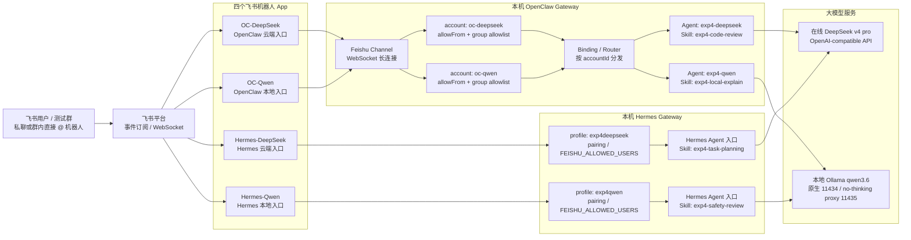

# 4. AgentOps 工业实战：多模型智能体网关部署 - 实验手册

## 实验主题

本实验围绕“多模型智能体网关如何在真实工程环境中运行”展开。前序实验已经让同学们体验了本地模型、MCP 风格工具抽象和 RAG 知识增强，本实验进一步把这些能力放到一个可运维的 AgentOps 网关中：通过 OpenClaw 与 Hermes Agent 两个框架，将云端模型、本地模型、消息通道、路由规则和配置文件组织为可验证、可对比的工程链路。

在进入 OpenClaw 配置之前，先补上一层直觉：什么是**多智能体**。在最简单的 Agent 应用中，系统通常只有一个 Agent，它接收用户问题，调用一个模型，必要时使用少量工具，然后直接给出回答。多智能体系统则不是把同一个 Agent 复制几份，而是把一个复杂任务拆给多个职责不同的 Agent：例如一个 Agent 负责写代码，一个 Agent 负责审查代码，一个 Agent 负责运行测试；或者一个 Agent 负责检索资料，一个 Agent 负责综合回答，一个 Agent 负责安全审核。每个 Agent 都有自己的任务边界、提示词、模型选择、工具权限和输出契约，系统再通过 Router、状态机或工作流把它们组织起来。

什么时候需要多智能体？可以先用一个朴素判断：**当一个任务已经超出“一个角色一次性回答”的能力边界时，才值得拆成多个 Agent**。常见场景包括：

- 任务需要多个专业角色协作，例如“需求分析 -> 代码生成 -> 测试 -> 审查 -> 修复”。
- 不同子任务适合不同模型，例如代码任务走更强的云端模型，普通问答走成本更低的本地模型。
- 不同子任务需要不同权限，例如资料检索 Agent 可以读知识库，但回复 Agent 不应直接访问敏感配置。
- 系统需要互相校验，例如生成 Agent 给出答案后，再由评估 Agent 检查格式、事实依据和安全风险。
- 任务链路较长，需要明确状态、重试、日志和责任边界，例如后续多 Agent 工作流编排实验。

也不是所有任务都应该拆成多智能体。如果任务很短、角色边界不清楚、上下文来回传递成本过高，或者只是把同一个提示词换几个名字重复调用，那么多智能体反而会增加复杂度、延迟和排错难度。本章要搭建的多模型智能体网关，正是为后续多智能体协作打基础：它先解决“多个 Agent 如何接入不同模型、从不同通道接收消息、按规则分发请求、留下可复盘日志”的工程问题。

本实验不把 OpenClaw 或 Hermes 当作“聊天机器人安装教程”，而是把它们作为 AgentOps 工程样例来观察：

```text
用户消息 -> Channel -> Router -> Agent -> Provider -> Model
                         ↓
                 配置文件、日志、审计与复盘
```

同学们需要完成的核心事情不是“点通某个平台”，而是理解一个企业级 Agent 系统如何把模型来源、消息入口、能力边界、路由策略和运行日志落到可复制、可检查、可迁移的工程对象中。

## 前后课程关系

第 2 章已经让同学们从传统 SaaS 过渡到 AI Agent，理解模型调用、工具抽象和 MCP 风格能力描述。第 3 章进一步讨论 RAG 如何接入外部资料，并强调引用来源、权限过滤和拒答边界。

本章位于“能构建 Agent 能力”和“能运维 Agent 系统”之间，重点补上 AgentOps 的系统视角。本章要求同学们实践两个框架：OpenClaw 用于观察传统多模型网关、飞书通道和前缀路由；Hermes Agent 用于观察新一代 Agent 框架中的模型切换、Gateway、记忆/Skill、子 Agent 与安全审批机制。

在系统对象上，可以先把两者放进同一张 AgentOps 图中：

- Provider 负责描述模型服务来源，例如火山引擎、OpenAI 兼容接口或 Ollama。
- Agent 负责绑定模型、系统提示词、能力和运行参数。
- Channel 负责接收外部消息，例如飞书 WebSocket。
- Router 负责把不同消息分发给不同 Agent。
- 配置文件和日志负责让系统可复现、可审计、可排错。

后续第 5 章会专门讨论 Skill 如何沉淀可复用能力，第 6 章会讨论提示词版本和评估，第 7 章会讨论 Harness 如何守住工具调用的安全边界。因此，本章只要求同学们为四个 Agent/入口创建轻量角色 Skill，用它们标清职责边界；复杂工具实现、外部 MCP 服务和安全执行 Harness 留到后续章节展开。

## 核心概念与系统定位

进入配置之前，先把本实验中的几个对象放在一张表里。后续每一步操作都应能对应到表中的一个或多个对象。

| 对象 | 系统定位 | 本实验中的观察方式 |
| :-- | :-- | :-- |
| Framework | 承载 AgentOps 能力的框架或运行时 | OpenClaw、Hermes Agent |
| Provider | 模型服务来源和鉴权配置 | DeepSeek 或课堂云端 Provider、本地 Ollama Provider |
| Agent | 面向任务的智能体实例 | OpenClaw: `exp4-deepseek`、`exp4-qwen`；Hermes: `hermes-exp4-deepseek`、`hermes-exp4-qwen` |
| Channel | 外部消息进入网关的通道 | OpenClaw 飞书 WebSocket Channel、Hermes 飞书 Gateway |
| Router | 消息分发规则 | OpenClaw 中可用 `/code`、`/chat` 前缀或飞书 account binding 分流；Hermes 中用不同 profile Gateway 固定不同入口 |
| Skill | 面向 Agent 的能力说明 | 四个 Agent/入口必须各自绑定不同 Skill：代码审查、课堂解释、任务规划、安全复核 |
| MCP | 工具协议和能力接口 | 本章只观察工具/能力字段，后续结合工具实验理解 |
| Config as Code | 用文件表达系统配置 | `openclaw.json`、`config.yaml` 或等价配置 |
| Log | 运行过程证据 | 网关启动、Channel 连接、路由命中、模型调用失败原因 |

本章的工程目标可以概括为：

```text
先用最小配置启动两个框架
    -> OpenClaw 接入 DeepSeek 与 qwen 两个 Agent
    -> Hermes 接入 DeepSeek 与 qwen 两个 profile/入口
    -> 为四个 Agent/入口分别创建不同飞书机器人、角色和 Skill
    -> OpenClaw 用 account Binding 完成分流，Hermes 用 profile Gateway 完成对照验收
    -> 回到配置文件和日志中复盘系统结构
```

## 实验目标

完成本实验后，同学们应能够：

1. 说明 AgentOps 网关在多模型、多通道、多 Agent 系统中的作用。
2. 区分 Provider、Agent、Channel、Router、Skill、MCP 的职责边界。
3. 使用 OpenClaw 完成基础安装、版本检查、健康检查、`OC-DeepSeek` 与 `OC-Qwen` 的端到端链路。
4. 接入 DeepSeek v4 pro 或课堂指定云端模型 Provider，并验证云端 Agent 能被调用。
5. 为 OpenClaw 与 Hermes 全新接入四个飞书机器人，理解最小权限、凭证保护和双响应风险。
6. 接入一个本地 Ollama qwen3.6 模型 Agent，观察本地模型在隐私、成本和性能上的差异。
7. 在 OpenClaw 中配置 `exp4-deepseek` 与 `exp4-qwen` 两个 Agent，并分别赋予不同角色、Skill 和飞书机器人。
8. 在 Hermes 中配置 `hermes-exp4-deepseek` 与 `hermes-exp4-qwen` 两个 Agent 入口，并分别赋予不同 profile、Skill 和飞书机器人。
9. 对比 OpenClaw 与 Hermes 在安装体验、通道能力、模型切换、Skill/记忆、安全控制、运维复杂度和课堂适配性上的优缺点。
10. 找到两个框架的配置文件和关键日志，能用配置文件解释系统实际运行结构。
11. 识别凭证泄露、权限过大、路由误配、日志暴露、云端费用误用等 AgentOps 风险。

## 课程概览

本实验建议安排 240 分钟。

| 时间段 | 教学环节 | 核心目标 | 关键技术栈 |
| :-- | :-- | :-- | :-- |
| **0-20'** | **阶段一：AgentOps 网关概念导入** | 建立 Provider、Agent、Channel、Router 的系统图 | AgentOps, Gateway |
| **20-45'** | **环境准备与验证** | 安装 OpenClaw 与 Hermes，确认 CLI、配置路径和网关状态 | OpenClaw, Hermes, CLI |
| **45-65'** | **阶段二：OpenClaw 网关启动与健康检查** | 启动本地网关，观察端口、日志和健康接口 | OpenClaw Gateway, Log |
| **65-95'** | **阶段三：云端 Provider 与 Agent 接入** | 配置 DeepSeek v4 pro 或课堂指定云端模型，完成一次云端调用 | DeepSeek/OpenAI-compatible, Provider |
| **95-120'** | **阶段四：飞书 Channel/Gateway 与最小权限** | 先清理旧飞书配置，再从零接入 OpenClaw Channel 与 Hermes Gateway | Feishu, WebSocket, OAuth |
| **120-145'** | **阶段五：本地 Ollama Agent 接入** | 配置 qwen3.6 或课堂指定本地模型 Agent，完成离线或半离线调用验证 | Ollama, Local Model |
| **145-170'** | **阶段六：OpenClaw Router 分流与端到端验收** | 通过 `/code`、`/chat` 等前缀完成双 Agent 分发 | Router, E2E Test |
| **170-205'** | **阶段七：Hermes 双模型 Agent 与飞书 Gateway 实践** | 完成 Hermes DeepSeek/Qwen 双入口、CLI 对话、飞书 Gateway 和安全观察 | Hermes, Gateway, Feishu, Skill |
| **205-230'** | **阶段八：双框架配置落盘与优缺点对比** | 对比 OpenClaw 与 Hermes 的配置、通道、模型、记忆和安全机制 | Config as Code, Comparison |
| **230-240'** | **阶段九：AgentOps 风险分析与自检** | 完成风险清单和实验自检 | Observability, Risk Review |

## 实验安全注意事项

1. DeepSeek、火山引擎或其他云端模型 API Key、飞书 App Secret、Hermes Gateway 凭证、访问 Token、Endpoint、企业内部群聊信息均属于敏感信息，不得写入公开仓库、截图外发或粘贴到报告原文中。
2. 配置文件如果包含密钥，只能提交脱敏片段。可使用 `<ARK_API_KEY>`、`<FEISHU_APP_SECRET>`、`<ENDPOINT_OR_MODEL>` 等占位符。
3. 飞书机器人只授予实验需要的最小权限。不要授予通讯录全量读取、群成员批量管理、文件读写等与本实验无关的权限。
4. 本实验使用测试群、测试消息和课堂指定账号，不要发送真实隐私、企业内部资料、个人身份证件、支付信息或未公开代码。
5. 若使用云端模型，注意区分订阅套餐接口与按量计费接口。错误的 Base URL 或模型名称可能导致额外费用。
6. 本地模型验证可以关闭网络观察行为，但不要关闭防火墙、杀毒软件或系统安全策略来“强行跑通”。
7. 日志中可能包含消息正文、用户标识和错误详情。截图前应检查是否需要打码。
8. 所有配置变更都应能回滚。实验结束后，建议重置临时 API Key、删除测试机器人或撤销不再需要的权限。

## 代码与配置片段阅读约定

本章的代码块和配置片段都服务于教学复现，不是要求同学们不加判断地整段复制。阅读时请先确认三件事：这个片段要放在哪里、它创建或修改什么对象、执行后应该观察到什么结果。

- `bash`、`powershell` 代码块通常是终端命令；代码中的注释说明命令目的、风险点和验证点。
- `javascript`、`xml` 片段只在 no-thinking proxy 等辅助实践中出现；注释会标出核心逻辑、启动方式和需要替换的本机路径。
- `json` 片段用于解释 OpenClaw、Provider、Channel 或脱敏快照结构。JSON 标准不允许 `#` 注释，因此手册用 `_comment` 字段表达教学注释；复制到真实配置前，应先删除 `_comment` 字段，除非本机版本明确支持额外字段。
- `yaml`、`toml`、`env` 类片段可以用 `#` 注释；注释用于说明字段用途、安全边界和是否需要替换为本机真实值。
- `text`、`markdown`、`mermaid` 片段是观察记录模板、消息模板或系统关系图；它们的用途会在片段前后说明。

所有真实配置文件都应先备份再修改。报告中只提交脱敏片段和关键字段说明，不提交 API Key、App Secret、用户 `open_id`、群 `chat_id` 或完整原始日志。

## 环境准备与验证

### 1. 基础环境

建议环境：

- Windows 10/11、macOS、Linux 或 WSL2。Windows 同学若遇到本机服务不稳定，可优先使用 WSL2。
- Node 22.16+ 或 Node 24。当前 OpenClaw 官方安装脚本会自动处理 Node 依赖；Hermes 安装脚本会处理 Python 3.11、Node、`ripgrep`、`ffmpeg` 等依赖。若课堂使用旧版包，以任课教师说明为准。
- Git、VS Code 或其他文本编辑器。
- Ollama，用于本地模型验证。
- 飞书网页版或 PC 客户端、飞书开发者后台访问权限。没有安装本地飞书客户端时，可使用飞书网页版观察群聊消息。
- 课堂指定云端模型服务。本章示例使用 OpenAI 兼容接口，课堂可选择 DeepSeek v4 pro、火山引擎方舟、OpenRouter 或统一代理服务。

### 2. 创建实验目录

下面这组命令用于创建本实验的独立工作目录。`notes/` 用来记录观察结果，`config_snapshots/` 用来保存脱敏配置片段，`logs/` 用来保存实验过程中的关键日志摘录。

```bash
# 创建本章实验目录。
mkdir agentops_gateway_lab

# 进入实验目录，后续命令和记录都以这里为起点。
cd agentops_gateway_lab

# 保存课堂观察、配置片段和日志摘录。
mkdir -p notes config_snapshots logs
```

建议最终形成如下结构：

```text
agentops_gateway_lab/
├── notes/
│   ├── environment.md
│   ├── gateway_health.md
│   ├── cloud_agent_check.md
│   ├── feishu_reset_check.md
│   ├── feishu_channel_check.md
│   ├── local_agent_check.md
│   ├── router_e2e_check.md
│   ├── hermes_check.md
│   ├── framework_comparison.md
│   └── config_review.md
├── config_snapshots/
│   ├── provider_agent_redacted.md
│   ├── channel_router_redacted.md
│   ├── hermes_redacted.md
│   └── config_path_notes.md
└── logs/
    ├── gateway_start.log
    ├── hermes_gateway.log
    ├── route_hit.log
    └── error_cases.log
```

### 3. 安装 OpenClaw

OpenClaw 版本迭代较快，命令名称可能随版本变化。本章以“官方安装脚本 + 配置文件复盘”为主线；如果本机命令与手册略有差异，请记录实际版本、等价命令和差异原因。

Windows PowerShell 可以使用以下安装方式：

```powershell
# 使用官方安装脚本安装 OpenClaw，并按提示完成初始引导。
iwr -useb https://openclaw.ai/install.ps1 | iex
```

macOS、Linux 或 WSL2 可以使用以下安装方式：

```bash
# 使用官方安装脚本安装 OpenClaw，并按提示完成初始引导。
curl -fsSL https://openclaw.ai/install.sh | bash
```

如果同学已经自行管理 Node 环境，也可以使用 npm 安装：

```bash
# 安装 OpenClaw CLI。
npm install -g openclaw@latest

# 启动 OpenClaw 初始配置流程。
openclaw onboard --install-daemon
```

如果课堂环境提供的是旧版 Python 包，可按任课教师说明使用 `pip install openclaw openclaw-cli`。报告和课堂记录中应写清楚所用版本，避免把不同版本的配置文件路径混在一起。

### 4. 安装 Hermes Agent

Hermes Agent 是 Nous Research 维护的开源 Agent 框架。和本章中用于观察多模型网关、通道与路由的 OpenClaw 相比，Hermes 更强调长期运行的自治 Agent、持久记忆、Skills、MCP、Gateway 多平台接入、子 Agent 并行和命令审批。本章不要求同学们把 Hermes 的全部能力都跑完，但要求完成与 OpenClaw 对应的双模型实践：配置一个 DeepSeek v4 pro 入口、一个本地 qwen3.6 入口，并把 Hermes Gateway 从零接入飞书完成验收。

macOS、Linux 或 WSL2 可以使用官方安装脚本：

```bash
# 安装 Hermes Agent。脚本会自动处理依赖、虚拟环境、全局 hermes 命令和初始配置。
curl -fsSL https://raw.githubusercontent.com/NousResearch/hermes-agent/main/scripts/install.sh | bash

# 重新加载 shell 配置；如果使用 zsh，可改为 source ~/.zshrc。
source ~/.bashrc
```

Windows 同学建议优先在 WSL2 中完成课堂验收。如果希望体验 Windows 原生安装，可在 PowerShell 中按官方 Windows 指南运行：

```powershell
# Windows 原生安装。安装完成后需要重新打开终端。
irm https://raw.githubusercontent.com/NousResearch/hermes-agent/main/scripts/install.ps1 | iex
```

安装后先做健康检查：

```bash
# 查看 Hermes CLI 是否可用。
hermes --version

# 检查依赖、配置和常见问题。
hermes doctor

# 选择或修改模型 Provider。可选择 OpenRouter、OpenAI 兼容接口或本地 Ollama Custom endpoint。
hermes model
```

如果同学使用本地 Ollama，可在 `hermes model` 中选择 Custom endpoint，并填入：

```text
API base URL: http://127.0.0.1:11435/v1
Model: qwen3.6:27b
```

这里的 `11435/v1` 指本章后续配置的 no-thinking proxy；如果同学此时尚未创建 proxy，可以先用 Ollama 默认的 `11434/v1` 完成连通性观察，最终验收前再切回 `11435/v1`。

配置完成后，运行一次基础对话：

```bash
# 启动交互式 Hermes。
hermes

# 或使用单次查询方式验证模型配置。
hermes chat -q "用两句话解释 AgentOps 和普通聊天机器人的区别。"
```

在 `notes/hermes_check.md` 中记录：

```markdown
## Hermes 基础检查

- 安装方式：macOS / Linux / WSL2 / Windows Native
- Hermes 版本：
- `hermes doctor` 结果：
- 模型 Provider：
- 模型名或 Custom endpoint：
- CLI 对话是否成功：
- 配置目录或数据目录：
- 遇到的问题：
```

### 5. 验证安装和配置路径

安装后先验证 OpenClaw 与 Hermes 的 CLI 是否可用，并记录版本信息。下面命令用于检查本机实际安装状态。

```bash
# 确认 OpenClaw CLI 可用。
openclaw --version

# 检查 OpenClaw 配置、依赖和常见问题。
openclaw doctor

# 查看网关状态。若当前版本不支持该命令，可记录错误并使用课堂给出的等价命令。
openclaw gateway status

# 确认 Hermes CLI 可用。
hermes --version

# 检查 Hermes 配置、依赖和常见问题。
hermes doctor
```

在 `notes/environment.md` 中记录：

- 操作系统和终端类型。
- OpenClaw 版本。
- Hermes 版本。
- Node 或 Python 版本。
- Ollama 版本。
- OpenClaw 实际配置文件路径。
- Hermes 实际配置目录或数据目录。
- 遇到的安装问题和解决方式。

OpenClaw 常见配置文件位置包括：

```text
~/.openclaw/openclaw.json
~/.openclaw/agents/main/agent/models.json
~/.openclaw/config.yaml
./.openclaw/config.yaml
```

Hermes 常见数据目录包括：

```text
~/.hermes/
~/.hermes/config.toml
~/.hermes/hermes-agent/
%LOCALAPPDATA%\hermes\    # Windows 原生安装时常见
```

不同版本可能使用 JSON、YAML、TOML 或命令式配置。不要强行改成手册中的某一种格式，关键是能找到本机真实生效的配置文件，并解释其中字段的含义。

### 6. 准备本地 Ollama 模型

本地 Agent 依赖 Ollama 或课堂指定本地模型服务。下面命令用于验证 Ollama 守护进程和模型是否可用。

```bash
# 查看 Ollama 是否安装。
ollama --version

# 查看本机已有模型。
ollama list

# 拉取或运行课堂指定模型；本章示例使用 qwen3.6:27b。
ollama run qwen3.6:27b
```

看到交互提示符后，输入一句中文问题，确认模型能回复，再输入 `/bye` 退出。此步骤的目的不是比较模型能力，而是确认本地模型服务、模型权重和推理环境已经准备好。

## 第一阶段：AgentOps 网关概念导入

### 目标

本阶段先建立系统图，避免后续配置变成“照着命令敲”。同学们需要能用自己的话说明：为什么一个飞书 Channel 可以通过不同机器人或 account 进入不同 Agent，为什么同一个 Agent 可以切换不同 Provider，以及 Router/Binding 为什么是运维层而不是提示词技巧。

### 概念拆解

可以从一个课堂场景理解本章：

```text
同学在飞书中发送：
@OC-DeepSeek /code 写一个 Python 单元测试

网关需要完成：
1. 飞书 Channel 接收消息。
2. Router 识别 `/code` 前缀。
3. Router 把请求交给代码 Agent。
4. 代码 Agent 使用云端 Provider 调用模型。
5. 回复通过飞书 Channel 返回。
6. 过程写入日志，配置写入文件。
```

如果同学发送：

```text
@OC-Qwen /chat 用一句话解释 RAG 为什么需要拒答
```

Router 或 account binding 可以把请求分给本地模型 Agent。这样，网关入口就能根据任务特点选择不同模型：代码任务走更强的云端模型，普通解释任务走成本更低、隐私更可控的本地模型。

### 课堂记录

在 `notes/environment.md` 末尾追加一段系统图说明：

```markdown
## 本章系统图

- Channel：
- Router：
- Cloud Agent：
- Local Agent：
- Provider：
- OpenClaw 配置文件路径：
- Hermes 配置目录：
- 日志观察位置：
```

这段记录后续会帮助同学们复盘配置文件，而不是只保留几张截图。

## 第二阶段：OpenClaw 网关启动与健康检查

### 目标

本阶段验证本地网关是否能稳定启动，并确认同学们知道如何查看端口、日志和健康状态。

### 操作步骤

先将网关日志调到便于课堂排错的级别。不同版本命令可能略有变化，如果 `gateway` 子命令不可用，可使用旧版等价命令 `openclaw configure gateway --log-level debug` 和 `openclaw start`。

```bash
# 设置网关日志级别，方便观察启动、连接和路由命中。
openclaw configure gateway --log-level debug

# 启动网关。若本机版本使用 daemon，可改用 openclaw gateway start。
openclaw gateway start
```

新开一个终端查看状态：

```bash
# 查看网关运行状态。
openclaw gateway status
```

如果本机版本提供健康接口，可以在浏览器访问：

```text
http://127.0.0.1:18789/health
```

若返回 `{"status":"ok"}` 或类似健康信息，说明网关核心服务已经启动。若端口不同，以本机日志输出为准。

### 观察要点

在 `notes/gateway_health.md` 中记录：

```markdown
## 网关健康检查

- 启动命令：
- 网关监听地址：
- 健康检查返回：
- 是否出现防火墙提示：
- 日志中能看到的关键字段：
- 遇到的问题：
```

Windows 同学若遇到防火墙提示，应允许当前实验需要的本地服务访问网络，但不要关闭整个系统防火墙。若出现端口占用，应先查明占用进程，再决定是否更换端口或停止旧进程。

## 第三阶段：云端 Provider 与 Agent 接入

### 目标

本阶段配置一个云端模型 Provider，并创建一个面向代码任务的 Agent。重点是理解“模型服务来源”和“Agent 任务角色”的分离：Provider 管鉴权和模型入口，Agent 管系统提示词、温度、模型选择和任务风格。

### 接口类型确认

课堂云端模型可以来自不同平台，但在网关中都要先回答三个问题：Base URL 是什么、模型 ID 是什么、鉴权字段放在哪里。不要把套餐接口、在线推理接口和第三方 OpenAI 兼容接口混在一起。

| 类型 | 常见 Base URL | 模型字段特点 | 风险提示 |
| :-- | :-- | :-- | :-- |
| DeepSeek OpenAI 兼容接口 | `https://api.deepseek.com/v1` | 显式填写课堂指定模型，如 `deepseek-v4-pro` | 不要使用未确认的别名，别名可能指向其他模型 |
| 火山引擎 Coding Plan | `https://ark.cn-beijing.volces.com/api/coding/v3` | 使用 Coding Plan 支持的 Model Name，如 `ark-code-latest` | 适合课堂统一套餐，注意不要填在线推理 Model ID |
| 在线推理 Chat API | `https://ark.cn-beijing.volces.com/api/v3` | 使用控制台中的模型或 Endpoint 配置 | 可能按量计费，需确认账户和费用 |
| 本地或课堂代理 | 由任课教师提供 | 通常兼容 `/v1/chat/completions` | 必须确认是否会记录学生请求正文 |

本章课堂验收推荐使用“一个在线大模型 + 一个本地模型”的组合。示例组合如下：

```text
在线模型：DeepSeek v4 pro，Provider 名称 deepseek，模型名 deepseek-v4-pro
本地模型：Ollama qwen3.6:27b，Provider 名称 ollama-nothink 或 local-ollama-nothink，模型名 qwen3.6:27b
```

### 先做直连烟测

在写入网关配置前，先直接调用模型服务。这样可以把“模型服务不可用”和“网关配置错误”区分开。下面命令只展示占位符，报告和截图中不得出现真实 API Key。

```bash
# 验证 DeepSeek OpenAI 兼容接口是否可用。
curl -sS https://api.deepseek.com/v1/chat/completions \
  -H "Authorization: Bearer <DEEPSEEK_API_KEY>" \
  -H "Content-Type: application/json" \
  -d '{
    "model": "deepseek-v4-pro",
    "messages": [
      {"role": "user", "content": "只回复一句：DeepSeek v4 pro 已经可以调用。"}
    ],
    "max_tokens": 64
  }'
```

如果直连失败，先检查 API Key、Base URL、模型名和账户额度，不要急着修改 OpenClaw 或 Hermes 配置。

### 写入 OpenClaw Provider 与 Agent

OpenClaw 版本之间的配置命令可能不同。本章建议优先使用当前版本提供的向导或配置命令；如果 CLI 没有对应子命令，可以编辑本机真实配置文件，但必须先备份。

```bash
# 记录 OpenClaw 版本和配置路径。
openclaw --version
openclaw config validate

# 备份配置。时间戳便于回滚和报告复盘。
cp ~/.openclaw/openclaw.json ~/.openclaw/openclaw.json.backup-exp4-$(date +%Y%m%d-%H%M%S)
```

OpenClaw 的关键配置对象应包含：

```json
{
  "_comment": "教学示意：定义 DeepSeek Provider。复制到真实配置前请删除所有 _comment 字段，并保留真实密钥在本机安全位置。",
  "models": {
    "_comment": "models 描述框架可调用的模型服务来源。",
    "providers": {
      "deepseek": {
        "_comment": "Provider 负责 Base URL、鉴权方式和可用模型列表；Agent 只引用这里的 provider/model。",
        "api": "openai-completions",
        "baseUrl": "https://api.deepseek.com/v1",
        "apiKey": "<DEEPSEEK_API_KEY>",
        "models": [
          {
            "_comment": "模型条目用于声明模型名、输入类型、上下文窗口和单次输出上限。",
            "id": "deepseek-v4-pro",
            "name": "deepseek-v4-pro",
            "input": ["text"],
            "contextWindow": 128000,
            "maxTokens": 8192
          }
        ]
      }
    }
  }
}
```

如果当前版本支持 `openclaw agents add`，可以为实验创建一个隔离 Agent：

```bash
# 创建使用在线 DeepSeek 的实验 Agent。
openclaw agents add exp4-deepseek \
  --model deepseek/deepseek-v4-pro \
  --workspace ~/.openclaw/workspace-exp4-deepseek \
  --non-interactive \
  --json
```

### 验证

先验证模型级调用，再验证 Agent 级调用：

```bash
# 模型级烟测：确认 Provider 与模型名正确。
openclaw infer model run \
  --local \
  --model deepseek/deepseek-v4-pro \
  --prompt "只回复一句：OpenClaw DeepSeek v4 pro 已经跑通。" \
  --json

# Agent 级烟测：确认 Agent 能通过 Gateway 完成一次回合。
openclaw agent \
  --agent exp4-deepseek \
  --local \
  --message "只回复一句：exp4-deepseek agent 已经跑通。" \
  --json
```

若调用成功，在 `notes/cloud_agent_check.md` 中记录：

```markdown
## 云端 Agent 验证

- Provider 名称：deepseek 或课堂指定名称
- Base URL 类型：DeepSeek / Coding Plan / 在线推理 / 课堂统一服务
- Agent 名称：exp4-deepseek 或本机实际名称
- 模型名或 Endpoint：deepseek-v4-pro 或课堂指定模型
- 验证命令：
- 返回是否成功：
- 日志中能看到的请求状态：
- 是否做了密钥脱敏：
```

### 观察要点

请重点观察两个问题：

1. Provider 和 Agent 为什么要拆开？
2. 如果模型名、Endpoint、Base URL 或 API Key 填错，错误信息分别出现在哪里？

将一次失败或一次排错过程记录到 `logs/error_cases.log`。如果没有遇到真实失败，可以故意把模型名改成一个明显错误的占位符，观察报错后再改回正确配置。

## 第四阶段：飞书 Channel/Gateway 与最小权限配置

### 目标

本阶段把外部消息入口接入本地网关。飞书 Channel/Gateway 的教学重点不是“创建一个机器人”，而是理解消息入口的职责：它把企业 IM 中的消息事件转换为网关可处理的输入，并负责把 Agent 回复送回 IM。

本章要求从零开始配置飞书。也就是说，同学们不要直接复用之前课程、个人项目或旧实验留下的飞书 App、群聊 allowlist、Webhook 或 WebSocket 配置。先清理旧配置，再重新创建飞书自建应用、配置权限、发布版本、写入网关、验证消息链路。标准做法是创建四个飞书自建应用，每个 Agent/入口一个机器人；如果课堂账号只能创建更少机器人，必须经任课教师确认，否则不视为本章标准验收。

四机器人标准映射如下：

| 飞书机器人 | 框架入口 | 模型 | 角色 | Skill |
| :-- | :-- | :-- | :-- | :-- |
| `OC-DeepSeek` | OpenClaw `exp4-deepseek` | `deepseek/deepseek-v4-pro` | 云端代码架构与代码审查 Agent | `exp4-code-review` |
| `OC-Qwen` | OpenClaw `exp4-qwen` | `ollama-nothink/qwen3.6:27b` | 本地课堂答疑与低敏解释 Agent | `exp4-local-explain` |
| `Hermes-DeepSeek` | Hermes profile `exp4deepseek` | `deepseek-v4-pro` | 云端任务规划与编排 Agent | `exp4-task-planning` |
| `Hermes-Qwen` | Hermes profile `exp4qwen` | `qwen3.6:27b`（no-thinking proxy） | 本地隐私与安全复核 Agent | `exp4-safety-review` |

四个飞书机器人、Gateway、Agent 和大模型之间的关系可以理解为下面这张图。飞书机器人是外部消息入口身份，Gateway 负责接收事件并交给框架，Agent 负责按照角色和 Skill 处理任务，大模型负责实际生成回答。



读图时注意三条边界：

1. 飞书机器人不是大模型本身，它只代表一个 App 身份和消息入口。
2. Gateway 不是 Agent，它负责连接飞书、校验权限、接收事件和转发回复。
3. DeepSeek 与 qwen3.6 是模型服务，可以被不同框架的不同 Agent 复用，但每个 Agent 的角色、Skill、权限和日志应分开。

### 0. 清理旧飞书配置

如果本机曾经配置过飞书，先备份并删除旧 Channel。下面命令展示的是 macOS/Linux/WSL2 思路；Windows 同学可用 PowerShell 完成同等备份和删除。

```bash
# 备份 OpenClaw 主配置，便于回滚。
cp ~/.openclaw/openclaw.json ~/.openclaw/openclaw.json.backup-remove-feishu-$(date +%Y%m%d-%H%M%S)

# 删除 OpenClaw 中的飞书 Channel 和飞书路由绑定。
jq 'del(.channels.feishu) |
    (.bindings = ((.bindings // []) | map(select((.match.channel? // "") != "feishu"))))' \
    ~/.openclaw/openclaw.json > /tmp/openclaw.no-feishu.json
mv /tmp/openclaw.no-feishu.json ~/.openclaw/openclaw.json

# 验证配置仍然是合法 JSON。
openclaw config validate
```

如果 Hermes 也曾经接入过飞书，应同步删除 `~/.hermes/.env` 以及相关 profile `.env` 中的飞书变量。不要删除模型变量，例如 `OPENAI_API_KEY`、`OPENAI_BASE_URL`，它们可能仍被 DeepSeek 配置使用。

```bash
# 备份 Hermes 环境文件。若某个文件尚不存在，可以跳过。
[ -f ~/.hermes/.env ] && cp ~/.hermes/.env ~/.hermes/.env.backup-remove-feishu-$(date +%Y%m%d-%H%M%S)
[ -f ~/.hermes/profiles/exp4deepseek/.env ] && cp ~/.hermes/profiles/exp4deepseek/.env ~/.hermes/profiles/exp4deepseek/.env.backup-remove-feishu-$(date +%Y%m%d-%H%M%S)
[ -f ~/.hermes/profiles/exp4qwen/.env ] && cp ~/.hermes/profiles/exp4qwen/.env ~/.hermes/profiles/exp4qwen/.env.backup-remove-feishu-$(date +%Y%m%d-%H%M%S)

# 手动编辑 ~/.hermes/.env 和本章两个 profile .env，删除所有 FEISHU_ 开头的变量。
# 常见字段包括：
# FEISHU_APP_ID
# FEISHU_APP_SECRET
# FEISHU_DOMAIN
# FEISHU_CONNECTION_MODE
# FEISHU_ALLOWED_USERS
# FEISHU_HOME_CHANNEL
```

如果 `hermes send --list` 仍能看到旧飞书群，说明频道目录里有历史缓存。可以备份后清空飞书缓存：

```bash
[ -f ~/.hermes/channel_directory.json ] && \
  cp ~/.hermes/channel_directory.json ~/.hermes/channel_directory.json.backup-clear-feishu-$(date +%Y%m%d-%H%M%S)

[ -f ~/.hermes/channel_directory.json ] && \
  jq 'if has("platforms") then (.platforms.feishu = []) else . end' \
    ~/.hermes/channel_directory.json > /tmp/hermes.channel-directory.no-feishu.json

[ -f /tmp/hermes.channel-directory.no-feishu.json ] && \
  mv /tmp/hermes.channel-directory.no-feishu.json ~/.hermes/channel_directory.json
```

清理后重启网关并确认飞书不再处于已配置状态：

```bash
# 重启 OpenClaw Gateway。
openclaw gateway restart
openclaw status

# 如果安装了 Hermes Gateway，也重启并检查状态；profile 模式下分别检查。
hermes gateway restart
[ -x "$(command -v exp4deepseek)" ] && exp4deepseek gateway restart
[ -x "$(command -v exp4qwen)" ] && exp4qwen gateway restart
hermes gateway list
```

预期观察：

```text
OpenClaw: Feishu OFF / disabled
Hermes: Feishu not configured
```

这一步的意义是让后续截图和日志能够证明：飞书是从零配置出来的，而不是依赖历史残留。

在 `notes/feishu_reset_check.md` 中记录：

```markdown
## 飞书旧配置清理

- 清理前是否已有飞书配置：
- OpenClaw 备份文件：
- Hermes 备份文件：
- 删除了哪些字段或环境变量：
- 清理后 OpenClaw 状态：
- 清理后 Hermes 状态：
- 是否仍存在历史频道缓存：
```

### 飞书后台配置

在飞书开发者后台完成以下步骤：

1. 创建四个企业自建应用，名称可以使用 `OC-DeepSeek`、`OC-Qwen`、`Hermes-DeepSeek`、`Hermes-Qwen`。若只能创建较少应用，应先取得任课教师或助教确认，再在报告中说明分时启停 Gateway 的风险。
2. 在“凭证与基础信息”中记录 `App ID` 和 `App Secret`，只保存在本地安全位置。
3. 添加“机器人”能力。
4. 在“事件订阅”中选择长连接或 WebSocket 接收事件。
5. 在“权限管理”中只申请实验需要的消息读取和发送权限。
6. 创建版本并发布到测试企业或测试范围。

建议最小权限包括：

```text
im:message:send_as_bot
im:message.p2p_msg:readonly
im:message.group_at_msg:readonly
```

如果课程要求读取群聊历史或在群中回复，再按飞书后台提示补充 `im:message:readonly`、`im:chat:read` 等权限。不要为了省事一次性授予所有权限。权限申请后通常需要创建版本并发布，否则本地配置正确也可能收不到事件。

### 配置 OpenClaw 飞书通道

如果当前版本支持 CLI 添加 Channel，可以参考下面命令：

```bash
# 添加飞书 WebSocket Channel。App Secret 只应放在本地安全配置中。
openclaw configure channel add \
  --name feishu-ws \
  --type feishu \
  --app-id "<FEISHU_APP_ID>" \
  --app-secret "<FEISHU_APP_SECRET>" \
  --mode websocket
```

如果当前版本使用向导或配置文件，请完成同等字段：Channel 名称、类型、App ID、App Secret、连接模式。

四机器人模式下，OpenClaw 侧需要把同一个 `feishu` Channel 配成两个 account，再分别绑定到两个 Agent。配置文件中的关键字段可按如下方式理解，字段名以本机版本为准：

```json
{
  "_comment": "教学示意：OpenClaw 飞书 Channel + 两个 account + 两条 Agent 绑定。复制到真实配置前删除 _comment 字段。",
  "channels": {
    "_comment": "Channel 负责连接飞书平台；account 负责区分同一 Channel 下的不同机器人身份。",
    "feishu": {
      "_comment": "顶层 feishu 配置定义连接模式、群策略和默认 mention 要求。",
      "enabled": true,
      "domain": "feishu",
      "connectionMode": "websocket",
      "requireMention": true,
      "groupPolicy": "allowlist",
      "groupAllowFrom": ["<TEST_GROUP_CHAT_ID>"],
      "groups": {
        "<TEST_GROUP_CHAT_ID>": {
          "enabled": true,
          "requireMention": true
        }
      },
      "accounts": {
        "_comment": "四机器人标准中，OpenClaw 侧使用两个 account：一个给 DeepSeek，一个给 Qwen。",
        "oc-deepseek": {
          "_comment": "OC-DeepSeek 只绑定云端代码审查 Agent；私聊和测试群都使用 allowlist 收敛权限。",
          "enabled": true,
          "name": "OC-DeepSeek",
          "appId": "<OC_DEEPSEEK_APP_ID>",
          "appSecret": "<OC_DEEPSEEK_APP_SECRET>",
          "domain": "feishu",
          "connectionMode": "websocket",
          "dmPolicy": "allowlist",
          "allowFrom": ["<OC_DEEPSEEK_USER_OPEN_ID>"],
          "groupPolicy": "allowlist",
          "groupAllowFrom": ["<TEST_GROUP_CHAT_ID>"],
          "groups": {
            "<TEST_GROUP_CHAT_ID>": {
              "enabled": true,
              "requireMention": true,
              "allowFrom": ["<OC_DEEPSEEK_USER_OPEN_ID>"]
            }
          }
        },
        "oc-qwen": {
          "_comment": "OC-Qwen 只绑定本地课堂解释 Agent；用户 open_id 不能直接复用另一个 App 下的 open_id。",
          "enabled": true,
          "name": "OC-Qwen",
          "appId": "<OC_QWEN_APP_ID>",
          "appSecret": "<OC_QWEN_APP_SECRET>",
          "domain": "feishu",
          "connectionMode": "websocket",
          "dmPolicy": "allowlist",
          "allowFrom": ["<OC_QWEN_USER_OPEN_ID>"],
          "groupPolicy": "allowlist",
          "groupAllowFrom": ["<TEST_GROUP_CHAT_ID>"],
          "groups": {
            "<TEST_GROUP_CHAT_ID>": {
              "enabled": true,
              "requireMention": true,
              "allowFrom": ["<OC_QWEN_USER_OPEN_ID>"]
            }
          }
        }
      }
    }
  },
  "bindings": [
    {
      "_comment": "这条绑定把 oc-deepseek 机器人收到的飞书消息路由到 exp4-deepseek。",
      "type": "route",
      "agentId": "exp4-deepseek",
      "match": {
        "channel": "feishu",
        "accountId": "oc-deepseek"
      }
    },
    {
      "_comment": "这条绑定把 oc-qwen 机器人收到的飞书消息路由到 exp4-qwen。",
      "type": "route",
      "agentId": "exp4-qwen",
      "match": {
        "channel": "feishu",
        "accountId": "oc-qwen"
      }
    }
  ]
}
```

#### OpenClaw 私聊与测试群权限收敛

`allowFrom` 是课堂安全控制的一部分。飞书 `open_id` 通常与 App 相关，同一个人在四个机器人下可能对应四个不同 `open_id`；应从各自机器人日志、pairing 提示或会话文件中记录，而不是把一个机器人看到的 `open_id` 复制给所有机器人。建议只加入自己的 open_id 和测试群 `chat_id`，不要用 `*` 开放给所有人。

OpenClaw 的 Feishu Channel 通常有两层权限：私聊由 `dmPolicy/allowFrom` 控制，群聊先由 `groupPolicy/groups` 控制哪些群可以进入，再由每个群规则中的 `allowFrom` 控制群内哪些用户可以触发。部分 OpenClaw 或飞书插件版本仍会在入站路径中检查旧字段 `groupAllowFrom`；如果日志出现 `not in groupAllowFrom (groupPolicy=allowlist)`，应把测试群 `chat_id` 同步写入 Channel 和对应 account 的 `groupAllowFrom`，同时保留 `groups` 配置。标准配置过程如下：

1. 分别向 `OC-DeepSeek` 和 `OC-Qwen` 私聊一次，或在测试群中直接 `@` 对应机器人一次。
2. 查看 OpenClaw Gateway 日志、会话文件或 Channel 事件记录，记录两个 App 下各自看到的用户 `open_id`。同一个同学在两个 OpenClaw App 下也可能不是同一个 `open_id`。
3. 将 `dmPolicy` 改为 `allowlist`，把该 App 下的用户 `open_id` 写入私聊 `allowFrom`。
4. 将测试群 `chat_id` 写入 `groups`，并在该群规则中设置 `requireMention: true` 与群内 `allowFrom`；若本机版本仍检查 `groupAllowFrom`，也把同一个测试群 `chat_id` 写入 `groupAllowFrom`。
5. 重启 Gateway 后分别验证：授权用户私聊能触发回复，测试群中直接 `@` 机器人能触发回复，非测试群或未授权用户不应触发回复。

配置后重启并检查：

```bash
openclaw gateway restart
openclaw status
openclaw doctor
openclaw channels status --json
openclaw agents bindings --json
```

### 配置 Hermes 飞书通道

Hermes 也必须接入飞书 Gateway。四机器人模式下，Hermes 推荐用两个 profile 固定两套模型、角色、Skill 和飞书凭证。这样 `Hermes-DeepSeek` 与 `Hermes-Qwen` 可以同时运行，日志也能自然分开。

先创建两个 profile：

```bash
hermes profile create exp4deepseek --clone \
  --description "Experiment 4 Hermes DeepSeek planning agent."

hermes profile create exp4qwen --clone \
  --description "Experiment 4 Hermes Qwen safety review agent."
```

在两个 profile 的 `.env` 中分别写入飞书凭证。真实值只写在本机，不写入报告：

```bash
# ~/.hermes/profiles/exp4deepseek/.env
# 用途：exp4deepseek profile 的飞书身份和安全边界。
# 注意：真实 App Secret 只写在本机，不写入报告和仓库。
FEISHU_APP_ID=<HERMES_DEEPSEEK_APP_ID>
FEISHU_APP_SECRET=<HERMES_DEEPSEEK_APP_SECRET>
FEISHU_DOMAIN=feishu
FEISHU_CONNECTION_MODE=websocket
# 只把默认发送目标设置为课堂测试群，避免误发到真实群。
FEISHU_HOME_CHANNEL=<TEST_GROUP_CHAT_ID>
FEISHU_HOME_CHANNEL_NAME=AgentOps实验4测试群
# 先关闭默认群开放，再用允许用户和 group_rules 精确放行。
FEISHU_GROUP_POLICY=disabled
FEISHU_ALLOW_ALL_USERS=false
FEISHU_ALLOWED_USERS=<HERMES_DEEPSEEK_USER_OPEN_ID>

# ~/.hermes/profiles/exp4qwen/.env
# 用途：exp4qwen profile 的飞书身份和安全边界。
# 注意：Qwen 与 DeepSeek 使用不同 App，open_id 也要分别记录。
FEISHU_APP_ID=<HERMES_QWEN_APP_ID>
FEISHU_APP_SECRET=<HERMES_QWEN_APP_SECRET>
FEISHU_DOMAIN=feishu
FEISHU_CONNECTION_MODE=websocket
# 两个 Hermes profile 可以指向同一个测试群，但不共享机器人凭证。
FEISHU_HOME_CHANNEL=<TEST_GROUP_CHAT_ID>
FEISHU_HOME_CHANNEL_NAME=AgentOps实验4测试群
FEISHU_GROUP_POLICY=disabled
FEISHU_ALLOW_ALL_USERS=false
FEISHU_ALLOWED_USERS=<HERMES_QWEN_USER_OPEN_ID>
```

如果刚开始还不知道自己的 `open_id`，课堂临时验收可以短时间使用 `FEISHU_ALLOW_ALL_USERS=true`，等日志中拿到用户标识后必须改回对应机器人的 `FEISHU_ALLOWED_USERS=<APP_SCOPED_USER_OPEN_ID>`。不要在正式环境长期开放所有用户。

#### Hermes 私聊 Pairing 与测试群权限收敛

Hermes 的飞书权限也应分成两层理解：第一层是“这个用户是否被 Hermes Gateway 认识”，由 `FEISHU_ALLOWED_USERS`、`FEISHU_ALLOW_ALL_USERS` 或 pairing 审批结果控制；第二层是“这个群是否允许进入 Hermes”，由 `FEISHU_HOME_CHANNEL`、`FEISHU_GROUP_POLICY` 和 `group_rules` 控制。只配置测试群 `chat_id` 不够，如果用户没有被授权，Hermes 在私聊中会返回类似下面的提示，群聊中则可能因为未授权而静默不回复：

```text
Hi~ I don't recognize you yet!
Here's your pairing code: <PAIRING_CODE>
Ask the bot owner to run:
hermes pairing approve feishu <PAIRING_CODE>
```

标准处理流程如下：

1. 分别向 `Hermes-DeepSeek` 和 `Hermes-Qwen` 私聊一条测试消息，取得各自的 pairing code；也可以从 Gateway 日志中读取同一用户在该 App 下的 `open_id`。
2. 在本机执行对应 profile 的 pairing 审批命令。不同 profile 不共用授权记录。
3. 将审批后的用户 `open_id` 写入该 profile 的 `FEISHU_ALLOWED_USERS`，保持 `FEISHU_ALLOW_ALL_USERS=false`。
4. 将测试群写入 `FEISHU_HOME_CHANNEL` 和 `group_rules`，并设置 `default_group_policy: disabled`，使其他群默认不响应。
5. 重启对应 Gateway 后，分别验证私聊和测试群直接 `@` 机器人都能回复。

示例命令如下：

```bash
# 批准 Hermes-DeepSeek 私聊用户。
exp4deepseek pairing approve feishu <PAIRING_CODE_FROM_HERMES_DEEPSEEK>
exp4deepseek pairing list

# 批准 Hermes-Qwen 私聊用户。
exp4qwen pairing approve feishu <PAIRING_CODE_FROM_HERMES_QWEN>
exp4qwen pairing list
```

如果选择直接写 `FEISHU_ALLOWED_USERS`，仍然要注意 `open_id` 的 App 作用域：`Hermes-DeepSeek` 与 `Hermes-Qwen` 应分别使用各自机器人看到的 `open_id`。配置完成后重启两个 profile：

```bash
exp4deepseek gateway restart
exp4qwen gateway restart
hermes gateway list
```

Hermes 如果要限制只服务某个测试群，可以在两个 profile 的 `config.yaml` 中加入同样的 `chat_id` 规则。`default_group_policy: disabled` 表示其他群默认不响应，指定群中仍要求直接 `@` 具体机器人：

```yaml
# 用途：限制 Hermes 飞书 Gateway 只在课堂测试群中响应。
platforms:
  feishu:
    home_channel:
      # home_channel 是主动发送测试消息时的默认目标。
      platform: feishu
      chat_id: <TEST_GROUP_CHAT_ID>
      name: AgentOps实验4测试群
    extra:
      # 默认关闭其他群，避免机器人被拉进未知群后自动响应。
      default_group_policy: disabled
      group_rules:
        <TEST_GROUP_CHAT_ID>:
          # 只对测试群放行，且仍要求直接 @ 具体机器人。
          policy: open
          require_mention: true
```

然后配置模型并启动两个 Gateway。下面给出的是最终验收配置：`exp4qwen` 指向 `11435/v1` no-thinking proxy；如果此时 proxy 尚未创建，可以先完成 `exp4deepseek` 验证，待第五阶段配置 proxy 后再重启 `exp4qwen`。

```bash
exp4deepseek config set model.provider custom
exp4deepseek config set model.default deepseek-v4-pro
exp4deepseek config set model.base_url https://api.deepseek.com/v1
exp4deepseek gateway install
exp4deepseek gateway restart
exp4deepseek status

exp4qwen config set model.provider custom
exp4qwen config set model.default "qwen3.6:27b"
exp4qwen config set model.base_url http://127.0.0.1:11435/v1
exp4qwen gateway install
exp4qwen gateway restart
exp4qwen status

hermes gateway list
```

OpenClaw 和 Hermes 可以同时服务。四机器人模式下，`OC-DeepSeek`、`OC-Qwen`、`Hermes-DeepSeek`、`Hermes-Qwen` 分别对应不同飞书 App、不同框架入口和不同 Skill，两个框架可以并行运行，互不抢同一条事件。

需要分时启停的情况只出现在“多个框架共用同一个飞书 App/机器人”时：群里 `@机器人` 的同一条消息可能被两个 Gateway 同时处理，出现两条回复。四机器人模式可以直接避免这个问题；如果没有四个机器人，课堂建议采用以下任一方式避免混乱：

- 使用不同的飞书测试机器人，分别给不同框架和模型入口。
- 或者测试 OpenClaw 时执行 `hermes gateway stop`，测试 Hermes 时执行 `openclaw gateway stop`。

Hermes 飞书验收至少要证明两件事：

- `exp4deepseek` 与 `exp4qwen` 两个 profile Gateway 都已经读取新的飞书配置，`hermes gateway list` 或等价日志显示两个 profile running。
- Hermes 的 DeepSeek 入口和 qwen3.6 入口都完成过调用验证，且两个入口使用不同 Skill。

### 验证

保持网关运行，在飞书网页版或客户端中向四个机器人分别发送测试消息。群聊中必须使用飞书真正的 `@` 选择机器人，不能只手打 `@机器人` 文本。

```text
@OC-DeepSeek 请用代码审查角色回复：OpenClaw DeepSeek 飞书入口已跑通。
@OC-Qwen 请用本地课堂解释角色回复：OpenClaw Qwen 飞书入口已跑通。
@Hermes-DeepSeek 请用任务规划角色回复：Hermes DeepSeek 飞书入口已跑通。
@Hermes-Qwen 请用安全复核角色回复：Hermes Qwen 飞书入口已跑通。
```

默认不要用 `@所有人` 或 `@全员` 作为四机器人验收方法。飞书机器人最稳定的触发方式是直接 `@` 具体机器人；`@全员` 主要面向群成员通知，不等价于逐个 `@` 机器人。若 `@全员` 时只有部分机器人响应，不能据此判断其他机器人没有接入，应改用上面四条“分别点选具体机器人”的消息逐一验证。

如果课堂确实要观察“`@所有人` 触发四个机器人”的效果，需要同时满足平台侧和网关侧条件：

1. 飞书后台必须把消息推给机器人。四个自建应用都要订阅 `im.message.receive_v1`。如果只有“接收群内 @ 机器人消息”权限，`@所有人` 可能不会被视为“@了该机器人”；此时需要为四个应用补充“获取群组中所有消息/读取群聊消息”类权限，权限标识以飞书后台显示为准，常见为 `im:message.group_msg`。这是敏感权限，必须只在测试群中使用，并重新创建版本、发布生效。
2. OpenClaw 侧要允许 `@所有人` 绕过“必须直接 @ 机器人”的门槛。可在 Channel 或 account 配置中设置 `respondToMentionAll: true`：

```bash
openclaw config set channels.feishu.respondToMentionAll true --strict-json
openclaw config set channels.feishu.accounts.oc-deepseek.respondToMentionAll true --strict-json
openclaw config set channels.feishu.accounts.oc-qwen.respondToMentionAll true --strict-json
openclaw gateway restart
```

3. Hermes 侧已经把飞书消息中的 `@_all` 视为一次 mention；保持 `require_mention: true` 即可。它仍然会继续执行 `FEISHU_ALLOWED_USERS`、`FEISHU_GROUP_POLICY` 和 `group_rules`，所以未授权用户或测试群外消息不应触发。如果没有收到 `@所有人` 事件，优先回到第 1 步检查飞书权限和事件订阅，而不是直接把 `require_mention` 改成 `false`。

不推荐为了让 `@所有人` 生效而把 Hermes 测试群的 `require_mention` 改成 `false`，因为这会让测试群里的每一条普通消息都可能触发 Agent。若临时这样做，必须在报告中说明它是调试手段，并在验证后改回。

观察网关日志中是否出现消息事件、用户标识、消息正文或 Channel 连接成功记录。不要把未脱敏的完整日志直接粘贴到共享文档中。

如果只想确认机器人是否能主动发消息，可以使用发送命令。下面命令中的 `chat_id` 应替换成测试群 ID。

```bash
# OpenClaw 发送一条测试消息到飞书群。四机器人模式下可以指定 account。
openclaw message send \
  --channel feishu \
  --account oc-deepseek \
  --target "<TEST_GROUP_CHAT_ID>" \
  --message "实验4 OC-DeepSeek 飞书通道连通性测试：已跑通。" \
  --json

# Hermes 发送一条测试消息到飞书 home channel。
exp4deepseek send --to feishu --json "实验4 Hermes-DeepSeek 飞书通道连通性测试：已跑通。"
```

若本机没有安装飞书客户端，可打开飞书网页版查看群聊消息：

```text
https://www.feishu.cn/messenger/
```

如果账号不在对应组织或不在测试群里，网页版也看不到群消息；这时需要加入测试群，或用飞书 OpenAPI 根据 `message_id` 做只读验证。

在 `notes/feishu_channel_check.md` 中记录：

```markdown
## 飞书 Channel 验证

- `OC-DeepSeek` 应用名称与 App ID 后四位：
- `OC-Qwen` 应用名称与 App ID 后四位：
- `Hermes-DeepSeek` 应用名称与 App ID 后四位：
- `Hermes-Qwen` 应用名称与 App ID 后四位：
- OpenClaw Channel 名称：
- Hermes Gateway 名称或状态：
- 连接模式：
- 已申请权限：
- 是否完成版本发布：
- 测试群 `chat_id` 是否只以脱敏形式记录：
- `OC-DeepSeek` 私聊用户 `open_id` 是否已加入对应 `allowFrom`：
- `OC-Qwen` 私聊用户 `open_id` 是否已加入对应 `allowFrom`：
- OpenClaw 测试群 `groups` 是否设置 `requireMention` 与群内 `allowFrom`：
- OpenClaw 如出现 `not in groupAllowFrom`，测试群 `chat_id` 是否也已写入 `groupAllowFrom`：
- `Hermes-DeepSeek` pairing 是否已批准或写入 `FEISHU_ALLOWED_USERS`：
- `Hermes-Qwen` pairing 是否已批准或写入 `FEISHU_ALLOWED_USERS`：
- Hermes 是否设置 `FEISHU_GROUP_POLICY=disabled` 或等价 `default_group_policy: disabled`：
- 测试群外是否默认不响应：
- OpenClaw 测试消息是否抵达网关：
- Hermes 测试消息是否抵达 Gateway：
- 日志中的连接状态：
- 是否使用四个机器人：
- 脱敏处理说明：
```

### 角色与 Skill 文件

每个 Agent/入口都必须有不同角色和不同 Skill。Skill 可以是框架内置 Skill，也可以是本实验创建的轻量 Skill；重点是角色边界清楚，不能四个入口都只是“通用聊天助手”。

本机实践采用的文件布局如下：

```text
~/.openclaw/workspace-exp4-deepseek/
├── AGENTS.md
├── IDENTITY.md
└── skills/exp4-code-review/SKILL.md

~/.openclaw/workspace-exp4-qwen/
├── AGENTS.md
├── IDENTITY.md
└── skills/exp4-local-explain/SKILL.md

~/.hermes/profiles/exp4deepseek/
├── SOUL.md
└── skills/domain/exp4-task-planning/SKILL.md

~/.hermes/profiles/exp4qwen/
├── SOUL.md
└── skills/domain/exp4-safety-review/SKILL.md
```

CLI 验证可以参考：

```bash
openclaw agent \
  --agent exp4-deepseek \
  --local \
  --message "请使用 exp4-code-review 角色，只回复一句：OC-DeepSeek code review skill check passed." \
  --json

openclaw agent \
  --agent exp4-qwen \
  --local \
  --message $'/no_think\n请使用 exp4-local-explain 角色，只回复一句：OC-Qwen local explain skill check passed.' \
  --json

exp4deepseek chat \
  -q "使用 exp4-task-planning skill，只回复一句：Hermes-DeepSeek task planning skill check passed." \
  -Q \
  --provider custom:exp4-deepseek \
  -m deepseek-v4-pro \
  --max-turns 2 \
  --ignore-rules \
  --skills exp4-task-planning

exp4qwen chat \
  -q $'/no_think\n使用 exp4-safety-review skill，只回复一句：Hermes-Qwen safety review skill check passed.' \
  -Q \
  --provider custom:exp4-ollama-qwen36 \
  -m "qwen3.6:27b" \
  --max-turns 2 \
  --ignore-rules \
  --skills exp4-safety-review
```

如果本地 qwen3.6 响应超过 2 分钟，应如实记录为本地模型性能或预热问题。可以用 `ollama ps`、网关日志和超时记录证明模型已加载但响应慢。若使用的是带 thinking 的 qwen 版本，应先关闭 thinking，再判断是否仍然是硬件或框架超时问题。

### 本机实践记录（2026-05-19）

以下记录来自本机完整重配过程，用于给同学们展示“什么证据算跑通，什么问题必须如实写入报告”。所有 App Secret、API Key 和用户标识均已脱敏。

| 入口 | 飞书 App ID 后四位 | 模型 | Skill | 本机验证结果 |
| :-- | :-- | :-- | :-- | :-- |
| `OC-DeepSeek` | `1bcb` | `deepseek/deepseek-v4-pro` | `exp4-code-review` | OpenClaw `oc-deepseek` account WebSocket running；CLI Skill 验证通过 |
| `OC-Qwen` | `9bb3` | `ollama-nothink/qwen3.6:27b` | `exp4-local-explain` | OpenClaw `oc-qwen` account WebSocket running；已切换到本地 no-thinking proxy，qwen 模型 `reasoning=false`，Agent/Skill 加入 `/no_think`；完整 Agent 上下文较大，若仍超时应继续裁剪工具和启动上下文 |
| `Hermes-DeepSeek` | `1bee` | `deepseek-v4-pro` | `exp4-task-planning` | `exp4deepseek` Gateway running；本地 Skill enabled；CLI Skill 验证通过 |
| `Hermes-Qwen` | `5bd8` | `qwen3.6:27b` | `exp4-safety-review` | `exp4qwen` Gateway running；本地 Skill enabled；已将 `agent.reasoning_effort` 设为 `none`，profile/Skill 加入 `/no_think`，并通过 no-thinking proxy 完成 CLI 短问验证 |

本机关键状态摘录：

```text
openclaw channels status --json
  oc-deepseek: configured=true, running=true, domain=feishu
  oc-qwen: configured=true, running=true, domain=feishu

hermes gateway list
  default: running
  exp4deepseek: running
  exp4qwen: running

ollama ps（qwen 测试时）
  qwen3.6:27b loaded, 42 GB, 100% GPU, context 262144

no-thinking proxy
  http://127.0.0.1:11435/health -> {"ok":true,"model":"qwen3.6:27b","think":false}
  /v1/chat/completions -> NO_THINK_OK

Hermes-Qwen CLI
  exp4qwen chat -> HERMES_QWEN_NO_THINK_OK
```

这里要区分三类“跑通”：飞书凭证、Gateway/Channel、Agent/Profile、Skill 文件和绑定关系已经跑通；本地 `qwen3.6:27b` 模型服务能在 `think:false` 下直接响应；框架级 Agent 是否能在完整上下文中按时返回，还受工具清单、启动上下文大小和超时设置影响。如果 qwen3.6 在框架调用中先输出较长 thinking，容易在可见答案出现前触发超时或空闲检测。处理顺序是：先关闭 thinking，再重新做短问题验收；若仍超时，继续裁剪工具、Skill 和启动上下文，或把 qwen 入口限定为低复杂度短任务。

### 观察要点

请回答：

1. 为什么本地网关能通过 WebSocket 接收到飞书云端事件？
2. 飞书 App Secret 泄露后可能造成什么后果？
3. 如果只收到消息但不能回复，应该优先检查 Channel/Gateway、Router 或默认模型、Agent 还是权限？

## 第五阶段：本地 Ollama Agent 接入

### 目标

本阶段接入一个本地模型 Agent，用来和云端 Agent 形成对比。云端模型通常推理能力更强、响应更稳定，但涉及网络、费用和数据出境；本地模型隐私和成本更可控，但受限于本机硬件和模型大小。

### 操作步骤

先确认 Ollama 服务正在运行：

```bash
# 查看本地模型服务是否可用。
ollama list

# 如果模型尚未加载，可以先运行一次进行预热。课堂示例使用 qwen3.6:27b。
ollama run qwen3.6:27b
```

如果使用的 qwen 模型默认会输出 thinking，应在框架配置和提示词中同时关闭。OpenClaw 的模型数组下标以本机配置为准，下面示例中的 `4` 表示 `qwen3.6:27b` 在 `models.providers.ollama.models` 中的实际位置；如果本机已经新建 `ollama-nothink` Provider，则应在该 Provider 的 qwen 模型条目上做同等设置。

```bash
# OpenClaw：将本地 qwen 标记为非 reasoning 模型；实际数组下标必须以本机配置为准。
openclaw config set 'models.providers.ollama.models[4].reasoning' false --strict-json

# Hermes qwen profile：关闭框架级 reasoning 配置。
exp4qwen config set agent.reasoning_effort none
```

同时在 qwen Agent/Profile 的角色文件和 Skill 中写明：请求以 `/no_think` 开头，不输出 `<think>` 块或推理轨迹，只返回最终答案。需要注意，`/no_think` 是提示层约束；在 Ollama 原生 API 中，真正关闭 thinking 的字段是 `think:false`。

```bash
# Ollama 原生 API 验证：响应中不应再出现 thinking 字段。
curl -s http://127.0.0.1:11434/api/chat \
  -d '{"model":"qwen3.6:27b","messages":[{"role":"user","content":"只回复：NO_THINK_OK"}],"think":false,"stream":false}'
```

若 OpenClaw 或 Hermes 只能通过 Ollama 的 OpenAI 兼容 `/v1/chat/completions` 调用，而本机测试仍返回 `reasoning` 字段，可以增加一个本地 no-thinking proxy：框架继续访问 `http://127.0.0.1:11435/v1`，proxy 再调用 Ollama 原生 `/api/chat` 并固定传入 `think:false`。本机实践中，Hermes-Qwen 与 OpenClaw-Qwen 均切换到这个 proxy，以避免 qwen 在飞书入口先输出长 thinking。

本机实践采用的 no-thinking proxy 是一个轻量本地服务，建议放在 `~/.hermes/profiles/exp4qwen/proxy/ollama-no-think-proxy.mjs` 或同等实验目录中。下面片段展示核心转换逻辑：它接收 OpenAI 兼容请求，转给 Ollama 原生接口，并在转发时固定加入 `think:false`。

```javascript
// 用途：把框架发来的 OpenAI 兼容请求转换为 Ollama 原生 /api/chat 请求。
// 教学重点：关闭 thinking 应落在模型 API 层，而不只依赖提示词中的 /no_think。
const OLLAMA_CHAT_URL = "http://127.0.0.1:11434/api/chat";

async function callOllamaWithoutThinking(openAiBody) {
  // 只保留 Ollama 能理解的消息字段，避免把框架扩展字段直接透传给本地模型。
  const messages = (openAiBody.messages || []).map((message) => ({
    role: message.role,
    content: typeof message.content === "string"
      ? message.content
      : JSON.stringify(message.content)
  }));

  const ollamaBody = {
    model: openAiBody.model || "qwen3.6:27b",
    messages,
    stream: false,
    think: false // 关键控制点：要求 Ollama 不返回 thinking/reasoning 轨迹。
  };

  // 真实服务中应继续处理 HTTP 状态码、超时、日志脱敏和错误返回。
  const response = await fetch(OLLAMA_CHAT_URL, {
    method: "POST",
    headers: { "content-type": "application/json" },
    body: JSON.stringify(ollamaBody)
  });
  return response.json();
}
```

如果希望 macOS 登录后自动启动 proxy，可以使用 LaunchAgent。下面配置片段只展示字段用途；真实路径应替换为本机实际文件路径。

```xml
<?xml version="1.0" encoding="UTF-8"?>
<!DOCTYPE plist PUBLIC "-//Apple//DTD PLIST 1.0//EN"
  "http://www.apple.com/DTDs/PropertyList-1.0.dtd">
<!-- 用途：让 no-thinking proxy 作为本机后台服务运行，供 OpenClaw-Qwen 和 Hermes-Qwen 共用。 -->
<plist version="1.0">
  <dict>
    <!-- Label 是 launchctl 管理服务时使用的唯一名称。 -->
    <key>Label</key>
    <string>ai.exp4.qwen-nothink-proxy</string>

    <!-- ProgramArguments 指向 Node 和 proxy 脚本；路径必须是本机真实绝对路径。 -->
    <key>ProgramArguments</key>
    <array>
      <string>/opt/homebrew/bin/node</string>
      <string>/Users/ryu/.hermes/profiles/exp4qwen/proxy/ollama-no-think-proxy.mjs</string>
    </array>

    <!-- RunAtLoad/KeepAlive 让服务在登录后启动，并在异常退出后自动拉起。 -->
    <key>RunAtLoad</key>
    <true/>
    <key>KeepAlive</key>
    <true/>
  </dict>
</plist>
```

OpenClaw-Qwen 切换到 proxy 后，Provider 片段可按下面方式理解。JSON 中的 `_comment` 是教学注释，复制到真实配置前请删除。

```json
{
  "_comment": "用途：让 OpenClaw-Qwen 访问 11435 no-thinking proxy，而不是直接访问 Ollama 的 /v1 兼容入口。",
  "models": {
    "providers": {
      "ollama-nothink": {
        "_comment": "该 Provider 不保存真实密钥；apiKey 只用于满足 OpenAI 兼容客户端的字段要求。",
        "api": "openai-completions",
        "baseUrl": "http://127.0.0.1:11435/v1",
        "apiKey": "ollama-local",
        "models": [
          {
            "_comment": "reasoning=false 告诉框架不要把该模型当作需要展示推理轨迹的模型。",
            "id": "qwen3.6:27b",
            "name": "qwen3.6:27b",
            "reasoning": false
          }
        ]
      }
    }
  }
}
```

Hermes-Qwen 切换到 proxy 后，profile 中应同时关闭框架级 reasoning，并把 custom provider 指向 `11435/v1`。字段名以本机 Hermes 版本为准。

```yaml
# 用途：让 Hermes-Qwen 使用 no-thinking proxy，并禁止框架层要求输出推理轨迹。
agent:
  # none 表示该 profile 不要求模型生成或展示 reasoning effort。
  reasoning_effort: none

model:
  # custom provider 指向下方命名 endpoint。
  provider: custom
  default: qwen3.6:27b
  base_url: http://127.0.0.1:11435/v1

custom_providers:
  - name: exp4-ollama-qwen36
    # 11435 是 no-thinking proxy；proxy 再调用 Ollama 原生 11434/api/chat。
    base_url: http://127.0.0.1:11435/v1
    model: qwen3.6:27b
    # 本地 Ollama 不需要真实 API Key，这里只填占位值。
    api_key: ollama-local
    api_mode: chat_completions
```

切换后至少做一次短问题验收：proxy 的 `/health` 应返回可用状态，`/v1/chat/completions` 的响应中不应出现 `thinking`、`reasoning` 或 `<think>`。如果短问题已经通过，但完整 OpenClaw Agent 仍超时，应把问题定位为“框架启动上下文或工具清单过大”，而不是继续纠结 thinking 开关。

然后添加本地 Provider 和 Agent。若本机模型名称不同，请替换为 `ollama list` 中实际存在的模型。本章推荐使用 OpenAI 兼容路径或 OpenClaw 内置 Ollama Provider，两种方式任选其一，报告中写清楚实际使用方式。

```bash
# 添加本地 Qwen Provider。这里指向 no-thinking proxy，proxy 再访问 Ollama 原生接口。
openclaw configure provider add \
  --name local-ollama-nothink \
  --base-url "http://127.0.0.1:11435/v1"

# 添加本地聊天 Agent，用于普通解释和低敏任务。
openclaw configure agent add \
  --name exp4-qwen \
  --provider local-ollama-nothink \
  --model "qwen3.6:27b" \
  --temperature 0.6 \
  --system-prompt "你是课程实验中的本地助手。回答应清楚、简短，并主动说明不确定之处。"
```

如果当前 OpenClaw 版本支持 `agents add`，也可以直接创建隔离 Agent：

```bash
# 创建使用本地 Ollama qwen3.6 的实验 Agent。
openclaw agents add exp4-qwen \
  --model ollama-nothink/qwen3.6:27b \
  --workspace ~/.openclaw/workspace-exp4-qwen \
  --non-interactive \
  --json
```

### 验证

```bash
# 模型级烟测：确认 OpenClaw 能调用本地 Ollama 模型。
openclaw infer model run \
  --local \
  --model ollama-nothink/qwen3.6:27b \
  --prompt $'/no_think\n最终答案只输出这一句：OpenClaw Ollama qwen3.6 已经跑通。' \
  --json

# Agent 级烟测：确认本地 Agent 能完成一次回合。
openclaw agent \
  --agent exp4-qwen \
  --local \
  --message $'/no_think\n只回复一句：exp4-qwen agent 已经跑通。' \
  --json
```

如果课堂条件允许，可以短暂关闭 Wi-Fi 或断开外网，再调用本地 Agent。测试结束后立即恢复网络。不要用断网测试云端 Agent。

在 `notes/local_agent_check.md` 中记录：

```markdown
## 本地 Agent 验证

- Ollama 版本：
- 本地模型名称：
- Provider 名称：
- Agent 名称：
- 验证命令：
- 是否断网测试：
- 响应耗时主观观察：
- CPU/内存/显存占用观察：
```

### 观察要点

请比较云端 Agent 与本地 Agent：

- 哪一个更适合代码生成？
- 哪一个更适合处理课堂低敏信息？
- 哪一个更容易受到本机硬件限制？
- 哪一个更需要关注调用费用？

## 第六阶段：Router 分流与端到端验收

### 目标

本阶段把前面的 Channel、Agent 和 Provider 串起来。Router 是网关中的调度层，它根据前缀、上下文、用户、群组或其他规则，把消息发给不同 Agent。本实验先使用最容易观察的前缀路由。

### 操作步骤

配置两条路由。不同 OpenClaw 版本的路由能力可能表现为前缀 Router、Channel Binding 或默认 Agent 绑定。课堂目标是证明“同一个入口可以把请求交给不同 Agent”，因此应优先使用当前版本支持的正式命令；如果当前版本没有前缀路由 CLI，就记录等价的绑定方式和限制。

```bash
# 代码类任务走云端代码 Agent。
openclaw configure router add --prefix "/code" --target exp4-deepseek

# 普通解释类任务走本地聊天 Agent。
openclaw configure router add --prefix "/chat" --target exp4-qwen
```

如果当前版本支持路由列表查看，执行：

```bash
# 查看当前路由规则，确认前缀和目标 Agent 正确。
openclaw configure router list
```

如果当前版本使用 Agent Binding 而不是前缀 Router，可先查看绑定，再把飞书 Channel 绑定到一个实验 Agent：

```bash
# 查看当前绑定。
openclaw agents bindings

# 示例：把飞书消息临时绑定到 DeepSeek 实验 Agent。
openclaw agents bind --agent exp4-deepseek --bind feishu

# 移除绑定时要显式执行，避免后续实验误用。
openclaw agents unbind --agent exp4-deepseek --bind feishu
```

四机器人模式下，更推荐把 `OC-DeepSeek` 这个飞书 account 绑定到 `exp4-deepseek`，把 `OC-Qwen` 绑定到 `exp4-qwen`。如果当前版本不支持同一 Channel 的前缀路由，也能通过“不同机器人 -> 不同 account -> 不同 Agent”的绑定关系完成等价分流；报告中应写清楚实际采用的是前缀 Router 还是 account binding。

### 飞书端到端验收

在飞书中向 OpenClaw 的两个机器人分别发送以下消息。若当前版本使用单机器人前缀 Router，可以保留 `/code` 与 `/chat`；若使用四机器人 account binding，机器人本身已经承担了分流职责。

```text
@OC-DeepSeek /code 用 Java 写一个线程安全的单例模式，并指出适用场景。
```

```text
@OC-Qwen /chat 用 30 个字解释为什么 RAG 系统需要资料外拒答。
```

端到端验收时应同时观察三处证据：

1. 飞书客户端是否收到回复。
2. 网关日志是否出现 Channel 收到消息、Router 命中规则、Agent 调用完成等信息。
3. 云端 Agent 与本地 Agent 的响应速度、输出风格和资源占用是否不同。

在 `notes/router_e2e_check.md` 中记录：

```markdown
## Router 端到端验收

| 测试消息 | 预期 Agent | 是否命中 | 是否回复 | 观察到的日志 | 备注 |
| --- | --- | --- | --- | --- | --- |
| @OC-DeepSeek /code ... | exp4-deepseek |  |  |  |  |
| @OC-Qwen /chat ... | exp4-qwen |  |  |  |  |

## 对比观察

- 云端 Agent 响应特点：
- 本地 Agent 响应特点：
- 路由误配或未命中的表现：
- 需要改进的地方：
```

### 故意构造一次路由失败

为了理解失败模式，请发送一条没有匹配前缀的消息：

```text
@OC-DeepSeek /unknown 请解释单元测试是什么
```

观察网关如何处理未知前缀：是进入默认 Agent、返回帮助信息，还是没有响应。将结果记录到 `logs/error_cases.log`。

## 第七阶段：Hermes 双模型 Agent 与飞书 Gateway 实践

### 目标

本阶段让同学们在 OpenClaw 之外再实践一个 AgentOps 框架。Hermes 的重点不只在“把消息路由给某个模型”，还包括长期运行的 Agent、记忆、Skills、MCP、Gateway 多平台接入、子 Agent 并行和命令审批。课堂要求是：配置 DeepSeek v4 pro 与本地 qwen3.6 两个 Hermes Agent 入口，跑通 CLI 对话，把 Hermes Gateway 从零接入飞书，并把它与 OpenClaw 做对比。

### 模型配置与 CLI 验证

如果前面已经运行过 `hermes model`，可以直接验证一次对话；如果还没有配置模型，先运行模型向导。

```bash
# 配置或切换模型 Provider。可选择 OpenRouter、OpenAI 兼容接口或本地 Ollama Custom endpoint。
hermes model

# 单次查询验证模型配置是否可用。
hermes chat -q "请用三句话说明 Hermes Agent 和 OpenClaw 的定位差异。"
```

本章要求 Hermes 与 OpenClaw 使用同一组模型：一个指向 DeepSeek v4 pro，一个指向本地 Ollama qwen3.6。由于 Hermes 的不同版本对“Agent/Profile/Provider”的命名不完全一致，报告中统一把下面两个 profile 称为 Hermes Agent 入口：

| Hermes Agent 入口 | Profile | Provider | 模型 | 角色 | Skill |
| :-- | :-- | :-- | :-- | :-- | :-- |
| `hermes-exp4-deepseek` | `exp4deepseek` | `custom:exp4-deepseek` | `deepseek-v4-pro` | 云端任务规划与编排 | `exp4-task-planning` |
| `hermes-exp4-qwen` | `exp4qwen` | `custom:exp4-ollama-qwen36` | `qwen3.6:27b` | 本地隐私与安全复核 | `exp4-safety-review` |

下面命令展示配置思路，真实密钥只应放在 `~/.hermes/.env`，不要写入报告。

```bash
# Hermes 使用 OpenAI 兼容环境变量访问 DeepSeek。
# 如果 ~/.hermes/.env 中已有同名字段，应更新原字段，不要重复追加。
OPENAI_API_KEY=<DEEPSEEK_API_KEY>
OPENAI_BASE_URL=https://api.deepseek.com/v1

# 将 Hermes 默认模型设为 DeepSeek custom endpoint。
hermes config set model.provider custom
hermes config set model.default deepseek-v4-pro
hermes config set model.base_url https://api.deepseek.com/v1
```

在 `~/.hermes/config.yaml` 中可记录命名 custom provider，便于分别测试在线模型和本地模型。字段名以当前版本为准：

```yaml
# 用途：为 Hermes 命名两个 custom provider，便于分别验证云端 DeepSeek 和本地 Qwen。
custom_providers:
  - name: exp4-deepseek
    # 在线模型走 DeepSeek OpenAI 兼容接口，密钥从环境变量读取。
    base_url: https://api.deepseek.com/v1
    model: deepseek-v4-pro
    key_env: OPENAI_API_KEY
    api_mode: chat_completions
  - name: exp4-ollama-qwen36
    # 本地 Qwen 走 no-thinking proxy，避免框架调用时返回 reasoning 字段。
    base_url: http://127.0.0.1:11435/v1
    model: qwen3.6:27b
    # 本地 Ollama 不需要真实密钥，保留占位值用于兼容客户端字段。
    api_key: no-key-required
    api_mode: chat_completions
```

然后分别做两次单轮验证。报告中应把这两次调用分别标记为 `hermes-exp4-deepseek` 与 `hermes-exp4-qwen`：

```bash
# 验证 Hermes 在线 DeepSeek Provider。
hermes chat \
  -q "只回复一句：Hermes 命名 provider exp4-deepseek 已经跑通。" \
  -Q \
  --provider custom:exp4-deepseek \
  -m deepseek-v4-pro \
  --max-turns 2 \
  --ignore-rules

# 验证 Hermes 本地 Ollama Provider。本地大模型可能需要几十秒。
hermes chat \
  -q $'/no_think\n只回复一句：Hermes 命名 provider exp4-ollama-qwen36 已经跑通。' \
  -Q \
  --provider custom:exp4-ollama-qwen36 \
  -m "qwen3.6:27b" \
  --max-turns 2 \
  --ignore-rules
```

如果同学更希望观察交互式体验，可以直接运行：

```bash
# 启动 DeepSeek profile 的交互式 Hermes。
exp4deepseek

# 启动 Qwen profile 的交互式 Hermes。
exp4qwen
```

在交互式会话中可以观察：模型选择、工具审批、上下文文件、记忆提示、Skill 触发提示等信息。不要让 Hermes 读取真实隐私文件或执行危险系统命令。

### Hermes 飞书 Gateway 与工具入口观察

Hermes 支持通过 Gateway 接入 Telegram、Discord、Slack、WhatsApp、Teams、飞书、钉钉、企业微信等多种通道。本章不要求同学接入所有通道，但要求接入飞书，并观察它和 OpenClaw Channel 配置的差异。本章标准做法是 `exp4deepseek` 和 `exp4qwen` 两个 profile 分别使用不同飞书机器人，并各自绑定不同模型、角色和 Skill。

```bash
# 分别安装和启动两个 profile 的 Gateway。
exp4deepseek gateway install
exp4deepseek gateway restart
exp4deepseek status

exp4qwen gateway install
exp4qwen gateway restart
exp4qwen status

# 统一查看 Gateway 列表。
hermes gateway list

# 查看工具配置入口，理解 Hermes 如何控制可用工具范围。
hermes tools

# 检查配置一致性。
hermes config check
```

若 `exp4deepseek status`、`exp4qwen status`、`hermes gateway list` 或 `hermes config check` 在当前版本不可用，应记录实际错误，并说明使用了哪个等价观察方式，例如 `hermes doctor`、配置文件查看、Gateway 日志或向导截图。

完成飞书配置后，在飞书群中分别验证两个 Hermes Agent 入口：

```text
@Hermes-DeepSeek 请只回复一句：hermes-exp4-deepseek 飞书入口已跑通。
@Hermes-Qwen 请不要展开推理，只回复一句：hermes-exp4-qwen 飞书入口已跑通。
```

如果课堂账号确实无法创建两个 Hermes 机器人，必须经任课教师确认后才能采用分时切换默认模型的方式；报告中应明确说明这不是本章标准做法，并分析双响应和日志混淆风险。

### 安全审批与 Skill/记忆观察

Hermes 的教学价值之一，是让同学看到“能长期运行的 Agent”必须配套安全与记忆机制。请重点观察：

- Hermes 是否要求确认某些命令或工具调用。
- 记忆和 Skill 文件保存在哪里。
- 是否支持 MCP 或外部工具扩展。
- Gateway 接入多个平台时，凭证如何保存。
- 子 Agent 或并行任务能力是否需要更强的日志与权限控制。

在 `notes/hermes_check.md` 中补充：

```markdown
## Hermes Gateway 与安全观察

- Gateway 向导中看到的平台：
- 飞书是否已配置成功：
- `hermes-exp4-deepseek` CLI 验证：
- `hermes-exp4-qwen` CLI 验证：
- `hermes-exp4-deepseek` 飞书验证：
- `hermes-exp4-qwen` 飞书验证：
- 工具配置入口：
- 是否看到命令审批或安全提示：
- 记忆/Skill/配置目录：
- 与 OpenClaw 最大的体验差异：
- 当前课堂环境下不适合启用的能力：
```

## 第八阶段：双框架配置落盘与优缺点对比

### 目标

本阶段回到配置文件，验证刚才通过 CLI、向导或后台完成的配置是否已经落盘。AgentOps 的关键思想之一是 Config as Code：系统结构不应只存在于某个界面的点击状态中，而应能被文件表达、版本控制、迁移和审计。完成配置复盘后，同学们需要比较 OpenClaw 与 Hermes 的优缺点。

### 查找配置文件

根据本机版本查找配置文件。下面命令用于辅助定位，不要求所有命令都成功。

```bash
# 查看 OpenClaw 相关目录。
ls -la ~/.openclaw

# 查找常见 JSON 配置文件。
find ~/.openclaw -maxdepth 4 -name "*.json"

# 查找常见 YAML 配置文件。
find ~/.openclaw -maxdepth 4 \( -name "*.yaml" -o -name "*.yml" \)
```

Windows PowerShell 可参考：

```powershell
# 查看用户目录下的 OpenClaw 配置目录。
Get-ChildItem $HOME\.openclaw -Recurse -File | Select-Object FullName
```

Hermes 可以参考：

```bash
# 查看 Hermes 数据目录。
ls -la ~/.hermes

# 查找 Hermes 常见配置文件。
find ~/.hermes -maxdepth 4 \( -name "*.toml" -o -name "*.yaml" -o -name "*.json" \)

# 使用 Hermes 自带诊断命令复核配置。
hermes doctor
```

### 脱敏配置片段

找到配置文件后，只摘录脱敏片段到 `config_snapshots/provider_agent_redacted.md`。例如：

```json
{
  "_comment": "用途：脱敏记录云端 Provider 与 Agent 的绑定关系；复制到真实配置前删除 _comment。",
  "provider": "deepseek",
  "baseUrl": "https://api.deepseek.com/v1",
  "apiKey": "<DEEPSEEK_API_KEY>",
  "agent": "exp4-deepseek",
  "model": "deepseek-v4-pro"
}
```

本地模型可记录为：

```json
{
  "_comment": "用途：脱敏记录本地 Qwen Agent；若关闭 thinking，可记录 no-thinking proxy 地址。",
  "provider": "ollama-nothink",
  "baseUrl": "http://127.0.0.1:11435/v1",
  "agent": "exp4-qwen",
  "model": "qwen3.6:27b"
}
```

飞书和 Router 可以记录到 `config_snapshots/channel_router_redacted.md`。例如：

```yaml
# 用途：脱敏记录飞书 Channel 和 Router/Binding 的关键字段。
channel:
  # 飞书入口名称，真实字段名以本机框架版本为准。
  name: feishu-ws
  type: feishu
  app_id: "<FEISHU_APP_ID>"
  # App Secret 必须脱敏，不能写真实值。
  app_secret: "<FEISHU_APP_SECRET>"
  mode: websocket

router:
  # 代码任务进入云端代码 Agent。
  - prefix: /code
    target: exp4-deepseek
  # 普通解释任务进入本地 Qwen Agent。
  - prefix: /chat
    target: exp4-qwen
```

注意：上面片段是教学示意，不要求与本机真实配置格式完全一致。同学们应以本机实际配置文件为准，并保持脱敏。

Hermes 可以额外记录到 `config_snapshots/hermes_redacted.md`：

```toml
# 教学示意：字段名以本机实际配置为准。
[model]
# 用途：记录 Hermes 默认模型入口。
provider = "custom"
base_url = "https://api.deepseek.com/v1"
model = "deepseek-v4-pro"

[gateway]
# 用途：记录 Hermes Gateway 是否启用飞书，以及默认测试群。
enabled = true
platforms = ["feishu"]
home_channel = "<TEST_GROUP_CHAT_ID>"

[[custom_providers]]
# 在线 DeepSeek Provider，真实密钥从 OPENAI_API_KEY 环境变量读取。
name = "exp4-deepseek"
base_url = "https://api.deepseek.com/v1"
model = "deepseek-v4-pro"
key_env = "OPENAI_API_KEY"

[[custom_providers]]
# 本地 Qwen Provider；若关闭 thinking，推荐记录 11435 no-thinking proxy。
name = "exp4-ollama-qwen36"
base_url = "http://127.0.0.1:11435/v1"
model = "qwen3.6:27b"
```

### OpenClaw 与 Hermes 优缺点对比

请不要只写“哪个更好”。更有价值的比较，是说明它们分别适合什么教学目标和工程场景。

| 维度 | OpenClaw 观察重点 | Hermes 观察重点 | 课堂判断 |
| :-- | :-- | :-- | :-- |
| 入门路径 | 多模型网关、Provider、Agent、Channel、Router 结构清楚 | 安装后一体化能力多，入口较丰富 | 初学网关结构时 OpenClaw 更直观；观察自治 Agent 生态时 Hermes 更完整 |
| 通道接入 | 适合围绕飞书等企业 IM 做端到端路由实验 | Gateway 支持更多消息平台和长期运行场景 | 本章两者都必须接入飞书；OpenClaw 用于路由验收，Hermes 用于 Gateway 对照 |
| 模型配置 | Provider 与 Agent 拆分明显，便于讲解多模型路由 | `hermes model` 和 custom provider 适合快速切换 Provider、本地模型和自定义 endpoint | OpenClaw 更适合讲显式 Agent/Router，Hermes 更适合讲运行入口、模型切换和长期 Agent 体验 |
| Skill/记忆 | 本章创建轻量角色 Skill，用于标清 Agent 职责边界 | 内置记忆、Skill、自我改进和 MCP 入口，适合观察长期 Agent 能力 | Hermes 更适合引出长期记忆和 Skill 工程；复杂 Skill 工程在第 5 章展开 |
| 安全控制 | 重点观察凭证、通道权限、路由误配和配置脱敏 | 重点观察命令审批、工具配置、记忆目录和外部工具权限 | 两者都需要最小权限和日志脱敏；Hermes 的工具面更宽，更要关注审批 |
| 运维复杂度 | 适合短链路课堂验收，配置对象较集中 | 能力多、配置多，需要控制课堂边界 | 本章基础验收要求两者都跑通；后续项目可按场景选择其中之一深化 |
| 局限性 | 生态和命令可能随版本变化，复杂自治能力不一定完整 | 学习面较宽，若不收束容易偏离本章主题 | 报告应写清楚版本、实际命令和未启用能力 |

在 `notes/framework_comparison.md` 中完成一段 300 字左右的比较，至少回答：

1. 哪个框架更适合作为“多模型路由网关”的课堂样例？为什么？
2. 哪个框架更适合展示长期运行 Agent、记忆、Skill 和 MCP？为什么？
3. 两者都接入飞书时，如何避免同一个群消息触发双响应？
4. 如果只能保留一个框架进入后续课程，你会保留哪个？理由是什么？

### 配置复盘问题

在 `notes/config_review.md` 中回答：

```markdown
## 配置复盘

1. 本机实际配置文件路径是什么？
2. OpenClaw 中 Provider、Agent、Channel、Router 分别出现在配置文件的哪个位置？
3. 哪些字段属于敏感信息？
4. 如果要把这套网关迁移到另一台机器，哪些配置可以复制，哪些必须重新申请？
5. 如果 `/code` 路由误配到本地 Agent，会出现什么现象？
6. 如果云端 Base URL 填成错误接口，可能带来什么费用或可用性风险？
7. Hermes 的模型、Gateway、Skill 或记忆配置分别在哪里观察？
```

## 第九阶段：AgentOps 风险分析与自检

### 目标

本阶段把操作结果上升到工程判断。同学们需要说明：一个 AgentOps 网关跑通以后，还需要哪些控制措施，才能接近真实团队可维护的状态。

### 风险清单

请结合自己的实验记录分析以下风险：

| 风险 | 典型表现 | 应对方式 |
| :-- | :-- | :-- |
| 凭证泄露 | API Key、App Secret 出现在截图、日志或仓库中 | 环境变量、密钥轮换、截图打码、配置脱敏 |
| 权限过大 | 飞书应用申请了与实验无关的通讯录或文件权限 | 最小权限、测试范围发布、定期撤权 |
| 路由误配 | `/code` 和 `/chat` 进入错误 Agent | 路由列表检查、端到端测试、失败案例记录 |
| 费用误用 | Coding Plan 与按量接口混用 | 明确 Base URL、模型名、预算告警 |
| 日志暴露 | 日志包含用户消息、密钥或群聊内容 | 日志脱敏、最短保留、仅保存必要字段 |
| 本地资源不足 | 本地模型响应慢或崩溃 | 小模型替代、并发限制、超时和降级策略 |
| 配置漂移 | 界面和文件不一致、修改后未生效 | 配置文件复盘、重启验证、版本记录 |
| 工具权限过宽 | Hermes 或其他 Agent 框架允许执行过多本机命令 | 工具白名单、命令审批、隔离目录、必要时使用容器 |

### 自检清单

实验结束前，同学们应完成以下自检：

- 已记录 OpenClaw 与 Hermes 版本。
- 已完成 OpenClaw 网关启动和健康检查。
- 已完成云端 Agent 调用验证，例如 `deepseek/deepseek-v4-pro` 或课堂指定模型。
- 已清理旧飞书配置，并从零完成 `OC-DeepSeek`、`OC-Qwen`、`Hermes-DeepSeek`、`Hermes-Qwen` 四个飞书机器人连通性验证。
- 已为 OpenClaw 两个 Agent 与 Hermes 两个 profile 分别配置不同角色和不同 Skill。
- 已完成本地 Ollama Agent 调用验证。
- 已完成 `/code` 和 `/chat` 两条 Router 端到端测试。
- 已完成 Hermes `hermes-exp4-deepseek` 与 `hermes-exp4-qwen` 两个 Agent 入口的 CLI 验证和飞书 Gateway 验证。
- 已完成 OpenClaw 与 Hermes 优缺点对比。
- 已记录至少一次失败或排错案例。
- 已找到本机真实 OpenClaw 配置文件路径和 Hermes 配置/数据目录。
- 已保存脱敏后的 Provider、Agent、Channel、Router 配置片段。
- 已说明至少 4 类 AgentOps 风险及应对方式。

## 故障排除 FAQ

### Q1: `openclaw` 命令找不到怎么办？

先重新打开终端，再检查 Node、npm 全局安装目录和 `PATH`。可以运行：

```bash
# 检查 Node 是否可用。
node -v

# 查看 npm 全局包路径。
npm prefix -g

# 查看当前 PATH。
echo "$PATH"
```

如果是 Windows PowerShell，确认安装脚本执行完成后重新打开 PowerShell。若课堂使用 WSL2，请确认是在 WSL2 终端中安装和运行。

### Q2: 手册中的 `openclaw gateway start` 不支持怎么办？

OpenClaw 版本差异可能导致命令名称不同。可尝试：

```bash
openclaw start
openclaw gateway start
openclaw onboard --install-daemon
openclaw gateway status
```

只要能启动网关并记录实际命令即可。报告中应写清楚版本和等价命令。

### Q3: 云端模型报 401 或 404 怎么办？

401 通常优先检查 API Key 是否正确、是否多复制了空格、环境变量是否生效。404 通常优先检查 Base URL、模型名或 Endpoint 是否匹配当前接口类型。使用 Coding Plan 时，不要把在线推理的 Model ID 当成套餐模型名。

### Q4: 飞书 WebSocket 连接不上怎么办？

先检查飞书后台是否选择了长连接或 WebSocket 接收事件，再检查 App ID、App Secret 和应用版本是否发布。随后查看本地网关日志是否有连接失败、鉴权失败或权限不足提示。

### Q5: 飞书能收到消息但机器人不回复怎么办？

按顺序检查四件事：

1. 群聊中是否真正 `@` 了机器人，而不是手打 `@机器人`。
2. 发送者 open_id 或测试群 chat_id 是否在 allowlist 中。
3. Channel 是否收到了消息事件。
4. Router 或 Agent Binding 是否命中了正确目标。
5. 目标 Agent 是否能在 CLI 中单独调用成功。
6. 飞书应用是否具备发送消息权限，权限变更后是否重新发布版本。

### Q6: 本地模型响应很慢怎么办？

本地模型速度受 CPU、内存、显存和模型大小影响。可以换用更小模型，关闭占用资源的程序，或只把本地 Agent 用于低复杂度任务。本章不要求本地模型速度超过云端模型。

### Q7: 找不到 `config.yaml` 怎么办？

不同版本可能使用 `openclaw.json`、`models.json` 或其他路径。重点是找到真实生效的配置文件，而不是必须叫 `config.yaml`。可以用 `openclaw doctor`、`OPENCLAW_CONFIG_PATH` 或文件搜索定位。

### Q8: 配置文件修改后不生效怎么办？

先确认修改的是实际生效文件，再重启网关。有些版本会把模型配置缓存到独立的 `models.json` 中，修改主配置后仍需同步检查模型配置文件。

### Q9: Hermes 必须接入飞书吗？

必须。本章要求 OpenClaw 与 Hermes 都接入飞书。Hermes 侧至少要完成 `hermes-exp4-deepseek` 与 `hermes-exp4-qwen` 两个 Agent 入口的 CLI 验证，并通过 Hermes Gateway 在飞书中完成两轮验证。若账号或网络限制导致无法使用飞书，必须经任课教师确认替代通道，并保留同等的 Channel、Gateway、模型入口和日志证据。

### Q10: OpenClaw 和 Hermes 同时接入同一个飞书机器人会怎样？

如果两个 Gateway 都在运行，并且使用同一个飞书 App，群里 `@机器人` 的同一条消息可能被两个框架同时处理，出现两条回复。课堂演示时建议二选一：

```bash
# 只测 OpenClaw。
hermes gateway stop
openclaw gateway start

# 只测 Hermes。
openclaw gateway stop
hermes gateway start
```

更规范的做法是创建四个飞书测试机器人，分别对应 `OC-DeepSeek`、`OC-Qwen`、`Hermes-DeepSeek`、`Hermes-Qwen`。这样模型、角色、Skill、日志和权限边界都能分开。

### Q11: Hermes 和 OpenClaw 都要完整跑通吗？

都要跑通，但验收重点不同。OpenClaw 负责显式 Provider、Agent、飞书 Channel、Router/Binding 和端到端分流；Hermes 负责 DeepSeek/Qwen 两个 Agent 入口、飞书 Gateway、长期 Agent 配置、Skill/记忆/安全机制观察和优缺点对比。这样既能保证课堂验收可控，也能让同学看到不同 AgentOps 框架的取舍。

### Q12: 是否必须使用飞书？

本章标准任务以飞书为例，因为它能体现企业 IM、机器人权限和 WebSocket Channel。若课堂因账号限制改用钉钉、企业微信、模拟 Channel 或本地 Webhook，应保持同样的分析框架：Channel 凭证、消息事件、最小权限、Router 命中和日志复盘。

### Q13: 本章是否需要编写 Skill？

需要，但只需要轻量角色 Skill。本章要求四个 Agent/入口分别具备不同 Skill，用来体现“不同职责、不同模型、不同通道入口”的 AgentOps 边界；第 5 章会继续把 Skill 扩展为更完整的可复用能力包，第 7 章会讨论 Harness 如何约束工具执行。

## 参考资源

- OpenClaw 官方安装文档：https://docs.openclaw.ai/install
- 火山引擎 OpenClaw 接入 Coding Plan 实践指南：https://developer.volcengine.com/articles/7615528054736945158
- Hermes Agent 官方文档：https://hermes-agent.nousresearch.com/docs/
- Hermes Agent 安装文档：https://hermes-agent.nousresearch.com/docs/getting-started/installation/
- Hermes Agent 快速开始：https://hermes-agent.nousresearch.com/docs/getting-started/quickstart/
- 飞书开放平台文档：https://open.feishu.cn/document/
- Ollama 官方文档：https://ollama.com/docs
